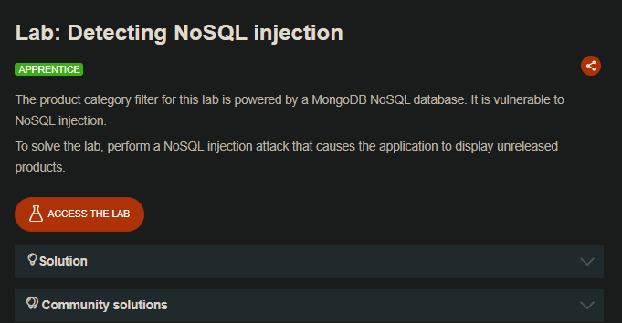
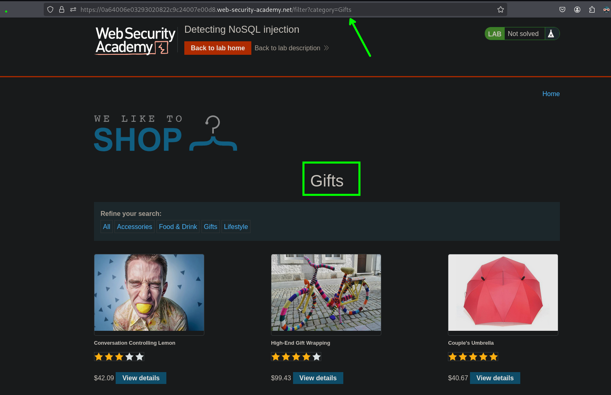
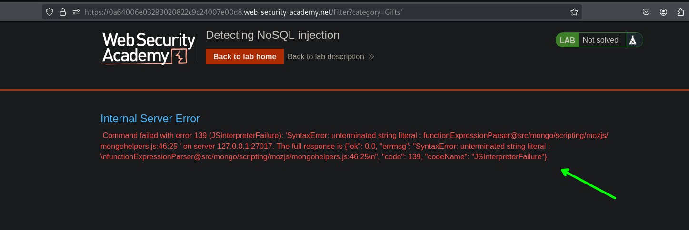
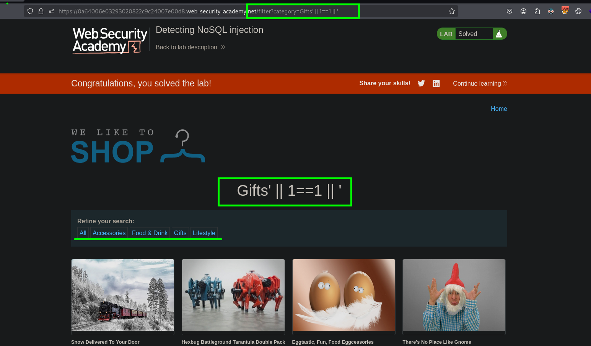

## LAB



En el stio web tenemos un apartado en donde podemos realiza una búsqueda desde la url.

```c
/filter?category=Gifts'
```

Al inyectar un `'` vemos que tenemos un error en el sitio web.



Al ir probando, observamos que este es un nosql y podemos inyectar los siguiente para bypasear la búsqueda por la categoría.

```c
/filter?category=Gifts' || 1==1 || '
```



