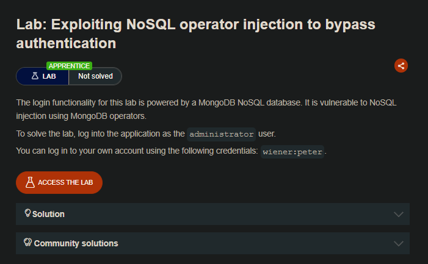
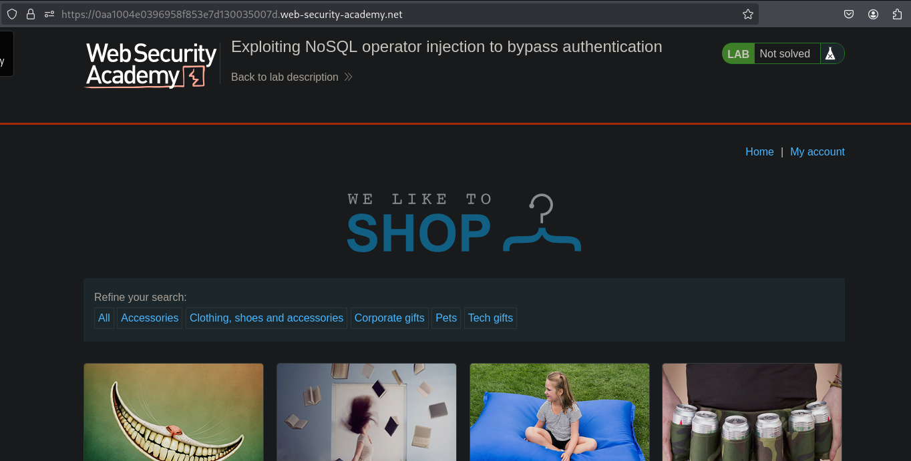
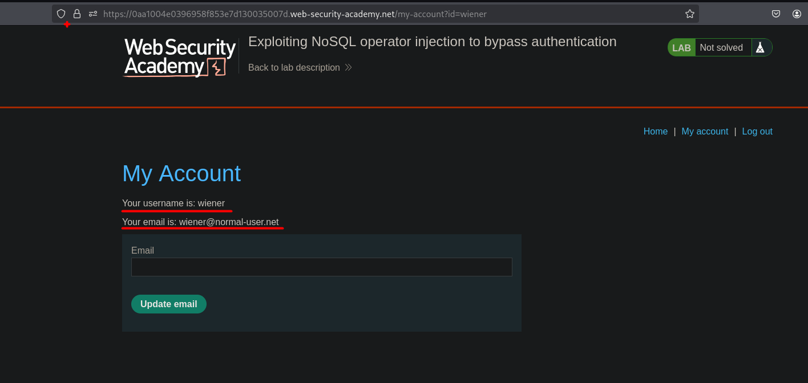
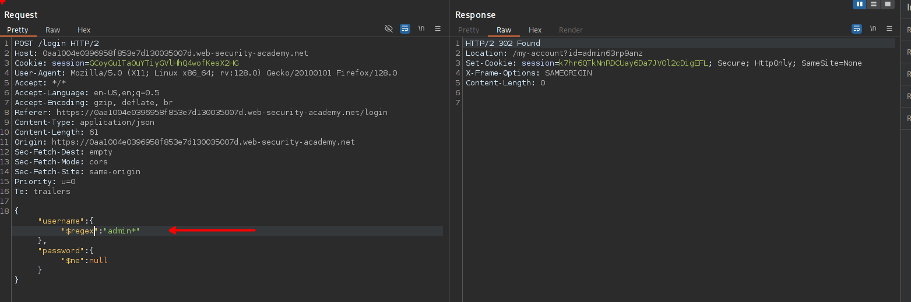
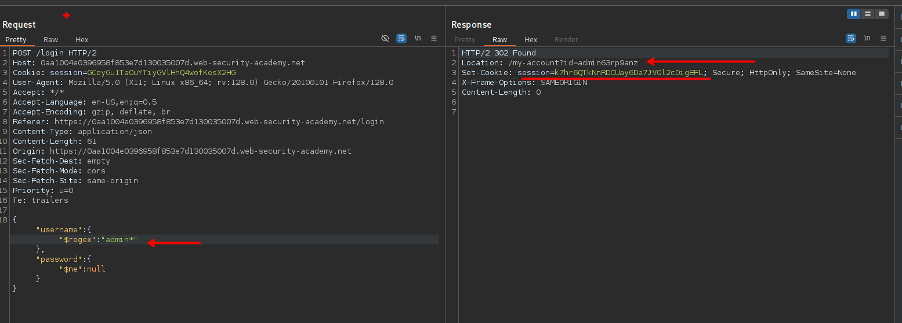
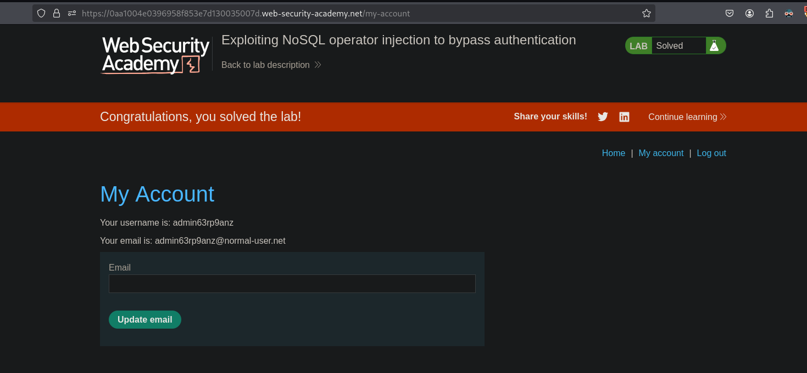

## LAB






Al ingresar veremos que el login se tramita mediante un json, así mismo podemos usar el siguiente recurso para bypasear el login con el usuario adminitrador.

- https://github.com/swisskyrepo/PayloadsAllTheThings/blob/master/NoSQL%20Injection/README.md#authentication-bypass



Vemos que haciendo uso de `regex` y una negación para la contraseña se puede bypasear el login.



```c
{"username": {"$regex": "admin*"}, "password": {"$ne": null}}
```

Luego podemos usar la sesion que recibimos para luego ingresar a la cuenta del usuario administrador.



