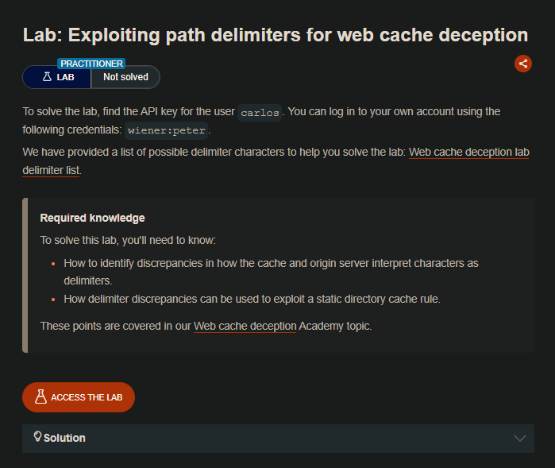
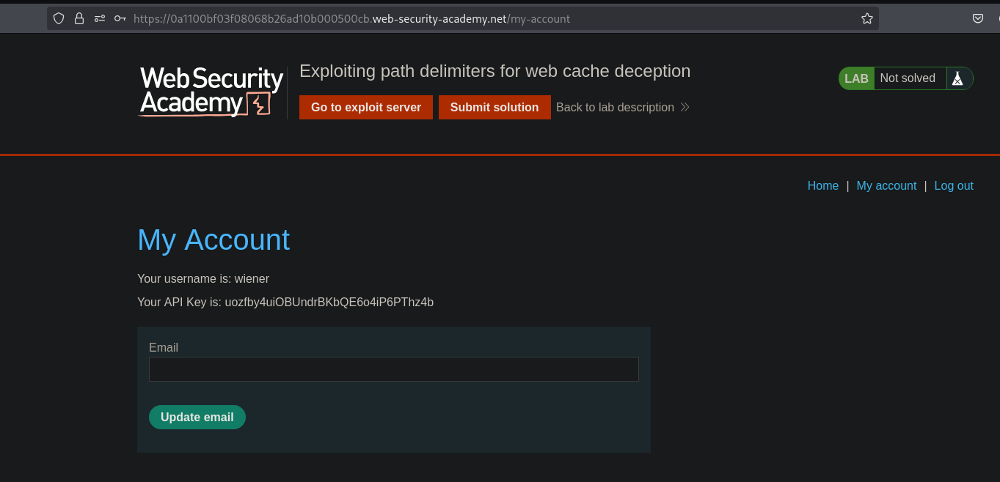
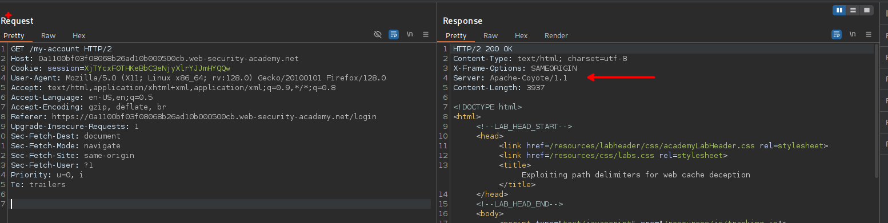
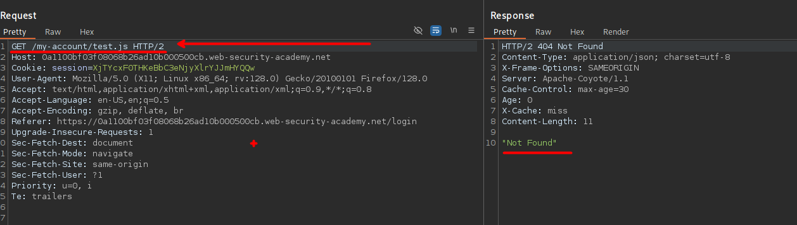
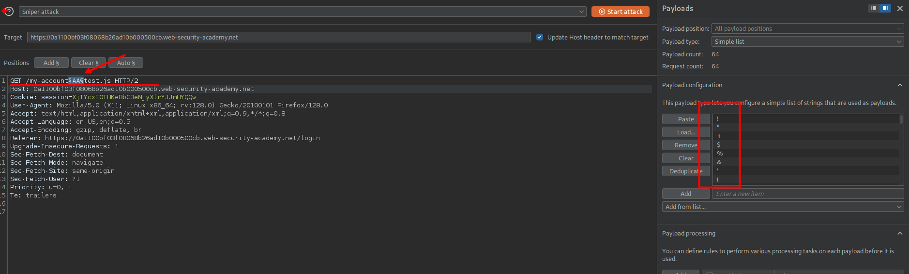
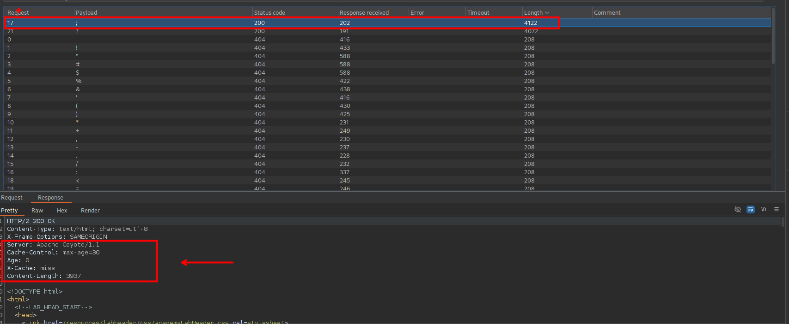
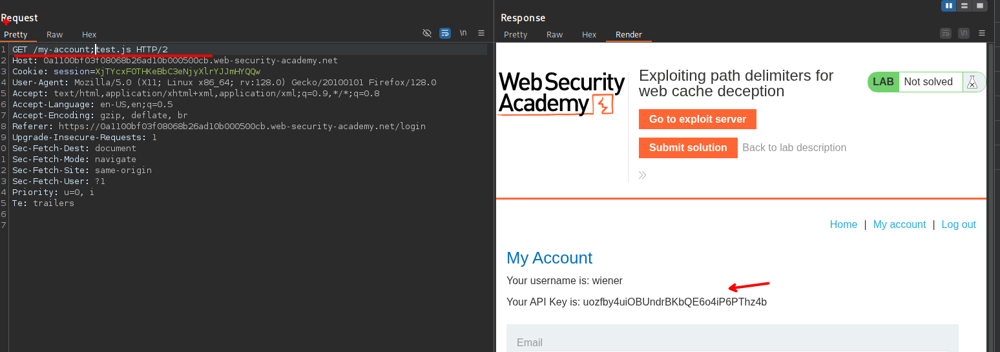
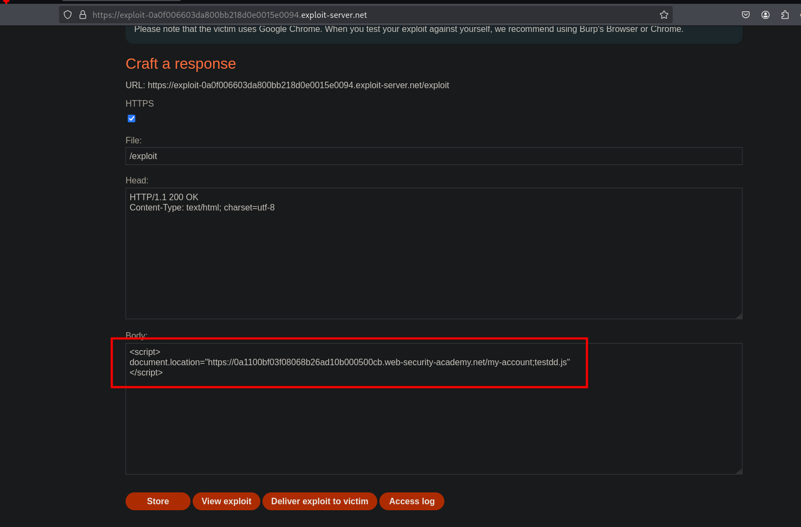
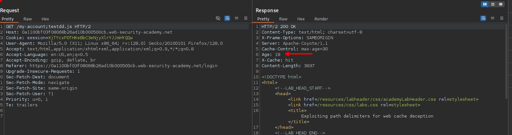
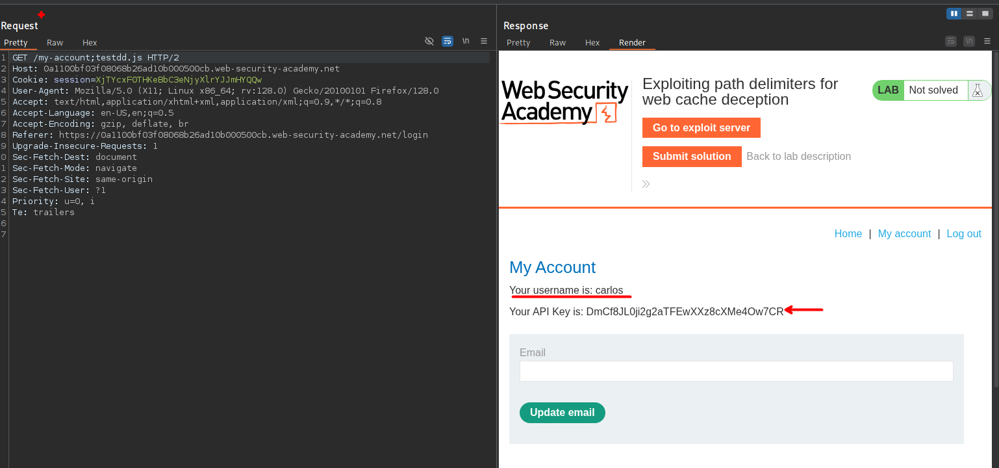

## LAB



Al ingresar usando las credenciales proporcionadas vemos en las respuestas que no se tiene el recurso en cache.



Al agregar una ruta de un archivo `/test.js` vemos que el sitio web lo almacena en cache, pero no podemos ver el contenido porque el servidor da una respuesta de `Not Found`



Investigando un poco vemos que podemos buscar algún carácter que nos ayude a no considerar el archivo. Por ello podemos usar el siguiente recurso para poder iterar.

- https://portswigger.net/web-security/web-cache-deception/wcd-lab-delimiter-list



Al usar el intruder el burpsuite vemos que tenemos que el caracter `;`. Al agregar este vemos que podemos almacenar el recurso en cache y ver la ruta `/my-account`





Para poder la victima alacena en cache su sesión usaremos el exploit server 

```c
<script>
document.location="https://0a1100bf03f08068b26ad10b000500cb.web-security-academy.net/my-account;testdd.js"
</script>
```



Al guardar y entregar a la victima podemos ver que tenemos en cache lo que la victima ve, ósea su Token API





