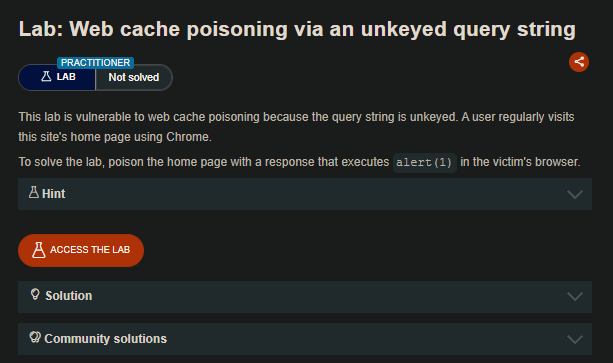
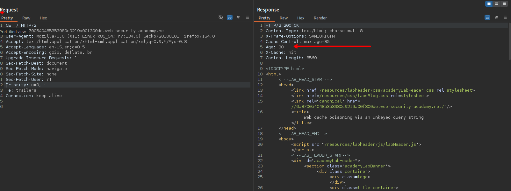
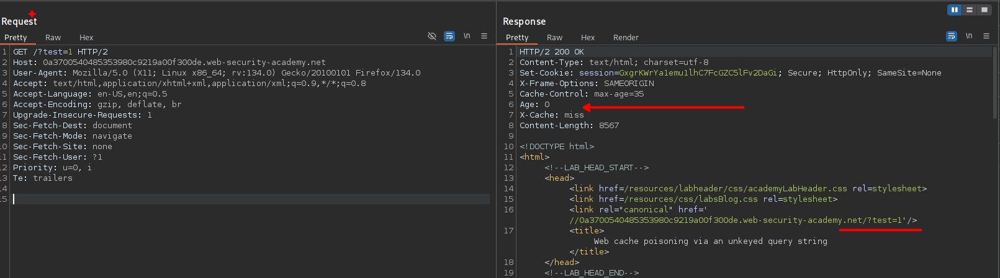
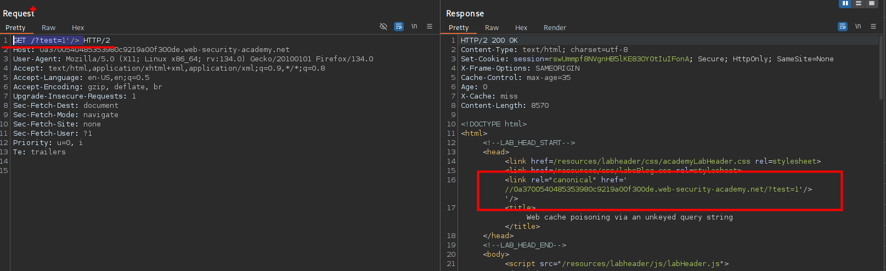
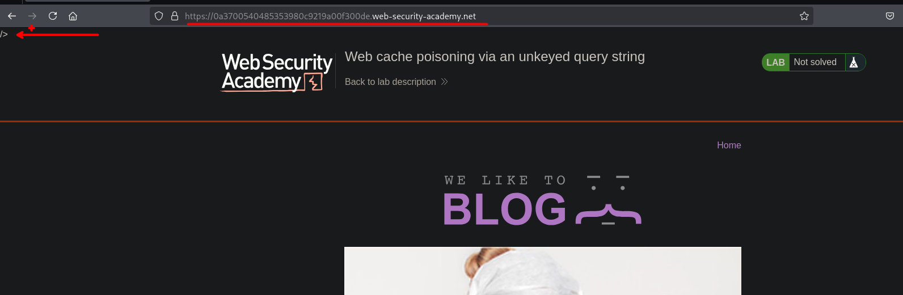
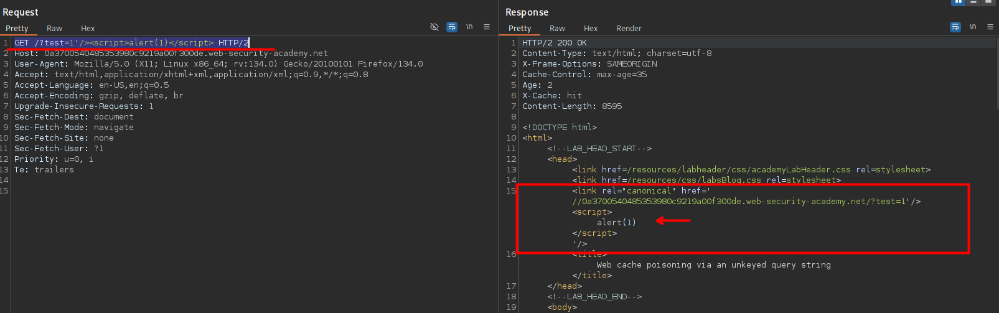
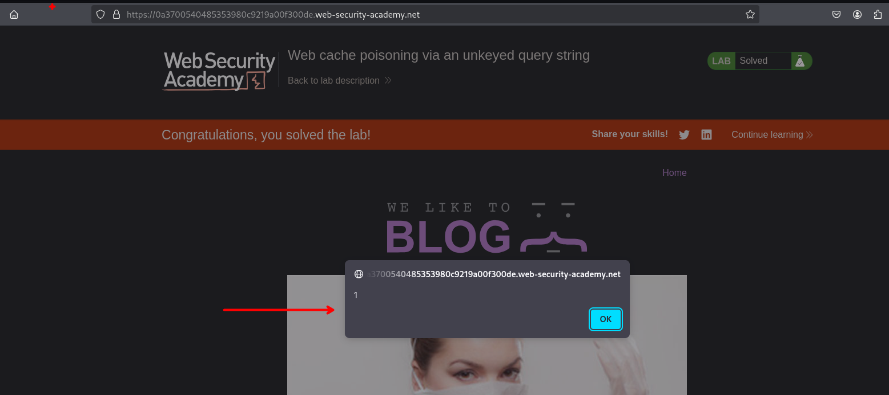

# Web cache poisoning via an unkeyed query string



## LAB

En nuestra solicitud podemos observar que el servidor manera la cache.



Al realizar una solicitud con un parámetro `test` vemos que el servidor lo almacena en cache y asi mismo tambien este se puede reflejar.

```c
GET /?test=1 HTTP/2
```



```c
GET /?test=1'/> 
```



En el parámetro de la URL no forman parte de la clave que usa la caché para distinguir entre distintas peticiones, lo que permite que una respuesta generada con un parámetro malicioso se almacene y luego se sirva a otros usuarios aunque accedan sin ese parámetro en lar ruta `/`.



```c
GET /?test=1'/><script>alert(1)</script> HTTP/2
```



El proceso consiste en añadir un parámetro con un valor que se refleje en la respuesta y permita inyectar código malicioso. Después se accede sin el parámetro, y si el contenido sigue presente, significa que la caché fue envenenada.



