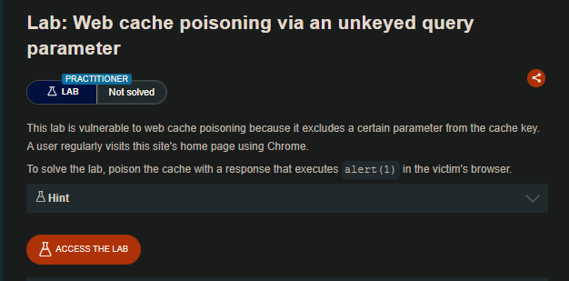
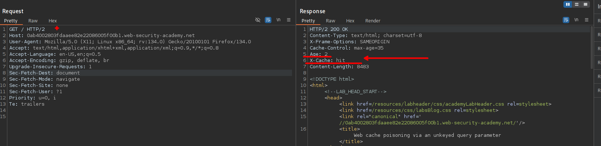
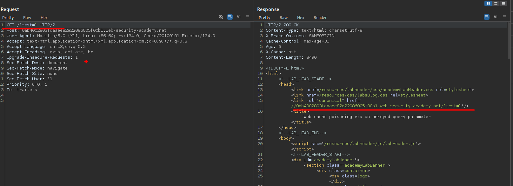
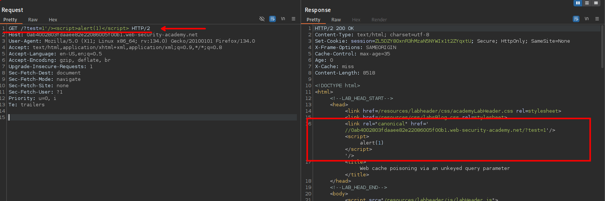
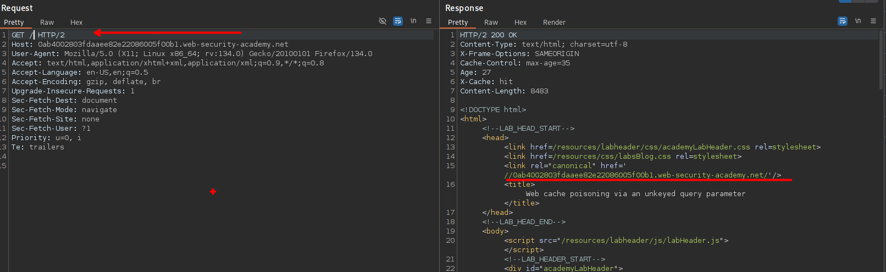
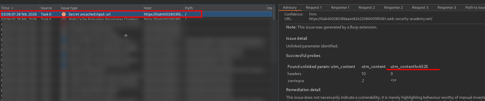
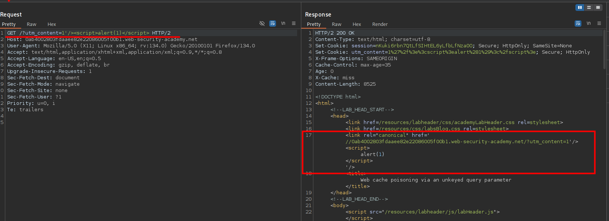
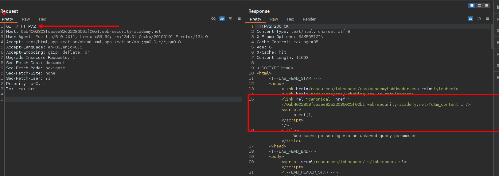
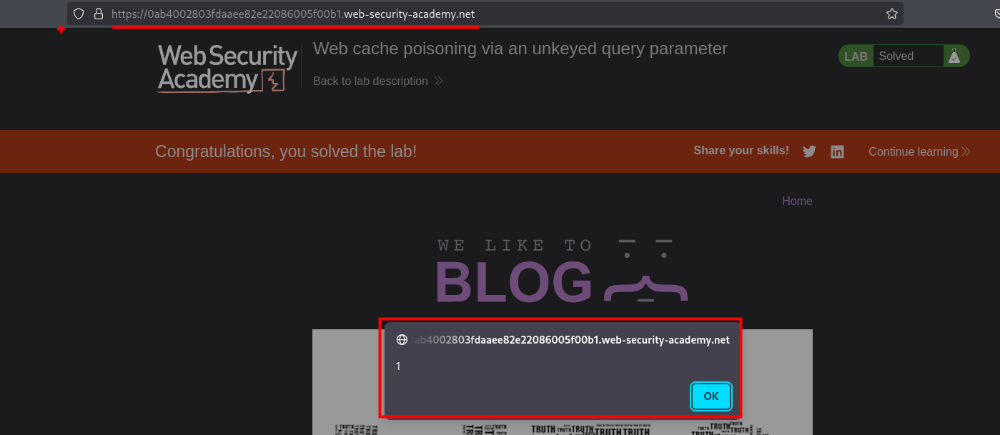

# Web cache poisoning via an unkeyed query parameter



## LAB

En nuestra solicitud podemos observar que el servidor manera la cache.



Al ingresar un parámetro `test=1` y vemos que este es reflejado y que esto queda en la cache del sitio web.



Al inyectar código javascript y este es reflejado en el sitio web.

```c
GET /?test=1'/><script>alert(1)</script> HTTP/2
```



Pero al enviar la solicitud en raíz `/` no se observa en la cache de la solicitud anterior.



Por lo que usando `Param miner` podemos observar un parámetro.



```c
utm_content
```

Este parámetro si se almacena en cache cuando se hace una solicitud a la raíz `GET /`





Por lo que al enviar una solicitud a la raíz `GET /` y podremos obtener la ejecución de javascript malicioso.



