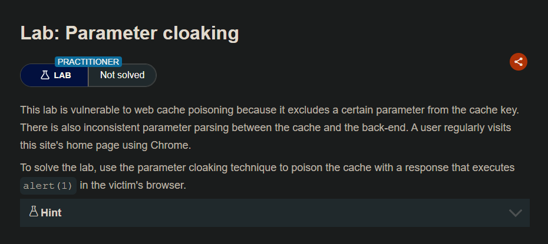
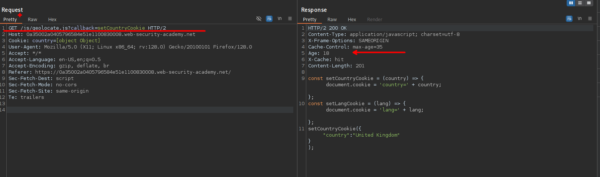
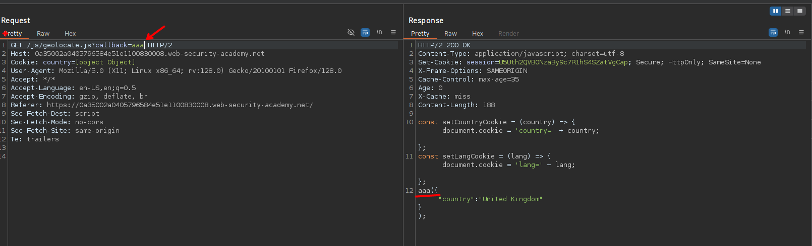
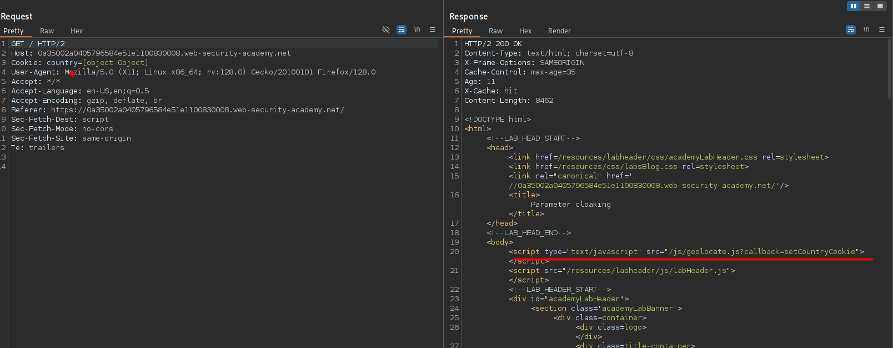
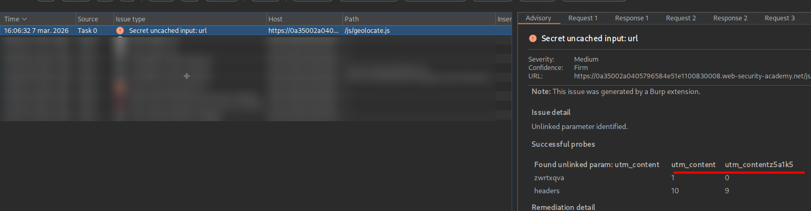
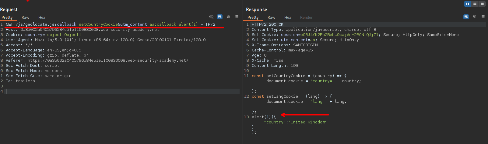
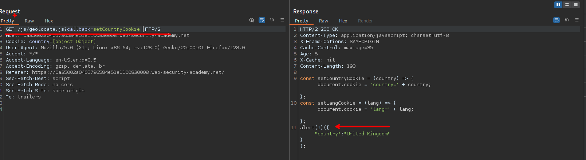
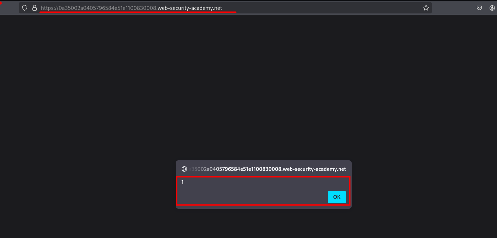

# Parameter cloaking



## LAB

Observamos que el sitio web maneja la cache.



Además que al cambar el valor del parámetro `callback` este es reflejado y podemos inyectar comando malicioso.



Si bien podemos agregar código malicioso y reflejado, este no será llamado. Debido a que a lo que se llama es a la ruta: `"/js/geolocate.js?callback=setCountryCookie"`



Por lo que haciendo uso de de la extensión `Param Miner` encontraremos un parametro el cual no es considerado como clave cache.



Al realizar la solicitud a:

```c
GET /js/geolocate.js?callback=setCountryCookie&utm_content=aa;callback=alert(1) HTTP/2
```

Observamos que podemos alterar parte del contenido del javascript en la cache.



Algo similar como se hizo anteriormente, pero en esta ocasión al realizar la solicitud desde la raiz `GET /` u otro recurso, este se mantiene en cache. 



Como observamos en la anterior imagen, se tiene cacheado. Y de esta manera cualquier usuario que ingrese al sitio web ejecutara el javascript que insertamos.



