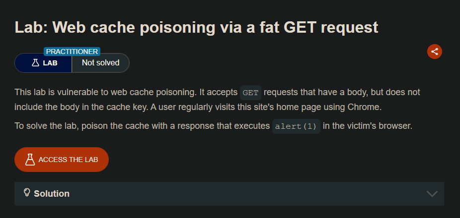
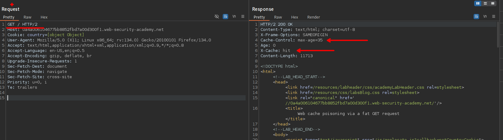
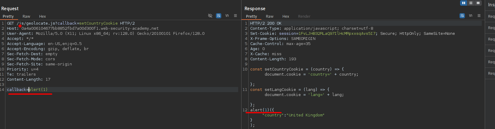
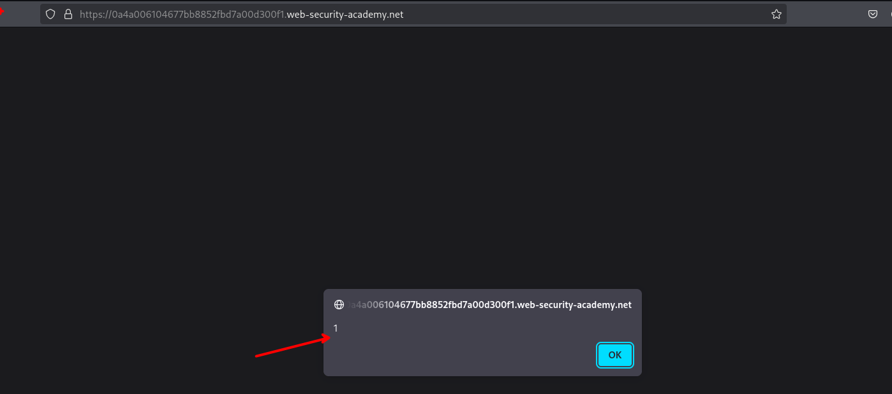

# Web cache poisoning via a fat GET request

## LAB

Observamos que el sitio web maneja cache en el sitio web.

El laboratorio indica que las solicitudes aceptan un cuerpo, por lo que podemos enviar parámetros en el cuerpo.

Al quedar en la cache y luego realizar una solicitud a la raiz `/` el sitio web ejecuta el javascript que introducimos.

