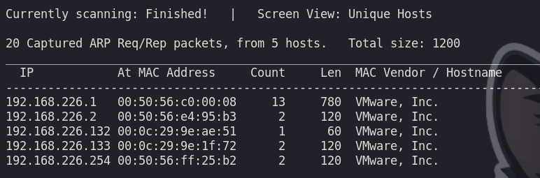
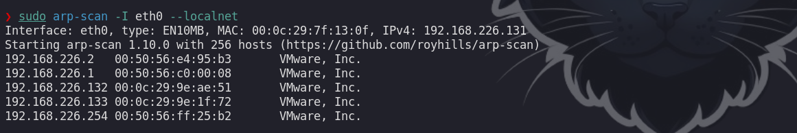

# Fping

Escaneo rápido de un rango de red (ICMP echo):
```c
❯ fping -a -g 192.168.226.132/24 2>/dev/null
192.168.226.2
192.168.226.131
192.168.226.132
192.168.226.133
```
- `-a` : muestra solo los hosts activos (alive).
- `-g` : genera el rango de IPs a partir de una notación CIDR o un rango inicio-fin.

También se puede pasar un rango explícito en vez de CIDR:
```c
❯ fping -a -g 192.168.226.1 192.168.226.254 2>/dev/null
```

Y si se quiere ver también los hosts caídos (útil para verificar filtrado):
```c
❯ fping -a -g 192.168.226.132/24
```
(sin redirigir `2>/dev/null` se muestran también los "ICMP Host Unreachable").

# Netdiscover

Escaneo activo/pasivo de la red local mediante ARP:
```c
❯ sudo netdiscover -i eth0 -r 192.168.226.1/24  
```


- `-i` : interfaz de red a utilizar.
- `-r` : rango a escanear en formato CIDR.
- `-p` : modo pasivo (solo escucha tráfico ARP, no envía paquetes; útil para pasar desapercibido).

```c
❯ sudo netdiscover -i eth0 -p
```

```c
❯ sudo arp-scan -I eth0 --localnet
```


- `-I` : interfaz a usar.
- `--localnet` : escanea automáticamente la red local asociada a la interfaz (sin necesidad de indicar el rango manualmente).

Para especificar un rango manualmente:
```c
❯ sudo arp-scan -I eth0 192.168.226.0/24
```

# Nmap

Enumeración de hosts en un rango (sin escaneo de puertos, `-sn`):
```c
❯ sudo nmap 172.16.50.0/24 -sn -oA tnet | grep for | cut -d" " -f5
172.16.50.4
172.16.50.10
172.16.50.11
172.16.50.18
172.16.50.19
172.16.50.20
172.16.50.28
```
- `-sn` : deshabilita el escaneo de puertos, solo hace descubrimiento de hosts (ping scan).
- `-oA` : guarda la salida en los tres formatos (normal, xml, grepable) con el nombre base `tnet`.

Enumeración pasando una lista de IPs:
```c
❯ sudo nmap -sn -oA tnet -iL hosts.lst | grep for | cut -d" " -f5
172.16.50.18
172.16.50.19
172.16.50.20
```
- `-iL` : lee la lista de objetivos desde un archivo (`hosts.lst`).

Escaneo de múltiples IPs indicadas directamente:
```c
❯ sudo nmap -sn -oA tnet 172.16.50.18 172.16.50.19 172.16.50.20 | grep for | cut -d" " -f5
172.16.50.18
172.16.50.19
172.16.50.20
```

Excluyendo hosts específicos de un rango (útil cuando hay IPs que no se quieren tocar, ej. gateway o IDS):
```c
❯ sudo nmap -sn 172.16.50.0/24 --exclude 172.16.50.1,172.16.50.254 -oA tnet | grep for | cut -d" " -f5
```

Descubrimiento forzando distintos tipos de sondas (útil cuando ICMP está filtrado por firewall):
```c
❯ sudo nmap -sn -PE -PP -PS443 -PA80 172.16.50.0/24 -oA tnet | grep for | cut -d" " -f5
```
- `-PE` : ICMP Echo request.
- `-PP` : ICMP Timestamp request.
- `-PS443` : TCP SYN a puerto 443.
- `-PA80` : TCP ACK a puerto 80.

Esto es útil cuando el firewall bloquea ICMP y el escaneo por defecto de `-sn` no detecta hosts activos.