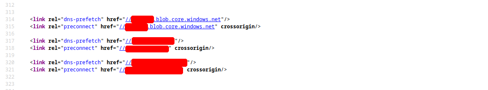
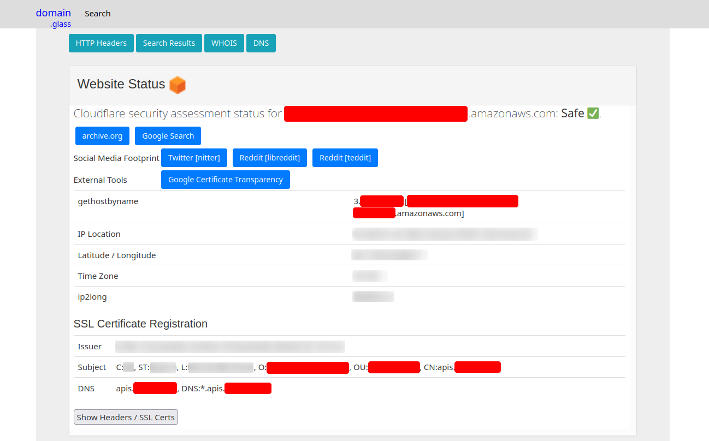
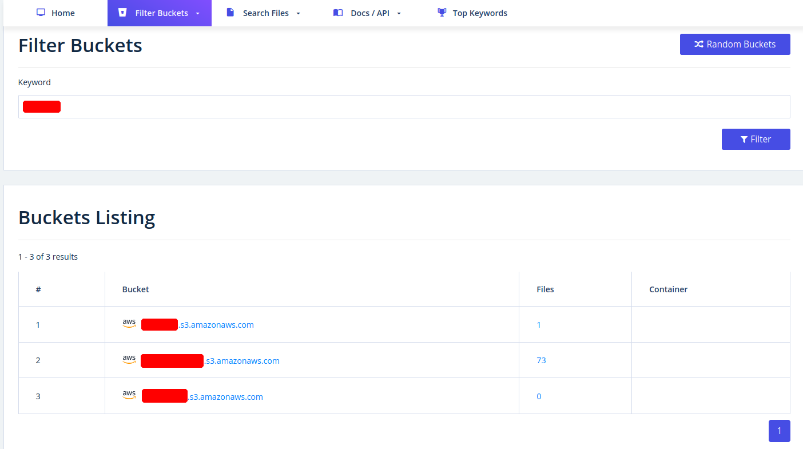
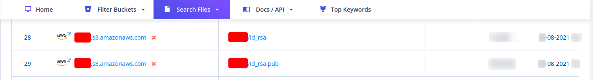

# Enumeración de subdominios

## Whois

`whois` es normalmente el primer paso de un reconocimiento pasivo. Consulta las bases de datos públicas de los registradores para obtener información sobre el propietario del dominio, fechas de registro/expiración, servidores de nombres (NS) y, en muchos casos, datos de contacto (si no están ocultos tras protección de privacidad).
```c
❯ whois empresacorp.com

Domain Name: EMPRESACORP.COM
Registry Domain ID: 123456789_DOMAIN_COM-VRSN
Registrar WHOIS Server: whois.registrar.com
Registrar URL: http://www.registrar.com
Updated Date: 2024-01-15T10:00:00Z
Creation Date: 2015-03-10T08:00:00Z
Registry Expiry Date: 2027-03-10T08:00:00Z
Registrar: Registrar Corp
Domain Status: clientTransferProhibited
Name Server: NS.INWX.NET
Name Server: NS2.INWX.NET
```
- **Creation Date / Registry Expiry Date** : antigüedad del dominio y cuándo expira (dominios recién registrados o a punto de expirar pueden ser relevantes en campañas de phishing/typosquatting).
- **Name Server** : confirma quién gestiona el DNS, útil para correlacionar con lo que luego se vea en los registros `NS` de `dig`.
- **Registrant/Admin/Tech contact** : si no están ocultos por un servicio de privacidad, pueden revelar nombres, correos o teléfonos de la organización.

Consultar contra un servidor whois específico (útil si el resultado por defecto no da suficiente detalle o redirige a otro registrador):
```c
❯ whois -h whois.arin.net empresacorp.com
```

`whois` también sirve para consultar a quién pertenece un rango de direcciones IP (información de ASN/organización), lo cual es útil una vez que ya se tienen IPs del objetivo:
```c
❯ whois 172.16.52.33

NetRange:       172.16.0.0 - 172.16.255.255
CIDR:           172.16.0.0/12
NetName:        EMPRESACORP-NET
Organization:   EmpresaCorp (EMPCORP)
OriginAS:       AS64512
Country:        DE
```
- **OriginAS** : el número de sistema autónomo (ASN) asociado a esa IP. Con esto se puede pivotar a herramientas como `bgp.he.net` o `amass intel -asn` para descubrir otros rangos IP que pertenecen a la misma organización.

### Campos clave de un reporte Whois

| **Campo** | **Descripción** |
|---|---|
| `Domain Name` | El nombre de dominio en sí (por ejemplo, `empresacorp.com`). |
| `Registrar` | La empresa donde se registró el dominio (por ejemplo, GoDaddy, Namecheap). |
| `Registrant Contact` | La persona u organización que registró el dominio. |
| `Administrative Contact` | La persona responsable de administrar el dominio. |
| `Technical Contact` | La persona que maneja los asuntos técnicos relacionados con el dominio. |
| `Creation and Expiration Dates` | Cuándo se registró el dominio y cuándo está previsto que caduque. |
| `Name Servers` | Servidores que traducen el nombre de dominio en una dirección IP. |

### Interpretando los resultados: casos de uso reales

Un reporte whois por sí solo es solo datos; su valor real está en cómo se interpreta según el contexto de la investigación.

**Escenario 1 — Investigación de phishing**
- `Registration Date` : el dominio fue registrado hace apenas unos días (señal fuerte de campaña reciente).
- `Registrant` : la información del registrante está oculta detrás de un servicio de privacidad.
- `Name Servers` : los servidores de nombres están asociados con un proveedor de alojamiento "bulletproof" conocido y usado a menudo para actividades maliciosas.

**Escenario 2 — Análisis de malware**
- `Registrant` : el dominio está registrado a nombre de una persona que usa un servicio de correo gratuito conocido por su anonimato.
- `Location` : la dirección del registrante se encuentra en un país con alta prevalencia de delitos cibernéticos.
- `Registrar` : el dominio se registró a través de un registrador con historial de políticas de abuso laxas.

**Escenario 3 — Reporte de threat intelligence**
- `Registration Dates` : los dominios se registraron en grupos, a menudo poco antes de ataques importantes (indicador de infraestructura preparada con antelación).
- `Registrants` : los registrantes utilizan varios alias e identidades falsas.
- `Name Servers` : los dominios a menudo comparten los mismos servidores de nombres, lo que sugiere una infraestructura común (pivote útil para encontrar dominios relacionados).
- `Takedown History` : muchos dominios han sido eliminados después de ataques, indicando intervenciones previas de las fuerzas de seguridad.

## Dig

### Herramientas para la enumeración DNS

| **Herramienta** | **Características principales** | **Casos de uso** |
|---|---|---|
| `dig` | Herramienta de búsqueda de DNS versátil que admite varios tipos de consultas (A, MX, NS, TXT, etc.) | Consultas DNS manuales, transferencias de zona, solución de problemas de DNS |
| `nslookup` | Herramienta de búsqueda de DNS más sencilla | Consultas DNS básicas, comprobaciones rápidas de resolución de dominio |
| `host` | Herramienta de búsqueda de DNS optimizada con resultados concisos | Comprobaciones rápidas de registros A, AAAA y MX |
| `dnsenum` | Herramienta de enumeración de DNS automatizada | Descubrir subdominios y recopilar información DNS |
| `fierce` | Herramienta de reconocimiento de DNS y enumeración de subdominios | Identificación de subdominios y objetivos potenciales |
| `dnsrecon` | Combina múltiples técnicas de reconocimiento de DNS | Enumeración de DNS completa, identificación de subdominios |
| `theHarvester` | Herramienta OSINT que recopila información de diversas fuentes | Recopilación de direcciones de correo electrónico, información de empleados |
| Servicios de búsqueda DNS en línea | Interfaces fáciles de usar para realizar búsquedas de DNS | Búsquedas rápidas, verificación de disponibilidad de dominio |

### Consultas con dig

Búsqueda de registro A por defecto:
```c
❯ dig empresacorp.com
```

Recuperar la dirección IPv4 (registro A):
```c
❯ dig empresacorp.com A
```

Recuperar la dirección IPv6 (registro AAAA):
```c
❯ dig empresacorp.com AAAA
```

Encontrar los servidores de correo (registros MX):
```c
❯ dig empresacorp.com MX
```

Identificar los servidores de nombres autoritativos (registros NS):
```c
❯ dig empresacorp.com NS
```

Recuperar registros TXT:
```c
❯ dig empresacorp.com TXT
```

Recuperar el registro de nombre canónico (CNAME):
```c
❯ dig empresacorp.com CNAME
```

Recuperar el registro de inicio de autoridad (SOA):
```c
❯ dig empresacorp.com SOA
```

Especificar un servidor de nombres concreto para la consulta (en este caso, `1.1.1.1`):
```c
❯ dig @1.1.1.1 empresacorp.com
```

Mostrar la ruta completa de resolución DNS, desde los root servers hasta la respuesta final:
```c
❯ dig +trace empresacorp.com
```

Búsqueda inversa sobre una IP para encontrar el hostname asociado:
```c
❯ dig -x 172.16.58.10
```

Respuesta breve y concisa a la consulta (solo el valor, sin cabeceras):
```c
❯ dig +short empresacorp.com
```

Mostrar solo la sección de respuesta de la consulta (sin las secciones de opciones/pregunta):
```c
❯ dig +noall +answer empresacorp.com
```

Recuperar todos los registros DNS disponibles:
```c
❯ dig empresacorp.com ANY
```
> **Nota:** muchos servidores DNS ignoran las consultas `ANY` para reducir la carga y evitar abusos, según el RFC 8482. En la práctica, suele ser más efectivo consultar cada tipo de registro por separado (`A`, `MX`, `TXT`, `NS`, etc.).

## Google Dorking

Google (y otros motores de búsqueda) pueden usarse con operadores avanzados para descubrir subdominios, archivos sensibles y configuraciones expuestas sin interactuar directamente con el objetivo.

### Subdominios

```
site:*.empresacorp.com
inurl:subdomain.empresacorp.com
site:empresacorp.com -www
intitle:"index of" site:empresacorp.com
site:empresacorp.com inurl:sub
```

### Archivos de configuración

```
filetype:ini inurl:"config" site:empresacorp.com
filetype:xml inurl:"config" site:empresacorp.com
filetype:conf inurl:"config" site:empresacorp.com
filetype:json inurl:"config" site:empresacorp.com
filetype:yaml inurl:"config" site:empresacorp.com
```

### Bases de datos

```
filetype:sql inurl:"backup" site:empresacorp.com
filetype:sql inurl:"dump" site:empresacorp.com
filetype:sql intext:"INSERT INTO" site:empresacorp.com
filetype:db inurl:"database" site:empresacorp.com
filetype:mdb inurl:"database" site:empresacorp.com
```

### Contraseñas

```
filetype:log intext:"password" site:empresacorp.com
filetype:txt intext:"password" site:empresacorp.com
filetype:xml intext:"password" site:empresacorp.com
filetype:json intext:"password" site:empresacorp.com
filetype:xls intext:"password" site:empresacorp.com
```

### Información sensible general

```
intitle:"index of" "parent directory" inurl:admin site:empresacorp.com
intitle:"index of" "parent directory" inurl:backup site:empresacorp.com
intitle:"index of" "parent directory" inurl:private site:empresacorp.com
intitle:"index of" "parent directory" inurl:sensitive site:empresacorp.com
intitle:"index of" "parent directory" inurl:confidential site:empresacorp.com
```

### Ficheros de interés

```
intitle:"index of" "parent directory" inurl:ftp site:empresacorp.com
intitle:"index of" "parent directory" inurl:sftp site:empresacorp.com
intitle:"index of" "parent directory" inurl:uploads site:empresacorp.com
intitle:"index of" "parent directory" inurl:files site:empresacorp.com
```

### Páginas de login y accesos expuestos

```
site:empresacorp.com inurl:login
site:empresacorp.com (inurl:login OR inurl:admin)
```

### Otros dorks útiles (complementarios)

```
site:*.empresacorp.com -site:www.empresacorp.com -site:help.empresacorp.com
site:pastebin.com "empresacorp.com"
site:trello.com "empresacorp.com"
site:docs.google.com "empresacorp.com"
```
- Los dos primeros combinan exclusión de subdominios ya conocidos para enfocarse en los menos obvios, y búsqueda en Pastebin de menciones (útil para encontrar credenciales filtradas o configuraciones pegadas por error).
- Los últimos dos buscan documentos internos (Trello, Google Docs) que a veces quedan indexados públicamente por error de permisos.

## Certificate Transparency (crt.sh)

Los certificados SSL/TLS quedan registrados públicamente en los logs de Certificate Transparency. Consultando `crt.sh` podemos obtener subdominios que en algún momento tuvieron un certificado emitido:
```c
❯ curl -s https://crt.sh/\?q\=empresacorp.com\&output\=json | jq .

[
  {
    "issuer_ca_id": 23451835427,
    "issuer_name": "C=US, O=Let's Encrypt, CN=R3",
    "common_name": "matomo.empresacorp.com",
    "name_value": "matomo.empresacorp.com",
    "id": 50815783237226155,
    "entry_timestamp": "2021-08-21T06:00:17.173",
    "not_before": "2021-08-21T05:00:16",
    "not_after": "2021-11-19T05:00:15",
    "serial_number": "03abe9017d6de5eda90"
  },
  {
    "issuer_ca_id": 6864563267,
    "issuer_name": "C=US, O=Let's Encrypt, CN=R3",
    "common_name": "matomo.empresacorp.com",
    "name_value": "matomo.empresacorp.com",
    "id": 5081529377,
    "entry_timestamp": "2021-08-21T06:00:16.932",
    "not_before": "2021-08-21T05:00:16",
    "not_after": "2021-11-19T05:00:15",
    "serial_number": "03abe90104e271c98a90"
  },
  {
    "issuer_ca_id": 113123452,
    "issuer_name": "C=US, O=Let's Encrypt, CN=R3",
    "common_name": "smartfactory.empresacorp.com",
    "name_value": "smartfactory.empresacorp.com",
    "id": 4941235512141012357,
    "entry_timestamp": "2021-07-27T00:32:48.071",
    "not_before": "2021-07-26T23:32:47",
    "not_after": "2021-10-24T23:32:45",
    "serial_number": "044bac5fcc4d59329ecbbe9043dd9d5d0878"
  },
  { ... SNIP ...
```
- `-s` : modo silencioso de curl, no muestra la barra de progreso.
- `output=json` : le pide a crt.sh que devuelva el resultado en formato JSON.
- `jq .` : formatea el JSON de salida para que sea legible.

Para quedarnos solo con los nombres de dominio (sin duplicados), útil para pasarlo a otras herramientas:
```c
❯ curl -s https://crt.sh/\?q\=empresacorp.com\&output\=json | jq -r '.[].name_value' | sort -u > subdomainlist
```

### Otras herramientas de enumeración pasiva

Como complemento a crt.sh, existen herramientas dedicadas a la enumeración de subdominios que agregan múltiples fuentes (crt.sh, Shodan, VirusTotal, etc.) en un solo comando:
```c
❯ subfinder -d empresacorp.com -silent
```
```c
❯ assetfinder --subs-only empresacorp.com
```
```c
❯ amass enum -passive -d empresacorp.com
```
```c
❯ sublist3r.py -d empresacorp.com
```
```c
❯ theHarvester -d empresacorp.com -b all
```
- `theHarvester` : además de subdominios, recopila correos electrónicos y nombres de empleados desde motores de búsqueda, redes sociales y otras fuentes OSINT.

### Fuerza bruta activa de subdominios

A diferencia de las herramientas pasivas (que consultan fuentes de terceros), estas resuelven cada candidato directamente contra el DNS del objetivo.

**Repositorios de las herramientas:**

| **Herramienta** | **Repositorio** |
|---|---|
| dnsenum | https://github.com/fwaeytens/dnsenum |
| fierce | https://github.com/mschwager/fierce |
| dnsrecon | https://github.com/darkoperator/dnsrecon |
| amass | https://github.com/owasp-amass/amass |
| assetfinder | https://github.com/tomnomnom/assetfinder |
| puredns | https://github.com/d3mondev/puredns |
| altdns | https://github.com/infosec-au/altdns |
| dnscan | https://github.com/rbsec/dnscan |
| dnssearch | https://github.com/evilsocket/dnssearch |
| gobuster | https://github.com/OJ/gobuster |
| knock | https://github.com/guelfoweb/knock |
| ffuf | https://github.com/ffuf/ffuf |
| subfinder | https://github.com/projectdiscovery/subfinder |
| sublist3r | https://github.com/aboul3la/Sublist3r |
| theHarvester | https://github.com/laramies/theHarvester |

```c
❯ dnsenum --enum empresacorp.com -f /usr/share/seclists/Discovery/DNS/subdomains-top1million-110000.txt -r
```
- `--enum` : atajo que activa varias opciones de ajuste recomendadas.
- `-f` : ruta a la wordlist de SecLists a usar para la fuerza bruta.
- `-r` : habilita fuerza bruta recursiva — si `dnsenum` encuentra un subdominio, intenta enumerar los subdominios de ese subdominio también.

```c
❯ dnsrecon -t brt -d empresacorp.com
```
- `-t brt` : modo de fuerza bruta (brute force) de `dnsrecon`.

```c
❯ fierce --domain empresacorp.com
```
- `fierce` : descubrimiento recursivo de subdominios con detección de comodines (wildcard), útil para no generar falsos positivos cuando el DNS resuelve cualquier subdominio a la misma IP.

```c
❯ dnscan -d empresacorp.com -w subdomains.txt
```
- Además de fuerza bruta, puede detectar transferencias de zona (AXFR) automáticamente si el servidor lo permite.

```c
❯ dnssearch -domain empresacorp.com
```
Mostrar también los registros CNAME encontrados:
```c
❯ dnssearch -domain empresacorp.com -cname
```

```c
❯ amass enum -active -d empresacorp.com -p 80,443,8080
```
- `-active` : a diferencia del modo pasivo, resuelve activamente cada subdominio encontrado e intenta conectarse a los puertos indicados.

```c
❯ amass enum -brute -d empresacorp.com
```

Alteraciones y permutaciones sobre una lista ya conocida de subdominios (por ejemplo, generar `api-dev`, `dev-api`, `api2` a partir de `api`):
```c
❯ altdns -i subdomains.txt -o new_subdomains.txt -w /usr/share/wordlists/seclists/Discovery/DNS/subdomains-top1million-20000.txt -r -s results_output.txt
```
- `-i` : archivo de entrada con subdominios ya conocidos.
- `-w` : wordlist de palabras/patrones para generar las permutaciones (`dev`, `staging`, `2`, `old`, etc.).
- `-r` : resuelve automáticamente las permutaciones generadas.
- `-s` : guarda solo los resultados que sí resolvieron.

```c
❯ knockpy empresacorp.com
```
Con salida silenciosa o en distintos formatos:
```c
❯ knockpy empresacorp.com --silent
❯ knockpy empresacorp.com --silent json
❯ knockpy empresacorp.com --silent csv
```

Resolución masiva de subdominios con `puredns` (combina wordlist + validación contra resolvers, filtrando falsos positivos de wildcard automáticamente):
```c
❯ puredns bruteforce /usr/share/seclists/Discovery/DNS/subdomains-top1million-110000.txt empresacorp.com -r resolvers.txt
```
- `-r` : archivo con una lista de resolvers DNS públicos a usar, lo que acelera mucho el proceso al distribuir las consultas.
- `puredns` es especialmente útil para wordlists grandes (millones de entradas), donde herramientas más simples serían demasiado lentas o darían falsos positivos por wildcards.

### Fuerza bruta de subdominios / Virtual Hosts con Gobuster y ffuf

Modo DNS de Gobuster (resuelve subdominios directamente contra el DNS):
```c
❯ gobuster dns -d empresacorp.com -w /usr/share/wordlists/dirb/common.txt -i
```
- `-i` : muestra también la dirección IP de cada subdominio encontrado.

Modo VHOST de Gobuster (útil cuando varios sitios comparten la misma IP y se diferencian por el header `Host`, algo que un escaneo DNS normal no detecta):
```c
❯ gobuster vhost -u empresacorp.com -w /usr/share/wordlists/dirb/common.txt -v
```

```c
❯ gobuster vhost -u http://empresacorp.local:81 -w /usr/share/seclists/Discovery/DNS/subdomains-top1million-110000.txt --append-domain

===============================================================
Gobuster v3.6
by OJ Reeves (@TheColonial) & Christian Mehlmauer (@firefart)
===============================================================
[+] Url:             http://empresacorp.local:81
[+] Method:          GET
[+] Threads:         10
[+] Wordlist:        /usr/share/seclists/Discovery/DNS/subdomains-top1million-110000.txt
[+] User Agent:      gobuster/3.6
[+] Timeout:         10s
[+] Append Domain:   true
===============================================================
Starting gobuster in VHOST enumeration mode
===============================================================
Found: forum.empresacorp.local:81 Status: 200 [Size: 100]
[...]
Progress: 114441 / 114442 (100.00%)
===============================================================
Finished
===============================================================
```
- `--append-domain` : agrega automáticamente el dominio base a cada palabra de la wordlist, evitando tener que preparar una lista con el dominio ya incluido.
- Este tipo de escaneo es clave cuando un servidor aloja múltiples sitios/aplicaciones internas (virtual hosting) que no aparecen en el DNS público, pero sí responden si se envía el `Host` correcto.

Lo mismo pero con `ffuf`, fuzzing directamente el header `Host`:
```c
❯ ffuf -w /usr/share/wordlists/SecLists/Discovery/DNS/namelist.txt -H "Host: FUZZ.empresacorp.com" -u http://172.16.58.10
```
- Requiere conocer (o suponer) la IP del servidor de antemano, ya que se apunta directamente a la IP con distintos valores de `Host`.

## Company Hosted Servers

Una vez con la lista de subdominios, resolvemos cada uno a su dirección IP para identificar qué servidores pertenecen realmente a la organización:
```c
❯ for i in $(cat subdomainlist);do host $i | grep "has address" | grep empresacorp.com | cut -d" " -f1,4;done

blog.empresacorp.com 172.16.51.93
empresacorp.com 172.16.52.33
matomo.empresacorp.com 172.16.54.22
www.empresacorp.com 172.16.54.33
s3-website-us-west-2.amazonaws.com 172.16.53.250
```
- `host` : resuelve el nombre de dominio a su dirección IP.
- El `grep empresacorp.com` filtra únicamente las líneas donde el dominio de la organización aparece en la resolución, descartando CNAMEs hacia terceros que no interesan en este paso.

## Shodan - IP List

Primero extraemos únicamente las IPs resueltas en el paso anterior:
```c
❯ for i in $(cat subdomainlist);do host $i | grep "has address" | grep empresacorp.com | cut -d" " -f4 >> ip-addresses.txt;done
```

Y luego consultamos cada IP en Shodan para ver puertos abiertos, servicios, banners y otra información expuesta:
```c
❯ for i in $(cat ip-addresses.txt);do shodan host $i;done

172.16.51.93
City:                    Berlin
Country:                 Germany
Organization:            InlaneFreight
Updated:                 2021-09-01T09:02:11.370085
Number of open ports:    2

Ports:
     80/tcp nginx 
    443/tcp nginx 
	
172.16.52.33
City:                    Berlin
Country:                 Germany
Organization:            InlaneFreight
Updated:                 2021-08-30T22:25:31.572717
Number of open ports:    3

Ports:
     22/tcp OpenSSH (7.6p1 Ubuntu-4ubuntu0.3)
     80/tcp nginx 
    443/tcp nginx 
        |-- SSL Versions: -SSLv2, -SSLv3, -TLSv1, -TLSv1.1, -TLSv1.3, TLSv1.2
        |-- Diffie-Hellman Parameters:
                Bits:          2048
                Generator:     2
				
172.16.52.22
City:                    Berlin
Country:                 Germany
Organization:            InlaneFreight
Updated:                 2021-09-01T15:39:55.446281
Number of open ports:    8

Ports:
     25/tcp  
        |-- SSL Versions: -SSLv2, -SSLv3, -TLSv1, -TLSv1.1, TLSv1.2, TLSv1.3
     53/tcp  
     53/udp  
     80/tcp Apache httpd 
     81/tcp Apache httpd 
    110/tcp  
        |-- SSL Versions: -SSLv2, -SSLv3, -TLSv1, -TLSv1.1, TLSv1.2
    111/tcp  
    443/tcp Apache httpd 
        |-- SSL Versions: -SSLv2, -SSLv3, -TLSv1, -TLSv1.1, TLSv1.2, TLSv1.3
        |-- Diffie-Hellman Parameters:
                Bits:          2048
                Generator:     2
                Fingerprint:   RFC3526/Oakley Group 14
    444/tcp  
		
172.16.52.33
City:                    Berlin
Country:                 Germany
Organization:            InlaneFreight
Updated:                 2021-08-30T22:25:31.572717
Number of open ports:    3

Ports:
     22/tcp OpenSSH (7.6p1 Ubuntu-4ubuntu0.3)
     80/tcp nginx 
    443/tcp nginx 
        |-- SSL Versions: -SSLv2, -SSLv3, -TLSv1, -TLSv1.1, -TLSv1.3, TLSv1.2
        |-- Diffie-Hellman Parameters:
                Bits:          2048
                Generator:     2
```
- Este método es pasivo: no se envía tráfico directo al objetivo, solo se consulta la base de datos de Shodan, lo que lo hace ideal para reconocimiento sigiloso.

## DNS Records

Consulta de todos los registros DNS disponibles de un dominio:
```c
❯ dig any empresacorp.com

; <<>> DiG 9.16.1-Ubuntu <<>> any empresacorp.com
;; global options: +cmd
;; Got answer:
;; ->>HEADER<<- opcode: QUERY, status: NOERROR, id: 52058
;; flags: qr rd ra; QUERY: 1, ANSWER: 17, AUTHORITY: 0, ADDITIONAL: 1

;; OPT PSEUDOSECTION:
; EDNS: version: 0, flags:; udp: 65494
;; QUESTION SECTION:
;empresacorp.com.             IN      ANY

;; ANSWER SECTION:
empresacorp.com.      300     IN      A       172.16.52.33
empresacorp.com.      300     IN      A       172.16.53.250
empresacorp.com.      3600    IN      MX      1 aspmx.l.google.com.
empresacorp.com.      3600    IN      MX      10 aspmx2.googlemail.com.
empresacorp.com.      3600    IN      MX      10 aspmx3.googlemail.com.
empresacorp.com.      3600    IN      MX      5 alt1.aspmx.l.google.com.
empresacorp.com.      3600    IN      MX      5 alt2.aspmx.l.google.com.
empresacorp.com.      21600   IN      NS      ns.inwx.net.
empresacorp.com.      21600   IN      NS      ns2.inwx.net.
empresacorp.com.      21600   IN      NS      ns3.inwx.eu.
empresacorp.com.      3600    IN      TXT     "MS=ms92346782372"
empresacorp.com.      21600   IN      TXT     "atlassian-domain-verification=IJdXMt1rKCy68JFszSdCKVpwPN"
empresacorp.com.      3600    IN      TXT     "google-site-verification=O7zV5-xFh_jn7JQ31"
empresacorp.com.      300     IN      TXT     "google-site-verification=bow47-er9LdgoUeah"
empresacorp.com.      3600    IN      TXT     "google-site-verification=gZsCG-BINLopf4hr2"
empresacorp.com.      3600    IN      TXT     "logmein-verification-code=87123gff5a479e-61d4325gddkbvc1-b2bnfghfsed1-3c789427sdjirew63fc"
empresacorp.com.      300     IN      TXT     "v=spf1 include:mailgun.org include:_spf.google.com include:spf.protection.outlook.com include:_spf.atlassian.net ip4:172.16.51.8 ip4:172.16.52.2 ip4:10.72.82.106 ~all"
empresacorp.com.      21600   IN      SOA     ns.inwx.net. hostmaster.inwx.net. 2021072600 10800 3600 604800 3600

;; Query time: 332 msec
;; SERVER: 127.0.0.53#53(127.0.0.53)
;; WHEN: Mi Sep 01 18:27:22 CEST 2021
;; MSG SIZE  rcvd: 940
```
- `any` : solicita todos los tipos de registros disponibles (aunque muchos servidores DNS modernos ignoran `ANY` por abuso/DoS y solo devuelven lo que tengan cacheado).
- Los registros `TXT` (SPF, verificaciones de Google/Atlassian/logmein) son especialmente útiles: revelan qué servicios de terceros usa la organización (Atlassian, Google Workspace, Mailgun) y rangos IP adicionales (`ip4:...`) que pueden ampliar el alcance del reconocimiento.
- El registro `MX` indica que el correo se gestiona con Google Workspace (`aspmx.l.google.com`).

# Recursos en la nube

## Sitio web de destino: código fuente

Revisar el código fuente de la página (HTML, JS, comentarios) puede revelar rutas internas, claves de API, nombres de buckets S3 u otra información sensible olvidada por los desarrolladores.



## Domain.Glass

Herramienta OSINT que centraliza información de un dominio (DNS, WHOIS, certificados, tecnologías usadas, subdominios) en un solo panel.



## GrayHatWarfare

Buscador de buckets de almacenamiento en la nube (S3, Azure Blob, etc.) expuestos públicamente, útil para encontrar archivos filtrados asociados a un dominio u organización.



## Private and Public SSH Keys Leaked

Ejemplo de claves SSH (públicas y privadas) encontradas expuestas en un bucket, lo cual representa un hallazgo crítico: una clave privada filtrada puede permitir acceso directo a un servidor.

